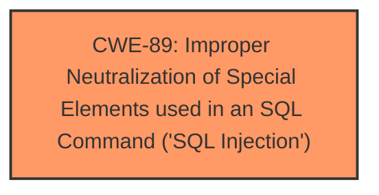

# Raw Analyzer Response for CVE-2024-11099

# Summary

| CWE ID | CWE Name | Confidence | CWE Abstraction Level | CWE Vulnerability Mapping Label | CWE-Vulnerability Mapping Notes |
|---|---|---|---|---|---|
| CWE-89 | Improper Neutralization of Special Elements used in an SQL Command ('SQL Injection') | 1.0 | Base | Allowed | Primary CWE. The vulnerability description clearly states that the manipulation of the 'email' argument leads to **SQL Injection**. |

## Evidence and Confidence

*   **Confidence Score:** 1.0
*   **Evidence Strength:** HIGH

## Relationship Analysis
The primary CWE, CWE-89, stands alone. No other relationships are apparent in this vulnerability. CWE-89 is a Base level CWE, which is appropriate as it directly describes the root cause of the vulnerability.

## Vulnerability Chain
The vulnerability chain starts with the **improper neutralization** of the 'email' argument in the `/login.php` file, leading directly to **SQL injection**.

## Summary of Analysis
The vulnerability description clearly states that the manipulation of the 'email' argument leads to **SQL injection** in the `/login.php` file of code-projects Job Recruitment 1.0. This aligns directly with the description of CWE-89, "Improper Neutralization of Special Elements used in an SQL Command ('SQL Injection')". The retriever results also strongly support this classification, with CWE-89 having a score of 1.0.

The other CWEs listed in the Retriever Results were considered but deemed less appropriate. For example, CWE-79 (Improper Neutralization of Input During Web Page Generation ('Cross-site Scripting')) is related to web page output, not direct SQL command construction. CWE-434 (Unrestricted Upload of File with Dangerous Type) is irrelevant as the vulnerability involves manipulating an email argument, not uploading files.

The selection of CWE-89 is at the optimal level of specificity as it directly addresses the root cause of the vulnerability, which is the **improper neutralization** of input leading to **SQL injection**. The evidence from the vulnerability description and the retriever results provide strong support for this classification.