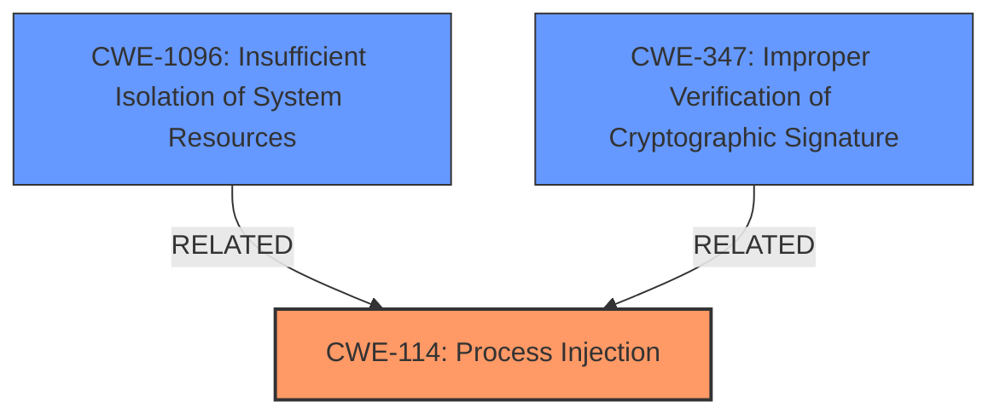

# Enhanced Analysis for CVE-2024-11128

# Summary
| CWE ID | CWE Name | Confidence | CWE Abstraction Level | CWE Vulnerability Mapping Label | CWE-Vulnerability Mapping Notes |
|---|---|---|---|---|---|
| CWE-114 | Process Injection | 0.9 | Class | Primary | Allowed-with-Review |
| CWE-1096 | Insufficient Isolation of System Resources | 0.7 | Base | Secondary | Allowed |
| CWE-347 | Improper Verification of Cryptographic Signature | 0.6 | Base | Secondary | Allowed |

## Evidence and Confidence

*   **Confidence Score:** 0.8
*   **Evidence Strength:** MEDIUM

## Relationship Analysis
The primary relationship influencing the selection was the hierarchical structure, particularly the parent-child relationship between CWE-114 and its potential children. While the description points to a specific type of process injection (DYLD injection), there isn't a specific CWE for it, making CWE-114 the most appropriate. Additionally, the absence of Hardened Runtime can be viewed as insufficient isolation of system resources or improper verification of signatures.



## Vulnerability Chain
The vulnerability chain starts with the **absence of Hardened Runtime or Library Validation signing**, leading to **dynamic library injection**, ultimately resulting in a high vulnerability and confidentiality impact.

## Summary of Analysis
The initial analysis identified CWE-114 as the primary weakness due to the DYLD injection. Supporting evidence includes the vulnerability description, which explicitly states **"dynamic library injection"** as a key aspect. The **"absence of Hardened Runtime or Library Validation signing"** is the root cause which has resulted in **dynamic library injection** (DYLD injection) bypassing AppleMobileFileIntegrity (AMFI). The retriever results also point to other related CWEs like CWE-426, CWE-427 related to search path issues, but these are less directly related to the core issue of process injection due to missing security features.

CWE-114 is chosen since it represents the general class of "Process Injection".

Here's how the evidence supports the selection of CWE-114 and other candidates:

*   **CWE-114 (Process Injection):** The vulnerability description explicitly mentions "dynamic library injection (DYLD injection)," making this the most direct match.
*   **CWE-1096 (Insufficient Isolation of System Resources):** The **absence of Hardened Runtime** can be interpreted as insufficient isolation of resources, making it a reasonable secondary consideration.
*   **CWE-347 (Improper Verification of Cryptographic Signature):** The **absence of Library Validation signing** directly relates to improper verification of cryptographic signatures.

The selected CWEs are at the optimal level of specificity because while a more specific CWE for DYLD injection would be ideal, none exists. CWE-114 captures the general concept, while CWE-1096 and CWE-347 capture the root causes that enabled it.

**CWEs Considered But Not Used:**

*   **CWE-20 Improper Input Validation:** While input validation might be a factor in some process injection scenarios, the primary cause here is the **lack of signing**, not necessarily improper input handling. Therefore, CWE-20 is not the most appropriate.
*   **CWE-426 Untrusted Search Path & CWE-427 Uncontrolled Search Path Element:** These CWEs relate to using untrusted or uncontrolled paths to find resources. While DYLD injection *could* involve manipulating search paths, the core issue here is the **lack of validation**, not the path itself.

# Relevant CWE Information:

## CWE-114: Process Injection
**Abstraction Level**: Class
**Description**: A process is manipulated to execute code that was not intended by the process's original developers.
**Mapping Guidance**:
- Usage: Allowed-with-Review

## CWE-1096: Insufficient Isolation of System Resources
**Abstraction Level**: Base
**Description**: The software does not adequately separate system resources so that unintended access or influence can occur.
**Mapping Guidance**:
- Usage: Allowed

## CWE-347: Improper Verification of Cryptographic Signature
**Abstraction Level**: Base
**Description**: The product does not verify, or incorrectly verifies, the cryptographic signature for data.
**Mapping Guidance**:
- Usage: Allowed


## CWE Relationship Analysis

Current CWEs represent these abstraction levels: .


### Vulnerability Chain Analysis

**Chain starting from CWE-427:**
- 427 (Uncontrolled Search Path Element) - ROOT


**Chain starting from CWE-426:**
- 426 (Untrusted Search Path) - ROOT


### CWE Relationship Diagram

```mermaid
graph TD
    classDef primary fill:#f96,stroke:#333,stroke-width:2px
    classDef secondary fill:#69f,stroke:#333
    classDef tertiary fill:#9e9,stroke:#333
```