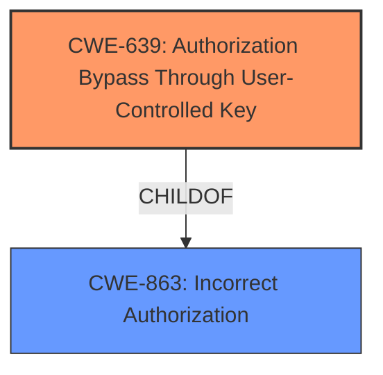

# Analysis Report for CVE-2024-11137

# Vulnerability Analysis Report: CVE-2024-11137

## Description

An Insecure Direct Object Reference (IDOR) vulnerability exists in the `PATCH /v1/runs/id/score` endpoint of lunary-ai/lunary version 1.6.0. This vulnerability allows an attacker to update the score data of any run by manipulating the id parameter in the request URL, which corresponds to the `runId_score` in the database. The endpoint does not sufficiently validate whether the authenticated user has permission to modify the specified runId, enabling an attacker with a valid account to modify other users runId scores by specifying different id values. This issue was fixed in version 1.6.1.

## Vulnerability Description Key Phrases

- **Component:** /v1/runs/id/score endpoint
- **Rootcause:** insecure direct object reference
- **Product:** lunary-ai/lunary
- **Impact:** modify other users runId scores, update the score data of any run
- **Attacker:** authenticated attacker
- **Version:** 1.6.0

## Analysis (with Relationship Data)

# Summary

| CWE ID | CWE Name | Confidence | CWE Abstraction Level | CWE Vulnerability Mapping Label | CWE-Vulnerability Mapping Notes |
|---|---|---|---|---|---|
| CWE-639 | Authorization Bypass Through User-Controlled Key | 0.9 | Base | Allowed | Primary CWE. The application's authorization **fails to prevent** a user from accessing another user's data by modifying the key identifying the data. |
| CWE-863 | Incorrect Authorization | 0.7 | Class | Allowed-with-Review | Secondary candidate. The application performs an authorization check, but it is **incorrect**, allowing unauthorized access. |

## Evidence and Confidence

*   **Confidence Score:** 0.9
*   **Evidence Strength:** HIGH

## Relationship Analysis
The primary CWE is CWE-639, which is a Base level CWE and a child of CWE-863. The application **fails to properly authorize** based on a user-controlled key, which directly aligns with CWE-639. CWE-863 is a Class-level CWE and represents a more general **incorrect authorization**.



## Vulnerability Chain
The vulnerability chain starts with the **insecure direct object reference**, which leads to an **authorization bypass** because the application **fails to validate** whether the authenticated user has permission to modify the specified runId. This allows an attacker to **modify other users' runId scores**.
  - **Root Cause:** CWE-639 Authorization Bypass Through User-Controlled Key
  - **Weakness:** Insecure Direct Object Reference
  - **Impact:** Modification of other users' data

## Summary of Analysis
Based on the provided evidence, the primary vulnerability is CWE-639, **Authorization Bypass Through User-Controlled Key**. The vulnerability description clearly states that an attacker can modify the `id` parameter in the request URL to update the score data of any run. The application **fails to sufficiently validate** whether the authenticated user has permission to modify the specified `runId`, which corresponds to the root cause weakness described by CWE-639 which is that "The system's authorization functionality does not prevent one user from gaining access to another user's data or record by modifying the key value identifying the data."

The CWEs considered, but not chosen:

*   **CWE-99: Improper Control of Resource Identifiers ('Resource Injection')** - While an IDOR vulnerability involves improper control of resource identifiers, CWE-639 is more specific to the authorization bypass that occurs due to this improper control.
*   **CWE-306: Missing Authentication for Critical Function** - This is not the root cause because authentication is present. The issue is with authorization after authentication.
*   **CWE-862: Missing Authorization** - Authorization is present but incorrect, making CWE-863 a better fit as a secondary issue.
*   **CWE-285: Improper Authorization** - While this is similar to CWE-863, CWE-863 is preferred, though both are class-level.
*   **CWE-668: Exposure of Resource to Wrong Sphere** - Too general, and a Class level CWE.
*   **CWE-732: Incorrect Permission Assignment for Critical Resource** - While related, the core issue is not the assignment of permissions but the **failure to properly authorize** access based on the provided key.
*   **CWE-918: Server-Side Request Forgery (SSRF)** - Not relevant as the vulnerability does not involve the server making requests on behalf of the user.
*   **CWE-612: Improper Authorization of Index Containing Sensitive Information** - Not relevant as the vulnerability is not specifically related to an index.

The final selection of CWE-639 and CWE-863 is based on the specific details of the vulnerability description and the relationship between these CWEs. CWE-639 accurately captures the root cause, while CWE-863 represents the broader issue of incorrect authorization.


## CWE Relationship Analysis

Current CWEs represent these abstraction levels: .


### Vulnerability Chain Analysis

**Chain starting from CWE-863:**
- 863 (Incorrect Authorization) - ROOT


**Chain starting from CWE-99:**
- 99 (Improper Control of Resource Identifiers ('Resource Injection')) - ROOT


### CWE Relationship Diagram

```mermaid
graph TD
    classDef primary fill:#f96,stroke:#333,stroke-width:2px
    classDef secondary fill:#69f,stroke:#333
    classDef tertiary fill:#9e9,stroke:#333
```


*Report generated on 2025-07-13 01:02:30*
