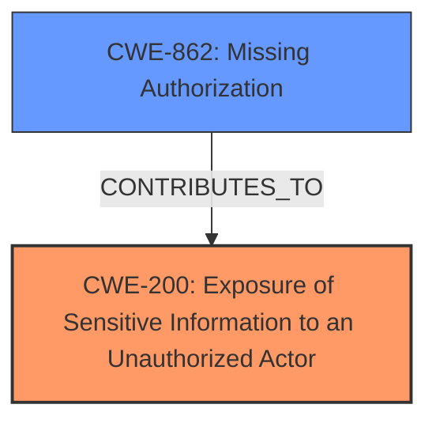

# Raw Analyzer Response for CVE-2024-11153

# Summary
| CWE ID | CWE Name | Confidence | CWE Abstraction Level | CWE Vulnerability Mapping Label | CWE-Vulnerability Mapping Notes |
|---|---|---|---|---|---|
| CWE-200 | Exposure of Sensitive Information to an Unauthorized Actor | 0.8 | Class | Primary | Allowed, root cause |
| CWE-862 | Missing Authorization | 0.6 | Class | Secondary | Allowed-with-Review, contributes to the vulnerability |

## Evidence and Confidence

*   **Confidence Score:** 0.7
*   **Evidence Strength:** MEDIUM

## Relationship Analysis
The primary relationship is that CWE-200 [Exposure of Sensitive Information to an Unauthorized Actor] is a general class of weakness. The specific cause involves content being exposed through the search feature, suggesting a potential link to authorization issues. While CWE-200 is a class-level CWE, it aligns well with the vulnerability description. CWE-862 [Missing Authorization] could be a contributing factor, as the search functionality might lack proper checks to ensure users only see content they are authorized to access, and is more specific than other candidates.

## Vulnerability Chain
The vulnerability chain starts with a **missing authorization** check (CWE-862) within the WordPress plugin's search functionality. This **allows sensitive information** to be accessed by unauthorized actors (CWE-200) through the search results. The root cause is the **lack of proper access control** on content indexed and displayed via the search feature.

## Summary of Analysis
The initial assessment identified **Sensitive Information Exposure** as the main weakness. The provided evidence, specifically the changelog description of CVE-2024-11153 and the vulnerability description key phrases, supports this. The explicit admin consent requirement suggests a **missing authorization** component contributing to the exposure.

CWE-200 [Exposure of Sensitive Information to an Unauthorized Actor] is selected as the primary CWE because it accurately describes the vulnerability's impact: sensitive data is being exposed to unauthorized individuals through the WordPress search feature.

CWE-862 [Missing Authorization] is chosen as a secondary CWE because the fix implemented (explicit admin consent) directly relates to authorization, indicating that the search functionality was missing proper access control checks.

The selected CWEs are at an appropriate level of specificity, with CWE-200 being a class-level CWE and CWE-862 being a class-level CWE, but with clear indication of missing authorization in the fix.

CWE-79 [Improper Neutralization of Input During Web Page Generation ('Cross-site Scripting')] was considered, but it's not relevant because the vulnerability is related to information exposure due to **missing authorization**, not input handling.

CWE-352 [Cross-Site Request Forgery (CSRF)] was considered but is also not applicable because the vulnerability does not involve CSRF.

CWE-434 [Unrestricted Upload of File with Dangerous Type] was considered, but it's not relevant because the vulnerability is not related to file uploads.