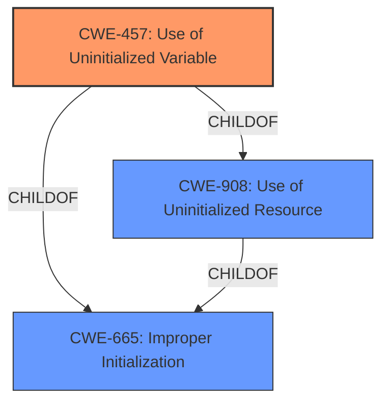

# Raw Analyzer Response for CVE-2024-11158

# Summary
| CWE ID | CWE Name | Confidence | CWE Abstraction Level | CWE Vulnerability Mapping Label | CWE-Vulnerability Mapping Notes |
|---|---|---|---|---|---|
| CWE-457 | Use of Uninitialized Variable | 0.9 | Variant | Allowed | Primary CWE. Matches the root cause described in the vulnerability. |
| CWE-908 | Use of Uninitialized Resource | 0.7 | Base | Allowed | Secondary candidate. A broader categorization of the issue. |

## Evidence and Confidence

*   **Confidence Score:** 0.9
*   **Evidence Strength:** HIGH

## Relationship Analysis
The primary relationship influencing the decision is the hierarchical structure. CWE-457 "Use of Uninitialized Variable" is a Variant of CWE-908 "Use of Uninitialized Resource". Given the explicit mention of an "uninitialized variable" in the vulnerability description, CWE-457 is the more specific and accurate choice. CWE-457 is also a child of the class CWE-665 "Improper Initialization".

## Vulnerability Chain
The vulnerability chain starts with the **uninitialized variable** (CWE-457), leading to potential arbitrary code execution.

CWE-457 -> Arbitrary Code Execution

## Summary of Analysis
The vulnerability description clearly indicates that the root cause is an **uninitialized variable**. The "CVE Reference Links Content Summary" supports this by stating, "The vulnerability is caused by the software accessing a variable before it has been initialized." The "Vulnerability Description Key Phrases" also highlights "**uninitialized variable**" as the root cause.

Based on this evidence, the primary CWE is CWE-457 "Use of Uninitialized Variable". This is a Variant-level CWE, offering a more specific classification than its parent, CWE-908 "Use of Uninitialized Resource", which is a Base-level CWE. While CWE-908 could also apply, CWE-457 more precisely captures the nature of the **weakness**.

The Retriever results list CWE-457 as the top result, further solidifying this choice. The mapping guidance for CWE-457 allows its usage, and the rationale confirms that Variant-level CWEs are preferred.

CWE-787 "Out-of-bounds Write" was also considered due to its high retriever score, but it doesn't directly represent the root cause of the vulnerability, which is the **use of an uninitialized variable**. The arbitrary code execution is a potential consequence, but not the primary flaw.

Relevant CWE Information:
# Enhanced Context (25 CWEs)
The following CWEs were identified as potentially relevant to this vulnerability:

## CWE-457: Use of Uninitialized Variable
**Abstraction Level**: Variant
**Similarity Score**: 0.75
**Source**: dense

**Description**:
The code uses a variable that has not been initialized, leading to unpredictable or unintended results.

**Mapping Guidance**:
- Usage: Allowed
- Rationale: This CWE entry is at the Variant level of abstraction, which is a preferred level of abstraction for mapping to the root causes of vulnerabilities.