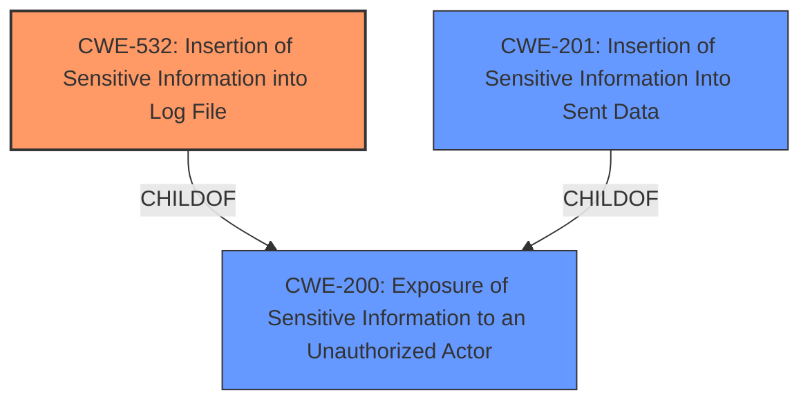

# Analysis Report for CVE-2024-11165

# Vulnerability Analysis Report: CVE-2024-11165

## Description

An **information disclosure vulnerability** exists in the backup configuration process where the SAS token is not masked in the configuration response. This oversight results in sensitive information leakage within the yb_backup log files, exposing the SAS token in plaintext. The leakage occurs during the backup procedure, leading to potential unauthorized access to resources associated with the SAS token.This issue affects YugabyteDB Anywhere from 2.20.0.0 before 2.20.7.0, from 2.23.0.0 before 2.23.1.0, from 2024.1.0.0 before 2024.1.3.0.

## Vulnerability Description Key Phrases

- **Weakness:** information disclosure vulnerability
- **Impact:** ['expose SAS token in plaintext', 'information disclosure']
- **Product:** YugabyteDB Anywhere
- **Version:** ['2.20.0.0 before 2.20.7.0', 'from 2.23.0.0 before 2.23.1.0', 'from 2024.1.0.0 before 2024.1.3.0']
- **Component:** backup configuration process

## Analysis (with Relationship Data)

# Summary
| CWE ID | CWE Name | Confidence | CWE Abstraction Level | CWE Vulnerability Mapping Label | CWE-Vulnerability Mapping Notes |
|---|---|---|---|---|---|
| CWE-532 | Insertion of Sensitive Information into Log File | 1.0 | Base | Allowed | Primary CWE: The SAS token was written to the log file |
| CWE-201 | Insertion of Sensitive Information Into Sent Data | 0.7 | Base | Allowed | Secondary Candidate: The SAS token was sent in the response data |
| CWE-200 | Exposure of Sensitive Information to an Unauthorized Actor | 0.5 | Class | Discouraged | Secondary Candidate: The SAS token was exposed, leading to information disclosure |

## Evidence and Confidence

*   **Confidence Score:** 0.9
*   **Evidence Strength:** HIGH

## Relationship Analysis
The primary weakness is the **insertion of sensitive information into a log file (CWE-532)**, which is a specific case of **exposure of sensitive information (CWE-200)**. The data was also **inserted into sent data (CWE-201)**. The chosen CWEs are at the Base and Class level, providing a good balance of specificity and broad applicability.



## Vulnerability Chain
The vulnerability chain starts with the **root cause** of **improper handling of sensitive information**, leading to **CWE-532 (Insertion of Sensitive Information into Log File)**, and **CWE-201 (Insertion of Sensitive Information Into Sent Data)**. The impact is **CWE-200 (Exposure of Sensitive Information to an Unauthorized Actor)**.

## Summary of Analysis
The primary focus is on **CWE-532 (Insertion of Sensitive Information into Log File)** because the vulnerability description and the CVE reference summary both mention the SAS token being written to the log file. The **Vulnerability Description** states "This oversight results in sensitive information leakage within the yb_backup log files, exposing the SAS token in plaintext".
The CVE Reference Links Content Summary supports this claim: "SAS tokens, which contain sensitive information including a signature (`sig` parameter), were being logged and exposed in backup responses and v1 backup logs without redaction."

**CWE-201 (Insertion of Sensitive Information Into Sent Data)** is a secondary candidate because the vulnerability description also mentions the SAS token being present in the configuration response: "An **information disclosure vulnerability** exists in the backup configuration process where the SAS token is not masked in the configuration response."

**CWE-200 (Exposure of Sensitive Information to an Unauthorized Actor)** is also added to represent the resulting **information disclosure**. However, according to MITRE, it is better to focus on the root cause rather than the impact.

The selected CWEs are at the optimal level of specificity because they accurately describe the **root cause** and the resulting impact of the vulnerability.

Relevant CWE Information:

# Enhanced Context (25 CWEs)
The following CWEs were identified as potentially relevant to this vulnerability:

## CWE-532: Insertion of Sensitive Information into Log File
**Abstraction Level**: Base
**Similarity Score**: 0.73
**Source**: dense

**Description**:
The product writes sensitive information to a log file.

**Mapping Guidance**:
- Usage: Allowed
- Rationale: This CWE entry is at the Base level of abstraction, which is a preferred level of abstraction for mapping to the root causes of vulnerabilities.

## CWE-497: Exposure of Sensitive System Information to an Unauthorized Control Sphere
**Abstraction Level**: Base
**Similarity Score**: 0.72
**Source**: dense

**Description**:
The product does not properly prevent sensitive system-level information from being accessed by unauthorized actors who do not have the same level of access to the underlying system as the product does.

**Mapping Guidance**:
- Usage: Allowed
- Rationale: This CWE entry is at the Base level of abstraction, which is a preferred level of abstraction for mapping to the root causes of vulnerabilities.

## CWE-200: Exposure of Sensitive Information to an Unauthorized Actor
**Abstraction Level**: Class
**Similarity Score**: 0.71
**Source**: dense

**Description**:
The product exposes sensitive information to an actor that is not explicitly authorized to have access to that information.

**Mapping Guidance**:
- Usage: Discouraged
- Rationale: CWE-200 is commonly misused to represent the loss of confidentiality in a vulnerability, but confidentiality loss is a technical impact - not a root cause error. As of CWE 4.9, over 400 CWE entries can lead to a loss of confidentiality. Other options are often available. [REF-1287].

## CWE-212: Improper Removal of Sensitive Information Before Storage or Transfer
**Abstraction Level**: Base
**Similarity Score**: 0.71
**Source**: dense

**Description**:
The product stores, transfers, or shares a resource that contains sensitive information, but it does not properly remove that information before the product makes the resource available to unauthorized actors.

**Mapping Guidance**:
- Usage: Allowed
- Rationale: This CWE entry is at the Base level of abstraction, which is a preferred level of abstraction for mapping to the root causes of vulnerabilities.

## CWE-538: Insertion of Sensitive Information into Externally-Accessible File or Directory
**Abstraction Level**: Base
**Similarity Score**: 0.71
**Source**: dense

**Description**:
The product places sensitive information into files or directories that are accessible to actors who are allowed to have access to the files, but not to the sensitive information.

**Mapping Guidance**:
- Usage: Allowed
- Rationale: This CWE entry is at the Base level of abstraction, which is a preferred level of abstraction for mapping to the root causes of vulnerabilities.

## CWE-209: Generation of Error Message Containing Sensitive Information
**Abstraction Level**: Base
**Similarity Score**: 0.70
**Source**: dense

**Description**:
The product generates an error message that includes sensitive information about its environment, users, or associated data.

**Mapping Guidance**:
- Usage: Allowed
- Rationale: This CWE entry is at the Base level of abstraction, which is a preferred level of abstraction for mapping to the root causes of vulnerabilities.

## CWE-201: Insertion of Sensitive Information Into Sent Data
**Abstraction Level**: Base
**Similarity Score**: 0.70
**Source**: dense

**Description**:
The code transmits data to another actor, but a portion of the data includes sensitive information that should not be accessible to that actor.

**Mapping Guidance**:
- Usage: Allowed
- Rationale: This CWE entry is at the Base level of abstraction, which is a preferred level of abstraction for mapping to the root causes of vulnerabilities.

## CWE-522: Insufficiently Protected Credentials
**Abstraction Level**: Class
**Similarity Score**: 0.69
**Source**: dense

**Description**:
The product transmits or stores authentication credentials, but it uses an insecure method that is susceptible to unauthorized interception and/or retrieval.

**Mapping Guidance**:
- Usage: Allowed-with-Review
- Rationale: This CWE entry is a Class and might have Base-level children that would be more appropriate

## CWE-303: Incorrect Implementation of Authentication Algorithm
**Abstraction Level**: Base
**Similarity Score**: 0.69
**Source**: dense

**Description**:
The requirements for the product dictate the use of an established authentication algorithm, but the implementation of the algorithm is incorrect.

**Mapping Guidance**:
- Usage: Allowed
- Rationale: This CWE entry is at the Base level of abstraction, which is a preferred level of abstraction for mapping to the root causes of vulnerabilities.

## CWE-204: Observable Response Discrepancy
**Abstraction Level**: Base
**Similarity Score**: 0.69
**Source**: dense

**Description**:
The product provides different responses to incoming requests in a way that reveals internal state information to an unauthorized actor outside of the intended control sphere.

**Mapping Guidance**:
- Usage: Allowed
- Rationale: This CWE entry is at the Base level of abstraction, which is a preferred level of abstraction for mapping to the root causes of vulnerabilities.

## CWE-532: Insertion of Sensitive Information into Log File
**Abstraction Level**: Base
**Similarity Score**: 1019.29
**Source**: sparse

**Description**:
The product writes sensitive information to a log file.

**Mapping Guidance**:
- Usage: Allowed
- Rationale: This CWE entry is at the Base level of abstraction, which


## CWE Relationship Analysis

Current CWEs represent these abstraction levels: .


### Vulnerability Chain Analysis

**Chain starting from CWE-201:**
- 201 (Insertion of Sensitive Information Into Sent Data) - ROOT


**Chain starting from CWE-532:**
- 532 (Insertion of Sensitive Information into Log File) - ROOT


### CWE Relationship Diagram

```mermaid
graph TD
    classDef primary fill:#f96,stroke:#333,stroke-width:2px
    classDef secondary fill:#69f,stroke:#333
    classDef tertiary fill:#9e9,stroke:#333
```


*Report generated on 2025-07-13 01:04:45*
