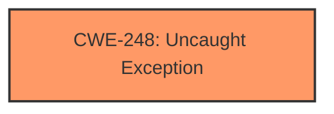

# Analysis Report for CVE-2024-11172

# Vulnerability Analysis Report: CVE-2024-11172

## Description

A vulnerability in danny-avila/librechat version git a1647d7 allows an unauthenticated attacker to cause a denial of service by sending a crafted payload to the server. The middleware `checkBan` is not surrounded by a try-catch block, and an **unhandled exception** will cause the server to crash. This issue is fixed in version 0.7.6.

## Vulnerability Description Key Phrases

- **Component:** checkBan middleware
- **Vector:** crafted payload
- **Weakness:** unhandled exception
- **Product:** danny-avila/librechat
- **Impact:** cause a denial of service, unhandled exception will cause the server to crash
- **Attacker:** unauthenticated attacker
- **Version:** git a1647d7

## Analysis (with Relationship Data)

# Summary
| CWE ID | CWE Name | Confidence | CWE Abstraction Level | CWE Vulnerability Mapping Label | CWE-Vulnerability Mapping Notes |
|---|---|---|---|---|---|
| CWE-248 | Uncaught Exception | 1.0 | Base | Allowed | Primary CWE. The root cause is an unhandled exception, leading to a crash. |

## Evidence and Confidence

*   **Confidence Score:** 1.0
*   **Evidence Strength:** HIGH

## Relationship Analysis
The primary relationship to consider is that CWE-248 [CWE-248: Uncaught Exception] can lead to a denial of service (DoS). While CWE-703 [CWE-703: Improper Check or Handling of Exceptional Conditions] and CWE-755 [CWE-755: Improper Handling of Exceptional Conditions] are related to exception handling, they are too abstract. CWE-248 [CWE-248: Uncaught Exception] directly addresses the core issue of an unhandled exception causing a crash.



## Vulnerability Chain
The vulnerability chain is straightforward:
1.  The `checkBan` middleware lacks a try-catch block.
2.  A crafted payload triggers an exception.
3.  The exception is uncaught (CWE-248 [CWE-248: Uncaught Exception]).
4.  The server crashes, resulting in a denial of service.

## Summary of Analysis
The vulnerability description clearly states that an **unhandled exception** in the `checkBan` middleware causes the server to crash. The CVE reference links content summary confirms the **lack of error handling** as the root cause. The mitigation involves adding a `try...catch` block to prevent the crash.

The Retriever Results list CWE-248 [CWE-248: Uncaught Exception] as the top candidate, further supporting this classification. While other CWEs like CWE-755 [CWE-755: Improper Handling of Exceptional Conditions] (Improper Handling of Exceptional Conditions) are related to exception handling, CWE-248 [CWE-248: Uncaught Exception] is the most specific and accurate representation of the **root cause**. The evidence directly supports CWE-248 [CWE-248: Uncaught Exception] at the Base level of abstraction.

The selected CWE-248 [CWE-248: Uncaught Exception] is at the optimal level of specificity, as it directly addresses the **unhandled exception** that leads to the denial of service.


## CWE Relationship Analysis

Current CWEs represent these abstraction levels: .


### Vulnerability Chain Analysis

**Chain starting from CWE-248:**
- 248 (Uncaught Exception) - ROOT


**Chain starting from CWE-703:**
- 703 (Improper Check or Handling of Exceptional Conditions) - ROOT


### CWE Relationship Diagram

```mermaid
graph TD
    classDef primary fill:#f96,stroke:#333,stroke-width:2px
    classDef secondary fill:#69f,stroke:#333
    classDef tertiary fill:#9e9,stroke:#333
```


*Report generated on 2025-07-13 01:05:32*
