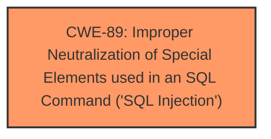

# Analysis for CVE-2024-11179

# Summary
| CWE ID | CWE Name | Confidence | CWE Abstraction Level | CWE Vulnerability Mapping Label | CWE-Vulnerability Mapping Notes |
|---|---|---|---|---|---|
| CWE-89 | Improper Neutralization of Special Elements used in an SQL Command ('SQL Injection') | 1.0 | Base | Allowed | Primary CWE. The root cause is **insufficient escaping** leading to SQL injection. |

## Evidence and Confidence

*   **Confidence Score:** 1.0
*   **Evidence Strength:** HIGH

## Relationship Analysis
The primary relationship that influenced the decision was the direct match of the vulnerability description to the CWE-89 specification. The vulnerability involves **insufficient escaping** of user-supplied input which leads to the construction of malicious SQL queries. CWE-89 is a base-level CWE which is preferred. No other relationships (parent-child, chain, peer) altered this assessment.

## Vulnerability Chain
The vulnerability chain starts with the **insufficient escaping** of the `status_type` parameter. This leads to the ability to inject malicious SQL code, which then allows an attacker to extract sensitive information from the database. The chain is:
1.  **Insufficient Escaping** (part of CWE-89)
2.  **SQL Injection** (CWE-89)
3.  **Information Disclosure** (Impact)

The primary CWE is CWE-89, as it represents the root cause of the vulnerability.

## Summary of Analysis
The analysis is based on the provided evidence. The vulnerability description clearly states that the root cause is **insufficient escaping** on the user supplied parameter and lack of sufficient preparation on the existing SQL query, leading to **SQL injection**. The `CVE Reference Links Content Summary` section further supports this by detailing the **insufficient sanitization** and validation of the `status_type` parameter, allowing injection of arbitrary SQL code.

The Retriever Results also list CWE-89 as the top candidate, with a score of 1.0.

The selected CWE, CWE-89, is at the optimal level of specificity (Base) as it directly represents the root cause of the vulnerability.

Relevant CWE Information:

# Enhanced Context (25 CWEs)
The following CWEs were identified as potentially relevant to this vulnerability:

## CWE-352: Cross-Site Request Forgery (CSRF)
**Abstraction Level**: Compound
**Similarity Score**: 0.73
**Source**: dense

**Description**:
The web application does not, or can not, sufficiently verify whether a well-formed, valid, consistent request was intentionally provided by the user who submitted the request.

**Mapping Guidance**:
- Usage: Allowed
- Rationale: This is a well-known Composite of multiple weaknesses that must all occur simultaneously, although it is attack-oriented in nature.

*Reason for not selecting:* This vulnerability is not related to CSRF. CSRF is a separate class of vulnerability.

## CWE-116: Improper Encoding or Escaping of Output
**Abstraction Level**: Class
**Similarity Score**: 0.71
**Source**: dense

**Description**:
The product prepares a structured message for communication with another component, but encoding or escaping of the data is either missing or done incorrectly. As a result, the intended structure of the message is not preserved.

**Mapping Guidance**:
- Usage: Allowed-with-Review
- Rationale: This CWE entry is a Class and might have Base-level children that would be more appropriate

*Reason for not selecting:* While **insufficient escaping** is a component, the more specific CWE-89 captures the entire attack.

## CWE-862: Missing Authorization
**Abstraction Level**: Class
**Similarity Score**: 0.71
**Source**: dense

**Description**:
The product does not perform an authorization check when an actor attempts to access a resource or perform an action.

**Mapping Guidance**:
- Usage: Allowed-with-Review
- Rationale: This CWE entry is a Class and might have Base-level children that would be more appropriate

*Reason for not selecting:* The vulnerability description mentions that authenticated attackers can exploit the vulnerability. This means that authorization exists but is bypassed due to the SQL injection, making CWE-862 less relevant.

## CWE-79: Improper Neutralization of Input During Web Page Generation ('Cross-site Scripting')
**Abstraction Level**: Base
**Similarity Score**: 0.70
**Source**: dense

**Description**:
The product does not neutralize or incorrectly neutralizes user-controllable input before it is placed in output that is used as a web page that is served to other users.

**Mapping Guidance**:
- Usage: Allowed
- Rationale: This CWE entry is at the Base level of abstraction, which is a preferred level of abstraction for mapping to the root causes of vulnerabilities.

*Reason for not selecting:* This vulnerability is related to SQL injection, not Cross-Site Scripting (XSS).

## CWE-20: Improper Input Validation
**Abstraction Level**: class
**Similarity Score**: 2.23
**Source**: graph

**Description**:
CWE-20: Improper Input Validation

**Mapping Guidance**:
- Usage: Discouraged
- Rationale: CWE-20 is commonly misused in low-information vulnerability reports when lower-level CWEs could be used instead, or when more details about the vulnerability are available [REF-1287]. It is not useful for trend analysis. It is also a level-1 Class (i.e., a child of a Pillar).

*Reason for not selecting:* While **insufficient escaping** is a form of improper input validation, CWE-89 is a more specific and appropriate choice.