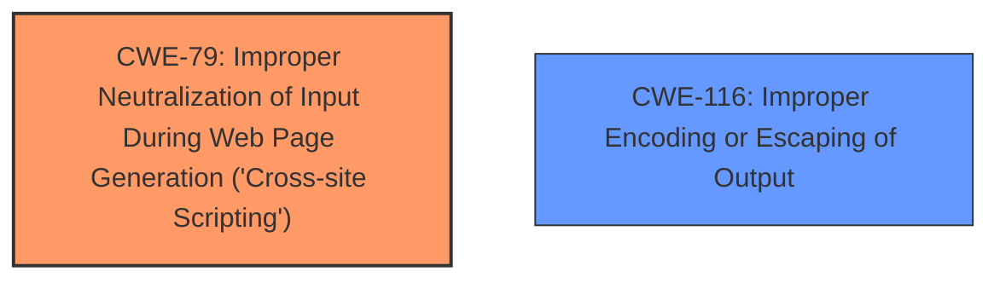

# Analysis Report for CVE-2024-11190

# Vulnerability Analysis Report: CVE-2024-11190

## Description

The jwp-a11y WordPress plugin through 4.1.7 **does not sanitise and escape some of its settings**, which could allow high privilege users such as admin to perform Stored Cross-Site Scripting attacks even when the unfiltered_html capability is disallowed (for example in multisite setup).

## Vulnerability Description Key Phrases

- **Rootcause:** ['does not sanitise and escape some of its settings', 'does not sanitise and escape settings']
- **Weakness:** cross-site scripting
- **Impact:** Stored Cross-Site Scripting attacks
- **Attacker:** high privilege users
- **Product:** jwp-a11y WordPress plugin
- **Version:** through 4.1.7

## Analysis (with Relationship Data)

# Summary
| CWE ID  | CWE Name  | Confidence | CWE Abstraction Level | CWE Vulnerability Mapping Label | CWE-Vulnerability Mapping Notes |
|---|---|---|---|---|---|
| CWE-79 | Improper Neutralization of Input During Web Page Generation ('Cross-site Scripting') | 1 | Base | Allowed | Primary CWE |
| CWE-116 | Improper Encoding or Escaping of Output | 0.7 | Class | Allowed-with-Review | Secondary Candidate |

## Evidence and Confidence

*   **Confidence Score:** 0.8
*   **Evidence Strength:** HIGH

## Relationship Analysis
The primary relationship is that CWE-79 is a base class that describes the **improper neutralization** which leads to cross-site scripting. CWE-116 is a class-level description of **improper encoding or escaping of output**, which is a common method of neutralization, and thus can be related to CWE-79, but less directly than a parent-child relationship. The abstraction levels influenced the selection, opting for a more specific base class (CWE-79) where the evidence supported it.



## Vulnerability Chain
The vulnerability chain starts with the **lack of sanitization and escaping** of settings. This leads to **improper neutralization**, and ultimately results in Stored Cross-Site Scripting attacks. The root cause is the **improper neutralization**, manifested as the lack of sanitization and escaping.

## Summary of Analysis
The vulnerability description clearly states that the plugin **does not sanitise and escape some of its settings**, leading to Stored Cross-Site Scripting (XSS) attacks. The keyphrase analysis points to CWE-79, Improper Neutralization of Input During Web Page Generation ('Cross-site Scripting'), as the most relevant CWE for the **cross-site scripting weakness**. This is because the **lack of sanitization and escaping** directly results in the ability to inject malicious scripts into web pages viewed by other users.

The choice of CWE-79 is strongly supported by the description, which explicitly mentions the vulnerability allows XSS due to the **lack of sanitization and escaping** of settings. This aligns perfectly with CWE-79's description: "The product does not neutralize or incorrectly neutralizes user-controllable input before it is placed in output that is used as a web page that is served to other users."

CWE-116, Improper Encoding or Escaping of Output, was also considered because the description mentions the **lack of escaping**. However, CWE-79 is a more direct representation of the XSS vulnerability, making it the primary CWE. CWE-116 can be considered a secondary weakness as the **lack of proper escaping** contributes to the **improper neutralization**.

The selected CWEs are at the optimal level of specificity. CWE-79 is a Base level CWE, providing a clear and specific description of the vulnerability. More generic CWEs like CWE-707 (Improper Neutralization) would be too high-level and would not capture the specific nature of the XSS vulnerability.

Relevant CWE Information:

# Enhanced Context (25 CWEs)
The following CWEs were identified as potentially relevant to this vulnerability:

## CWE-352: Cross-Site Request Forgery (CSRF)
**Abstraction Level**: Compound
**Similarity Score**: 0.76
**Source**: dense

**Description**:
The web application does not, or can not, sufficiently verify whether a well-formed, valid, consistent request was intentionally provided by the user who submitted the request.

**Mapping Guidance**:
- Usage: Allowed
- Rationale: This is a well-known Composite of multiple weaknesses that must all occur simultaneously, although it is attack-oriented in nature.

*Not Selected*: This CWE is related to request forgery, which is not the primary issue described in the vulnerability.

## CWE-425: Direct Request ('Forced Browsing')
**Abstraction Level**: Base
**Similarity Score**: 0.75
**Source**: dense

**Description**:
The web application does not adequately enforce appropriate authorization on all restricted URLs, scripts, or files.

**Mapping Guidance**:
- Usage: Allowed
- Rationale: This CWE entry is at the Base level of abstraction, which is a preferred level of abstraction for mapping to the root causes of vulnerabilities.

*Not Selected*: This CWE is related to authorization, which is not the primary issue described in the vulnerability.

## CWE-80: Improper Neutralization of Script-Related HTML Tags in a Web Page (Basic XSS)
**Abstraction Level**: Variant
**Similarity Score**: 0.74
**Source**: dense

**Description**:
The product receives input from an upstream component, but it does not neutralize or incorrectly neutralizes special characters such as "<", ">", and "&" that could be interpreted as web-scripting elements when they are sent to a downstream component that processes web pages.

**Mapping Guidance**:
- Usage: Allowed
- Rationale: This CWE entry is at the Variant level of abstraction, which is a preferred level of abstraction for mapping to the root causes of vulnerabilities.

*Not Selected*: This is a variant of CWE-79, but the description doesn't specify the vulnerability is limited to only neutralizing HTML tags.

## CWE-472: External Control of Assumed-Immutable Web Parameter
**Abstraction Level**: Base
**Similarity Score**: 0.74
**Source**: dense

**Description**:
The web application does not sufficiently verify inputs that are assumed to be immutable but are actually externally controllable, such as hidden form fields.

**Mapping Guidance**:
- Usage: Allowed
- Rationale: This CWE entry is at the Base level of abstraction, which is a preferred level of abstraction for mapping to the root causes of vulnerabilities.

*Not Selected*: This CWE is not directly related to the described vulnerability.

## CWE-116: Improper Encoding or Escaping of Output
**Abstraction Level**: Class
**Similarity Score**: 0.73
**Source**: dense

**Description**:
The product prepares a structured message for communication with another component, but encoding or escaping of the data is either missing or done incorrectly. As a result, the intended structure of the message is not preserved.

**Mapping Guidance**:
- Usage: Allowed-with-Review
- Rationale: This CWE entry is a Class and might have Base-level children that would be more appropriate

*Selected as Secondary*: The **lack of escaping** contributes to the **improper neutralization** that leads to the XSS vulnerability.

## CWE-434: Unrestricted Upload of File with Dangerous Type
**Abstraction Level**: Base
**Similarity Score**: 0.73
**Source**: dense

**Description**:
The product allows the upload or transfer of dangerous file types that are automatically processed within its environment.

**Mapping Guidance**:
- Usage: Allowed
- Rationale: This CWE entry is at the Base level of abstraction, which is a preferred level of abstraction for mapping to the root causes of vulnerabilities.

*Not Selected*: This CWE is not related to the described vulnerability.

## CWE-178: Improper Handling of Case Sensitivity
**Abstraction Level**: Base
**Similarity Score**: 0.72
**Source**: dense

**Description**:
The product does not properly account for differences in case sensitivity when accessing or determining the properties of a resource, leading to inconsistent results.

**Mapping Guidance**:
- Usage: Allowed
- Rationale: This CWE entry is at the Base level of abstraction, which is a preferred level of abstraction for mapping to the root causes of vulnerabilities.

*Not Selected*: This CWE is not related to the described vulnerability.

## CWE-138: Improper Neutralization of Special Elements
**Abstraction Level**: Class
**Similarity Score**: 0.72
**Source**: dense

**Description**:
The product receives input from an upstream component, but it does not neutralize or incorrectly neutralizes special elements that could be interpreted as control elements or syntactic markers when they are sent to a downstream component.

**Mapping Guidance**:
- Usage: Discouraged
- Rationale: This CWE entry is a level-1 Class (i.e., a child of a Pillar). It might have lower-level children that would be more appropriate

*Not Selected*: This CWE is too generic and does not provide enough specificity for the vulnerability.

## CWE-184: Incomplete List of Disallowed Inputs
**Abstraction Level**: Base
**Similarity Score**: 0.72
**Source**: dense

**Description**:
The product implements a protection mechanism that relies on a list of inputs (or properties of inputs) that are not allowed by policy or otherwise require other action to neutralize before additional processing takes place, but the list is incomplete.

**Mapping Guidance**:
- Usage: Allowed
- Rationale: This CWE entry is at the Base level of abstraction, which is a preferred level of abstraction for mapping to the root causes of vulnerabilities.

*Not Selected*: This CWE does not align with the vulnerability, which involves a **lack of


## CWE Relationship Analysis

Current CWEs represent these abstraction levels: .


### Vulnerability Chain Analysis

**Chain starting from CWE-116:**
- 116 (Improper Encoding or Escaping of Output) - ROOT


**Chain starting from CWE-80:**
- 80 (Improper Neutralization of Script-Related HTML Tags in a Web Page (Basic XSS)) - ROOT


### CWE Relationship Diagram

```mermaid
graph TD
    classDef primary fill:#f96,stroke:#333,stroke-width:2px
    classDef secondary fill:#69f,stroke:#333
    classDef tertiary fill:#9e9,stroke:#333
```


*Report generated on 2025-07-13 01:06:48*
