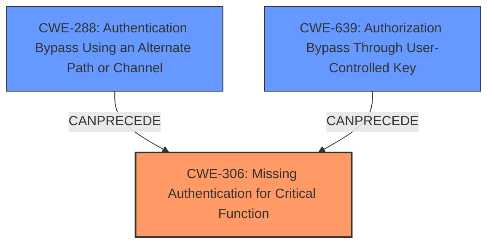

# Analysis for CVE-2024-11197

# Summary
| CWE ID | CWE Name | Confidence | CWE Abstraction Level | CWE Vulnerability Mapping Label | CWE-Vulnerability Mapping Notes |
|---|---|---|---|---|---|
| CWE-306 | Missing Authentication for Critical Function | 0.9 | Base | Allowed | Primary CWE: The plugin **does not perform any authentication** for application password logins when the user account is locked, which is a critical function. |
| CWE-288 | Authentication Bypass Using an Alternate Path or Channel | 0.7 | Base | Allowed | Secondary CWE: The plugin has an alternate path (application password logins) that **does not require authentication** when the user account is locked. |
| CWE-639 | Authorization Bypass Through User-Controlled Key | 0.6 | Base | Allowed | Secondary CWE: An attacker can gain access to the system by using an application password, which acts as a key, even when the user's account is locked. |

## Evidence and Confidence

*   **Confidence Score:** 0.8
*   **Evidence Strength:** HIGH

## Relationship Analysis
The primary weakness is the lack of authentication for a critical function, which leads to an authentication bypass. The attacker uses an alternate path (application password logins) to bypass the user lock mechanism. The relationships between these CWEs can be visualized as follows:

## Vulnerability Chain
1.  **Root Cause:** CWE-306 Missing Authentication for Critical Function - The plugin **does not perform any authentication** for application password logins when the user account is locked.
2.  **Weakness:** CWE-288 Authentication Bypass Using an Alternate Path or Channel - Application passwords provide an alternate path that bypasses the intended user lock mechanism.
3.  **Weakness:** CWE-639 Authorization Bypass Through User-Controlled Key - An attacker can use the application password (key) to bypass authorization.
4.  **Impact:** Authenticated attackers can interact with the vulnerable site via APIs despite their account being locked.

## Summary of Analysis
The vulnerability in the Lock User Account plugin for WordPress allows authenticated attackers to bypass the user lock mechanism by using application passwords. The root cause is the **missing authentication** for application password logins when user accounts are locked, which is a critical function. This leads to an authentication bypass, allowing attackers to interact with the vulnerable site despite their account being locked.

The primary CWE is CWE-306 Missing Authentication for Critical Function, as it directly addresses the root cause of the vulnerability. The plugin **does not perform any authentication** for application password logins, which is a critical function that requires authentication.

CWE-288 Authentication Bypass Using an Alternate Path or Channel is a secondary CWE, as it describes how the attacker is able to bypass the user lock mechanism. The application passwords provide an alternate path that bypasses the intended authentication mechanism.

CWE-639 Authorization Bypass Through User-Controlled Key is also a secondary CWE, as it describes how the attacker is able to use the application password (key) to bypass authorization.

The evidence for these CWEs is found in the vulnerability description and the CVE reference links content summary. The vulnerability description states that the plugin permits application password logins when user accounts are locked. The CVE reference links content summary states that the plugin's intended user locking mechanism is bypassed due to the improper handling of application password logins.

The retriever results also support these CWEs, with CWE-306, CWE-288, and CWE-639 all being listed as potential CWEs for this vulnerability.

I considered CWE-863 Incorrect Authorization, CWE-1390 Weak Authentication, and CWE-285 Improper Authorization, but these CWEs are not as specific as CWE-306, CWE-288, and CWE-639. CWE-863 and CWE-285 are class level CWEs that might have more specific children to use. CWE-1390 is a class level CWE and might have base-level children that would be more appropriate.

I also considered CWE-352 Cross-Site Request Forgery (CSRF), but this CWE is not relevant to the vulnerability. The vulnerability **does not** involve cross-site request forgery.