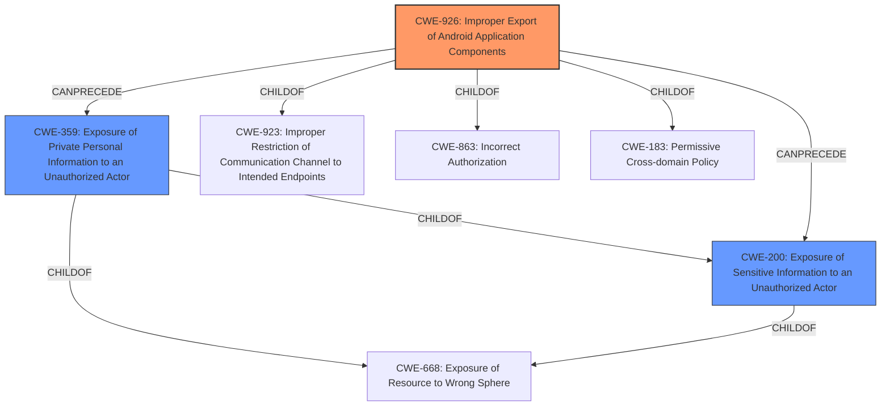

# Enhanced Analysis for CVE-2024-11206

# Summary
| CWE ID | CWE Name | Confidence | CWE Abstraction Level | CWE Vulnerability Mapping Label | CWE-Vulnerability Mapping Notes |
|---|---|---|---|---|---|
| CWE-926 | Improper Export of Android Application Components | 0.8 | Variant | Allowed | Primary CWE |
| CWE-359 | Exposure of Private Personal Information to an Unauthorized Actor | 0.6 | Base | Allowed | Secondary Candidate |
| CWE-200 | Exposure of Sensitive Information to an Unauthorized Actor | 0.5 | Class | Discouraged | Secondary Candidate |

## Evidence and Confidence

*   **Confidence Score:** 0.7
*   **Evidence Strength:** MEDIUM

## Relationship Analysis
The primary relationship influencing the CWE selection is the hierarchical structure, particularly the Variant level of CWE-926 which directly addresses the Android application component exposure. While CWE-359 and CWE-200 are related to information exposure, they are less specific. The chain relationships don't play a significant role here as the focus is on the initial access control issue.



## Vulnerability Chain
The vulnerability chain starts with **Improper Export of Android Application Components (CWE-926)**, leading to **Exposure of Private Personal Information to an Unauthorized Actor (CWE-359)**. The root cause is the misconfiguration of the Android application component, which then results in the information leakage.

## Summary of Analysis
The analysis is based on the vulnerability description stating an **"Unauthorized access vulnerability in the mobile application (com.transsion.phoenix) can lead to the leakage of user information."** The key phrase "Unauthorized access" points to an authorization issue, and the product being a "mobile application" suggests Android-specific vulnerabilities.

CWE-926 is chosen as the primary CWE because it directly addresses the root cause: the improper export of Android application components, leading to unauthorized access. This is a variant level CWE, providing more specificity than broader classes like **CWE-284: Improper Access Control** or **CWE-200: Exposure of Sensitive Information to an Unauthorized Actor**.

CWE-359 is included as a secondary CWE because it represents the direct consequence of the unauthorized access: the exposure of private personal information.

CWE-200 was considered as a secondary option, but it is a more general class of weakness. While the vulnerability does lead to the exposure of sensitive information, the root cause is better captured by CWE-926. Additionally, CWE-200 is discouraged per its mapping guidance, which states "CWE-200 is commonly misused to represent the loss of confidentiality in a vulnerability, but confidentiality loss is a technical impact - not a root cause error."

Other CWEs were considered but deemed less relevant:

*   **CWE-285: Improper Authorization** and **CWE-284: Improper Access Control** are too general and don't capture the Android-specific nature of the vulnerability.
*   **CWE-639: Authorization Bypass Through User-Controlled Key** implies a user-controlled key is involved, which is not evident in the description.
*   **CWE-287: Improper Authentication** focuses on authentication issues, which are not described.
*   **CWE-522: Insufficiently Protected Credentials** suggests that credentials are not adequately protected, which is not mentioned.
*   **CWE-668: Exposure of Resource to Wrong Sphere** is too high-level.
*   **CWE-1272: Sensitive Information Uncleared Before Debug/Power State Transition** is unrelated to the provided vulnerability description.


## CWE Relationship Analysis

Current CWEs represent these abstraction levels: .


### Vulnerability Chain Analysis

**Chain starting from CWE-183:**
- 183 (Permissive List of Allowed Inputs) - ROOT


**Chain starting from CWE-863:**
- 863 (Incorrect Authorization) - ROOT


### CWE Relationship Diagram

```mermaid
graph TD
    classDef primary fill:#f96,stroke:#333,stroke-width:2px
    classDef secondary fill:#69f,stroke:#333
    classDef tertiary fill:#9e9,stroke:#333
```