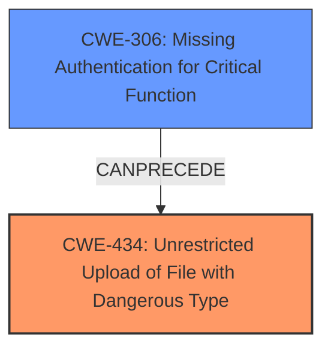

# Analysis Report for CVE-2024-11211

# Vulnerability Analysis Report: CVE-2024-11211

## Description

A vulnerability classified as critical has been found in EyouCMS up to 1.6.7. Affected is an unknown function of the component Website Logo Handler. The manipulation leads to **unrestricted upload**. It is possible to launch the attack remotely. The exploit has been disclosed to the public and may be used. The vendor was contacted early about this disclosure but did not respond in any way.

## Vulnerability Description Key Phrases

- **Weakness:** unrestricted upload
- **Impact:** unrestricted upload
- **Product:** EyouCMS
- **Version:** up to 1.6.7
- **Component:** Website Logo Handler

## Analysis (with Relationship Data)

# Summary

| CWE ID  | CWE Name                                                                     | Confidence | CWE Abstraction Level | CWE Vulnerability Mapping Label | CWE-Vulnerability Mapping Notes |
| :-------- | :--------------------------------------------------------------------------- | :--------- | :---------------------- | :------------------------------ | :-------------------------------- |
| CWE-434 | Unrestricted Upload of File with Dangerous Type                               | 1          | Base                    | Primary                         | Allowed                           |
| CWE-434 | Unrestricted Upload of File with Dangerous Type                               | 0.75         | Base                    | Secondary                       | Allowed                           |
| CWE-306 | Missing Authentication for Critical Function                                 | 0.75         | Base                    | Secondary                       | Allowed                           |

## Evidence and Confidence

*   **Confidence Score:** 0.9
*   **Evidence Strength:** MEDIUM

## Relationship Analysis

The primary CWE is CWE-434, which represents the **unrestricted upload** vulnerability directly. The other candidate CWEs represent related security issues that could either lead to or result from the primary weakness.



## Vulnerability Chain

The vulnerability chain starts with a missing authentication check (CWE-306), leading to the **unrestricted upload** of dangerous files (CWE-434).

## Summary of Analysis

The primary weakness is the **unrestricted upload** vulnerability, which allows attackers to upload dangerous files without proper restrictions. This is directly represented by CWE-434. The description mentions that the component affected is the "Website Logo Handler," indicating that an attacker could potentially upload a malicious file as a website logo.

CWE-434 is the most appropriate because the **root cause** is the **unrestricted upload** itself.

The retriever results also suggest CWE-306, Missing Authentication for Critical Function, which could be related if the upload function lacks proper authentication. This would allow unauthorized users to upload files, exacerbating the vulnerability.

CWE-434 is a Base level CWE, which is the preferred level of abstraction.

Relevant CWE Information:

# Enhanced Context (25 CWEs)
The following CWEs were identified as potentially relevant to this vulnerability:

## CWE-434: Unrestricted Upload of File with Dangerous Type
**Abstraction Level**: Base
**Similarity Score**: 0.80
**Source**: dense

**Description**:
The product allows the upload or transfer of dangerous file types that are automatically processed within its environment.

**Mapping Guidance**:
- Usage: Allowed
- Rationale: This CWE entry is at the Base level of abstraction, which is a preferred level of abstraction for mapping to the root causes of vulnerabilities.

## CWE-306: Missing Authentication for Critical Function
**Abstraction Level**: base
**Similarity Score**: 2.33
**Source**: graph

**Description**:
CWE-306: Missing Authentication for Critical Function

**Mapping Guidance**:
- Usage: Allowed
- Rationale: This CWE entry is at the Base level of abstraction, which is a preferred level of abstraction for mapping to the root causes of vulnerabilities.

CWE-89, CWE-79, CWE-96, and CWE-1336 were considered but not selected because they are related to injection vulnerabilities, which are not directly indicated in the provided description. The core issue is the **unrestricted upload**, not the improper handling of injected code.

CWE-425 was considered but not selected. While forced browsing might be a technique used to access the upload functionality, the **root cause** is still the **unrestricted upload**.


## CWE Relationship Analysis

Current CWEs represent these abstraction levels: .


### Vulnerability Chain Analysis

**Chain starting from CWE-89:**
- 89 (Improper Neutralization of Special Elements used in an SQL Command ('SQL Injection')) - ROOT


**Chain starting from CWE-306:**
- 306 (Missing Authentication for Critical Function) - ROOT


### CWE Relationship Diagram

```mermaid
graph TD
    classDef primary fill:#f96,stroke:#333,stroke-width:2px
    classDef secondary fill:#69f,stroke:#333
    classDef tertiary fill:#9e9,stroke:#333
```


*Report generated on 2025-07-13 01:08:15*
