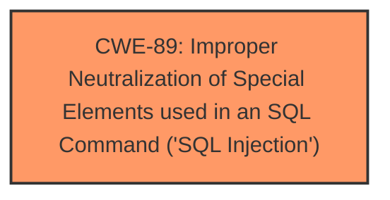

# Analysis for CVE-2024-11241

# Summary
| CWE ID | CWE Name | Confidence | CWE Abstraction Level | CWE Vulnerability Mapping Label | CWE-Vulnerability Mapping Notes |
|---|---|---|---|---|---|
| CWE-89 | Improper Neutralization of Special Elements used in an SQL Command ('SQL Injection') | 1.0 | Base | Primary | Allowed |

## Evidence and Confidence

*   **Confidence Score:** 1.0
*   **Evidence Strength:** HIGH

## Relationship Analysis
The primary relationship that influenced the decision was the direct match of the vulnerability description to CWE-89, which is a Base level CWE. There was no need to explore parent-child relationships for a more specific CWE, as CWE-89 accurately captures the root cause.

## Vulnerability Chain
The vulnerability chain consists of the following:
1.  **Root Cause:** CWE-89 - Improper Neutralization of Special Elements used in an SQL Command ('SQL Injection') due to the direct incorporation of the user-controlled `e` parameter into an SQL query without any sanitization or validation.
2.  **Impact:** Sensitive Information Disclosure, Remote Code Execution (RCE), Database Manipulation.

## Summary of Analysis
The analysis is based on the provided evidence from the vulnerability description and CVE reference links. The vulnerability lies in the **lack of sanitization** of the 'e' parameter in the reset.php file, leading to a direct **SQL injection** vulnerability (CWE-89). The 'CVE Reference Links Content Summary' explicitly states this, "The vulnerability stems from directly incorporating the user-controlled `e` parameter into an SQL query without any sanitization or validation."

The retriever results also strongly support CWE-89 as the primary weakness with a score of 1.0.

Other CWEs were considered, but ultimately deemed less relevant:

*   CWE-79 (Improper Neutralization of Input During Web Page Generation ('Cross-site Scripting')): While potentially a secondary impact if the SQL injection leads to modified web page content, it is not the root cause.
*   CWE-434 (Unrestricted Upload of File with Dangerous Type): This is a potential impact of successful SQL injection leading to RCE by writing a PHP shell, but not the root cause.
*   CWE-74 (Improper Neutralization of Special Elements in Output Used by a Downstream Component ('Injection')): This is a more general case of injection and CWE-89 is more specific.

The selection of CWE-89 is at the optimal level of specificity, as it directly addresses the **SQL injection** vulnerability caused by **improper neutralization**.