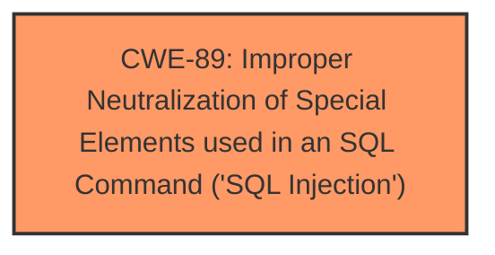

# Raw Analyzer Response for CVE-2024-11257

# Summary
| CWE ID | CWE Name | Confidence | CWE Abstraction Level | CWE Vulnerability Mapping Label | CWE-Vulnerability Mapping Notes |
|---|---|---|---|---|---|
| CWE-89 | Improper Neutralization of Special Elements used in an SQL Command ('SQL Injection') | 1.0 | Base | Allowed | Primary CWE. The vulnerability involves the lack of proper input sanitization of the 'email' parameter in the `admin/forgot-password.php` file, leading to SQL injection. |

## Evidence and Confidence

*   **Confidence Score:** 1.0
*   **Evidence Strength:** HIGH

## Relationship Analysis
The primary relationship is the direct mapping of the vulnerability to CWE-89, which is at the Base level of abstraction. There are no direct parent-child or chain relationships that significantly influenced the decision in this case, as the evidence points directly to SQL Injection as the root cause. The other suggested CWEs were considered, but were not as strongly supported by the evidence.

## Vulnerability Chain
The vulnerability chain is relatively straightforward:
1.  **Root Cause:** Lack of input validation and sanitization for the 'email' parameter in `/admin/forgot-password.php`.
2.  **Weakness:** Improper Neutralization of Special Elements used in an SQL Command ('SQL Injection') (CWE-89).
3.  **Impact:** Unauthorized database access, sensitive data leakage, data tampering, potential system control, and service interruption.

## Summary of Analysis
The analysis is primarily based on the provided evidence, specifically the "CVE Reference Links Content Summary" section and the "Vulnerability Description Key Phrases" indicating **SQL Injection** as the **weakness**. The description clearly states that manipulation of the 'email' argument leads to **SQL Injection** in the `/admin/forgot-password.php` file.

The selection of CWE-89 is based on its direct relevance to the vulnerability description and the clear evidence of **SQL Injection**. The CWE is also at the Base level of abstraction, which is preferred for mapping root causes.

The retriever results strongly support this selection, with CWE-89 having a score of 1.0.

Relevant CWE Information:

# Enhanced Context (25 CWEs)
The following CWEs were identified as potentially relevant to this vulnerability:

## CWE-472: External Control of Assumed-Immutable Web Parameter
**Abstraction Level**: Base
**Similarity Score**: 0.79
**Source**: dense

**Description**:
The web application does not sufficiently verify inputs that are assumed to be immutable but are actually externally controllable, such as hidden form fields.

**Mapping Guidance**:
- Usage: Allowed
- Rationale: This CWE entry is at the Base level of abstraction, which is a preferred level of abstraction for mapping to the root causes of vulnerabilities.

*   **Why Not Used:** While external control of parameters is present, the core issue is the **improper neutralization** leading to SQL injection, making CWE-89 a more precise fit.

## CWE-89: Improper Neutralization of Special Elements used in an SQL Command ('SQL Injection')
**Abstraction Level**: Base
**Similarity Score**: 0.79
**Source**: dense

**Description**:
The product constructs all or part of an SQL command using externally-influenced input from an upstream component, but it does not neutralize or incorrectly neutralizes special elements that could modify the intended SQL command when it is sent to a downstream component. Without sufficient removal or quoting of SQL syntax in user-controllable inputs, the generated SQL query can cause those inputs to be interpreted as SQL instead of ordinary user data.

**Mapping Guidance**:
- Usage: Allowed
- Rationale: This CWE entry is at the Base level of abstraction, which is a preferred level of abstraction for mapping to the root causes of vulnerabilities.

*   **Why Used:** This is the primary CWE because the description explicitly mentions **SQL injection** due to **improper neutralization** of the 'email' parameter.

## CWE-425: Direct Request ('Forced Browsing')
**Abstraction Level**: Base
**Similarity Score**: 0.78
**Source**: dense

**Description**:
The web application does not adequately enforce appropriate authorization on all restricted URLs, scripts, or files.

**Mapping Guidance**:
- Usage: Allowed
- Rationale: This CWE entry is at the Base level of abstraction, which is a preferred level of abstraction for mapping to the root causes of vulnerabilities.

*   **Why Not Used:** This CWE relates to authorization issues, which are not the primary concern in this vulnerability.

## CWE-434: Unrestricted Upload of File with Dangerous Type
**Abstraction Level**: Base
**Similarity Score**: 0.78
**Source**: dense

**Description**:
The product allows the upload or transfer of dangerous file types that are automatically processed within its environment.

**Mapping Guidance**:
- Usage: Allowed
- Rationale: This CWE entry is at the Base level of abstraction, which is a preferred level of abstraction for mapping to the root causes of vulnerabilities.

*   **Why Not Used:** This CWE is not relevant as the vulnerability does not involve file uploads.

## CWE-74: Improper Neutralization of Special Elements in Output Used by a Downstream Component ('Injection')
**Abstraction Level**: Class
**Similarity Score**: 0.78
**Source**: dense

**Description**:
The product constructs all or part of a command, data structure, or record using externally-influenced input from an upstream component, but it does not neutralize or incorrectly neutralizes special elements that could modify how it is parsed or interpreted when it is sent to a downstream component.

**Mapping Guidance**:
- Usage: Discouraged
- Rationale: CWE-74 is high-level and often misused when lower-level weaknesses are more appropriate.

*   **Why Not Used:** While this is a general injection CWE, CWE-89 is more specific to **SQL injection**, making it a better fit.

## CWE-80: Improper Neutralization of Script-Related HTML Tags in a Web Page (Basic XSS)
**Abstraction Level**: Variant
**Similarity Score**: 0.77
**Source**: dense

**Description**:
The product receives input from an upstream component, but it does not neutralize or incorrectly neutralizes special characters such as "<", ">", and "&" that could be interpreted as web-scripting elements when they are sent to a downstream component that processes web pages.

*   **Why Not Used:** This CWE is for Cross-Site Scripting (XSS), not SQL Injection.

## CWE-116: Improper Encoding or Escaping of Output
**Abstraction Level**: Class
**Similarity Score**: 0.77
**Source**: dense

**Description**:
The product prepares a structured message for communication with another component, but encoding or escaping of the data is either missing or done incorrectly. As a result, the intended structure of the message is not preserved.

*   **Why Not Used:** While encoding/escaping is related to neutralization, CWE-89 is a more specific fit for **SQL Injection**.

## CWE-639: Authorization Bypass Through User-Controlled Key
**Abstraction Level**: Base
**Similarity Score**: 0.77
**Source**: dense

**Description**:
The system's authorization functionality does not prevent one user from gaining access to another user's data or record by modifying the key value identifying the data.

*   **Why Not Used:** This CWE is for authorization bypass, not applicable to the **SQL injection** vulnerability.

## CWE-1391: Use of Weak Credentials
**Abstraction Level**: Class
**Similarity Score**: 0.76
**Source**: dense

**Description**:
The product uses weak credentials (such as a default key or hard-coded password) that can be calculated, derived, reused, or guessed by an attacker.

*   **Why Not Used:** This CWE relates to weak credentials, which is not relevant to the **SQL injection** vulnerability.

## CWE-88: Improper Neutralization of Argument Delimiters in a Command ('Argument Injection')
**Abstraction Level**: Base
**Similarity Score**: 0.76
**Source**: dense

**Description**:
The product constructs a string for a command to be executed by a separate component
in another control sphere, but it does not properly delimit the
intended arguments, options, or switches within that command string.

*   **Why Not Used:** This CWE is for argument injection in commands, not **SQL injection**.

## CWE-79: Improper Neutralization of Input During Web Page Generation ('Cross-site Scripting')
**Abstraction Level**: Base
**Similarity Score**: 1196.70
**Source**: sparse

**Description**:
The product does not neutralize or incorrectly neutralizes user-controllable input before it is placed in output that is used as a web page that is served to other users.

*   **Why Not Used:** This CWE is for Cross-Site Scripting (XSS), not SQL Injection.

## CWE-1336: Improper Neutralization of Special Elements Used in a Template Engine
**Abstraction Level**: Base
**Similarity Score**: 1153.28
**Source**: sparse

**