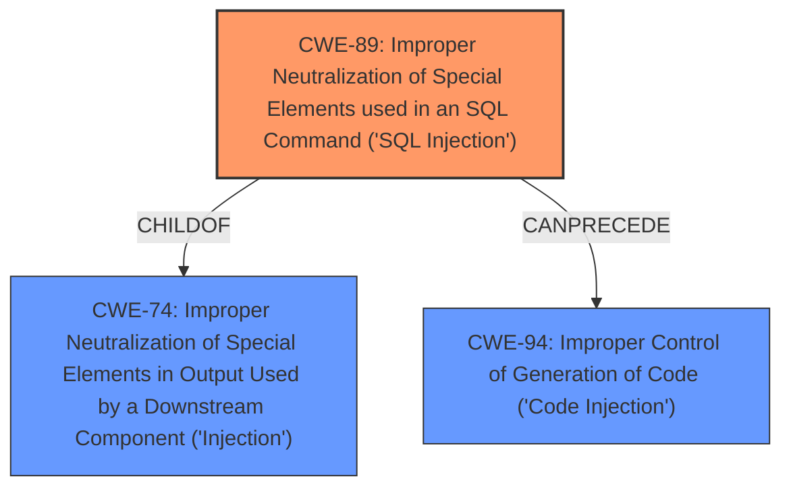

# Analysis for CVE-2024-11258

# Summary
| CWE ID | CWE Name | Confidence | CWE Abstraction Level | CWE Vulnerability Mapping Label | CWE-Vulnerability Mapping Notes |
|---|---|---|---|---|---|
| CWE-89 | Improper Neutralization of Special Elements used in an SQL Command ('SQL Injection') | 1.0 | Base | Allowed | Primary CWE. The **lack of proper input validation** of the 'username' parameter in the SQL query is the root cause. |

## Evidence and Confidence

*   **Confidence Score:** 1.0
*   **Evidence Strength:** HIGH

## Relationship Analysis
The primary CWE is CWE-89, which is a Base level CWE. The other CWEs are less relevant and more general.

## Vulnerability Chain
The vulnerability chain starts with the **improper neutralization** of the 'username' parameter, leading to **SQL injection**, which could then lead to unauthorized database access, sensitive data leakage, data tampering, comprehensive system control and service interruption.

## Summary of Analysis
The vulnerability description clearly states that the manipulation of the 'username' argument leads to **SQL injection**. The CVE Reference Links Content Summary confirms that the **root cause** is the **lack of proper input validation** of the 'username' parameter, which is directly used in SQL queries without sanitization or validation. This aligns perfectly with CWE-89.

CWE-89 is the best fit because it accurately describes the **improper neutralization** of special elements used in an SQL command. The vulnerability description key phrases also point towards **SQL injection** as the weakness.

Other CWEs such as CWE-79, CWE-434, CWE-1336, CWE-117, CWE-96, CWE-93 were considered but were not selected as they do not accurately reflect the **root cause** of the vulnerability, which is the **improper neutralization** of input leading to **SQL injection**. The retriever results also gives CWE-89 the highest rank.

Relevant CWE Information:

# Enhanced Context (25 CWEs)
The following CWEs were identified as potentially relevant to this vulnerability:

## CWE-89: Improper Neutralization of Special Elements used in an SQL Command ('SQL Injection')
**Abstraction Level**: Base
**Similarity Score**: 0.80
**Source**: dense

**Description**:
The product constructs all or part of an SQL command using externally-influenced input from an upstream component, but it does not neutralize or incorrectly neutralizes special elements that could modify the intended SQL command when it is sent to a downstream component. Without sufficient removal or quoting of SQL syntax in user-controllable inputs, the generated SQL query can cause those inputs to be interpreted as SQL instead of ordinary user data.

**Mapping Guidance**:
- Usage: Allowed
- Rationale: This CWE entry is at the Base level of abstraction, which is a preferred level of abstraction for mapping to the root causes of vulnerabilities.