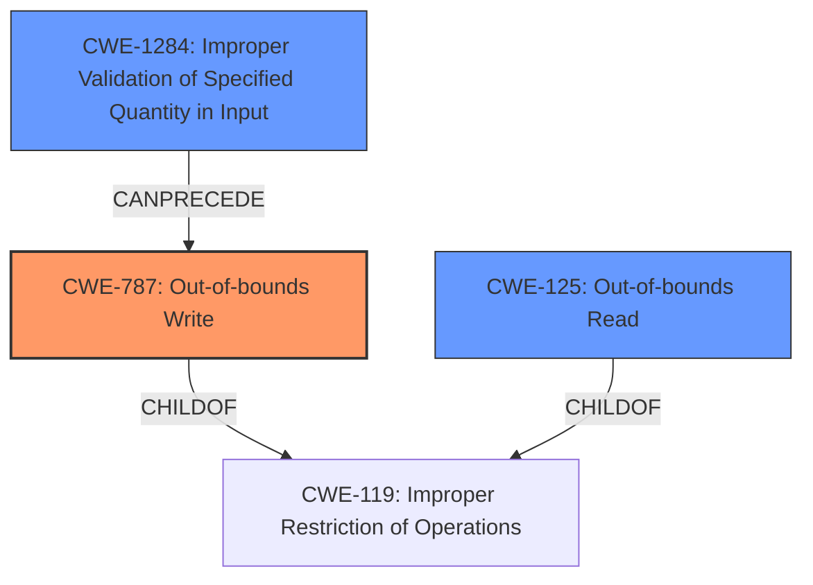

# Analysis Report for CVE-2024-11261

# Vulnerability Analysis Report: CVE-2024-11261

## Description

A vulnerability, which was classified as critical, was found in SourceCodester Student Record Management System 1.0. Affected is an unknown function of the file StudentRecordManagementSystem.cpp of the component Number of Students Menu. The manipulation leads to **memory corruption**. Attacking locally is a requirement. The exploit has been disclosed to the public and may be used.

## Vulnerability Description Key Phrases

- **Weakness:** memory corruption
- **Product:** SourceCodester Student Record Management System
- **Version:** 1.0
- **Component:** Number of Students Menu in StudentRecordManagementSystem.cpp

## Analysis (with Relationship Data)

# Summary

| CWE ID  | CWE Name                                                                         | Confidence | CWE Abstraction Level | CWE Vulnerability Mapping Label | CWE-Vulnerability Mapping Notes |
| :-------- | :------------------------------------------------------------------------------- | :---------- | :-------------------- | :------------------------------ | :------------------------------ |
| CWE-787 | Out-of-bounds Write                                                              | 0.9         | Base                  | Primary                         | Allowed                       |
| CWE-125 | Out-of-bounds Read                                                               | 0.7         | Base                  | Secondary                       | Allowed                       |
| CWE-1284 | Improper Validation of Specified Quantity in Input                               | 0.6         | Base                  | Secondary                       | Allowed                       |

## Evidence and Confidence

*   **Confidence Score:** 0.8
*   **Evidence Strength:** MEDIUM

## Relationship Analysis

The primary relationship is that CWE-787 (Out-of-bounds Write) and CWE-125 (Out-of-bounds Read) are peers and both children of CWE-119 (Improper Restriction of Operations Within the Bounds of a Memory Buffer). The description indicates **memory corruption** due to a lack of proper input validation which can lead to an out-of-bounds write. CWE-1284 can precede CWE-787, where the quantity is not validated and leads to the out-of-bounds write. The chosen CWEs are at the Base level, providing the most specific representation of the vulnerability.



## Vulnerability Chain

The vulnerability chain starts with **improper input validation**, leading to residual characters in the input buffer. This can cause logical errors and, ultimately, **memory corruption** via an out-of-bounds write.

Improper Input Validation -> Improper Buffer Handling -> Out-of-bounds Write (CWE-787)

## Summary of Analysis

The initial assessment focused on the reported **memory corruption**. After analyzing the CVE Reference Links Content Summary, it became clear that the root cause is **improper input validation** and buffer handling. The program's failure to properly handle non-integer characters in the input buffer leads to residual characters being processed, potentially causing an out-of-bounds write, which is a form of **memory corruption**. The Retriever results confirm that CWE-787 (Out-of-bounds Write) is a strong candidate, supported by a high similarity score. Other considered CWEs, like CWE-20 (Improper Input Validation), are too general. CWE-1284 is considered because the program does not validate that the quantity has the required properties. The selection of CWE-787, CWE-125, and CWE-1284 is based on the provided evidence, relationship analysis, and mapping guidance, ensuring the most specific and accurate representation of the vulnerability.

Relevant CWE Information:

*   **CWE-787: Out-of-bounds Write** - The product writes data past the end, or before the beginning, of the intended buffer. This aligns with the **memory corruption** aspect mentioned in the vulnerability description.
*   **CWE-125: Out-of-bounds Read** - The product reads data past the end, or before the beginning, of the intended buffer. This is a closely related issue to an out-of-bounds write, and it's plausible given the **memory corruption** context.
*   **CWE-1284: Improper Validation of Specified Quantity in Input** - The product receives input that is expected to specify a quantity (such as size or length), but it does not validate or incorrectly validates that the quantity has the required properties. This is a potential root cause that can precede CWE-787.

Other CWEs Considered but Not Used:

*   CWE-20 (Improper Input Validation): While input validation is the root cause, this CWE is too general.
*   CWE-89 (Improper Neutralization of Special Elements used in an SQL Command ('SQL Injection')): Not relevant as the application is not related to SQL commands.
*   CWE-79 (Improper Neutralization of Input During Web Page Generation ('Cross-site Scripting')): Not relevant as the application is not a web application.


## CWE Relationship Analysis

Current CWEs represent these abstraction levels: .


### Vulnerability Chain Analysis

**Chain starting from CWE-89:**
- 89 (Improper Neutralization of Special Elements used in an SQL Command ('SQL Injection')) - ROOT


**Chain starting from CWE-1284:**
- 1284 (Improper Validation of Specified Quantity in Input) - ROOT


### CWE Relationship Diagram

```mermaid
graph TD
    classDef primary fill:#f96,stroke:#333,stroke-width:2px
    classDef secondary fill:#69f,stroke:#333
    classDef tertiary fill:#9e9,stroke:#333
```


*Report generated on 2025-07-13 01:14:28*
