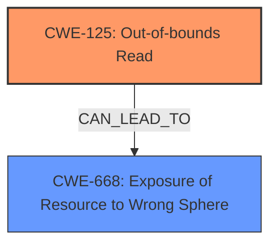

# Raw Analyzer Response for CVE-2024-11268

# Summary
| CWE ID    | CWE Name                                                    | Confidence | CWE Abstraction Level | CWE Vulnerability Mapping Label | CWE-Vulnerability Mapping Notes |
| :---------- | :---------------------------------------------------------- | :--------- | :---------------------- | :------------------------------ | :------------------------------ |
| CWE-125     | Out-of-bounds Read                                        | 0.9        | Base                    | Primary                         | Allowed                         |
| CWE-668     | Exposure of Resource to Wrong Sphere                      | 0.5        | Class                    | Secondary                         | Discouraged                         |

## Evidence and Confidence

*   **Confidence Score:** 0.7
*   **Evidence Strength:** MEDIUM

## Relationship Analysis
The primary relationship is that CWE-125 [CWE-125: Out-of-bounds Read] can lead to information exposure. CWE-668 [CWE-668: Exposure of Resource to Wrong Sphere] is a class-level CWE that can describe information exposure in broad terms. CWE-125 is a more specific Base CWE, making it a better primary choice.

## Vulnerability Chain
The chain starts with a **maliciously crafted PDF file** leading to an **Out-of-Bounds Read** (CWE-125 [CWE-125: Out-of-bounds Read]). The **Out-of-Bounds Read** can then lead to a **memory leak** and/or a **crash**. The **memory leak** can be classified as **Exposure of Resource to Wrong Sphere** (CWE-668 [CWE-668: Exposure of Resource to Wrong Sphere]).

## Summary of Analysis
The primary weakness is the **Out-of-Bounds Read** caused by parsing a **maliciously crafted PDF file**. The vulnerability description explicitly states: "A maliciously crafted PDF file, when parsed through Autodesk Revit, can force an **Out-of-Bounds Read**." This directly maps to CWE-125 [CWE-125: Out-of-bounds Read]. The potential impact of this **Out-of-Bounds Read** includes a crash or a memory leak. The **memory leak** can be further classified as CWE-668 [CWE-668: Exposure of Resource to Wrong Sphere].

CWE-787 [CWE-787: Out-of-bounds Write] was considered but is less appropriate because the vulnerability description specifically mentions an **Out-of-Bounds Read**. While an out-of-bounds write could potentially lead to similar consequences, the provided information does not directly support this.
CWE-190 [CWE-190: Integer Overflow or Wraparound] and CWE-193 [CWE-193: Off-by-one Error] were also considered, but they are less relevant as the core issue is reading beyond buffer boundaries.
CWE-665 [CWE-665: Improper Initialization] was considered for the **memory leak**, but CWE-668 [CWE-668: Exposure of Resource to Wrong Sphere] is a better fit as it describes the resource exposure aspect more directly.

The selection of CWE-125 [CWE-125: Out-of-bounds Read] is at the optimal level of specificity as it is a Base-level CWE that directly describes the **Out-of-Bounds Read** condition. CWE-668 [CWE-668: Exposure of Resource to Wrong Sphere] is a Class level CWE that describes the high-level impact.