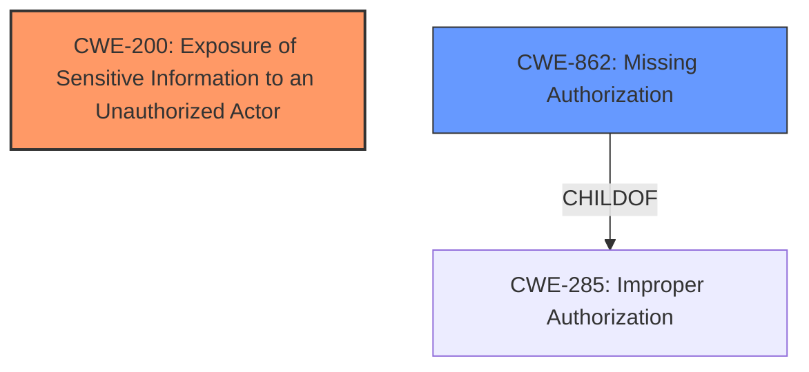

# Analysis Report for CVE-2024-11280

# Vulnerability Analysis Report: CVE-2024-11280

## Description

The PPWP Password Protect Pages plugin for WordPress is vulnerable to **Sensitive Information Exposure** in all versions up to, and including, 1.9.5 via the WordPress core search feature. This makes it possible for unauthenticated attackers to extract sensitive data from posts that have been restricted to higher-level roles such as administrator.

## Vulnerability Description Key Phrases

- **Weakness:** Sensitive Information Exposure
- **Impact:** extract sensitive data
- **Attacker:** unauthenticated attackers
- **Product:** PPWP Password Protect Pages plugin for WordPress
- **Version:** up to and including 1.9.5
- **Component:** WordPress core search feature

## Analysis (with Relationship Data)

# Summary
| CWE ID | CWE Name | Confidence | CWE Abstraction Level | CWE Vulnerability Mapping Label | CWE-Vulnerability Mapping Notes |
|---|---|---|---|---|---|
| CWE-200 | Exposure of Sensitive Information to an Unauthorized Actor | 0.9 | Class | Allowed | The primary issue is **sensitive information exposure** due to a failure to properly restrict access. |
| CWE-862 | Missing Authorization | 0.7 | Class | Allowed-with-Review | The plugin **fails to properly restrict access** to password-protected content. |

## Evidence and Confidence

*   **Confidence Score:** 0.8
*   **Evidence Strength:** HIGH

## Relationship Analysis
The primary weakness is CWE-200 Exposure of Sensitive Information to an Unauthorized Actor, which is a class-level CWE. The root cause is a **missing authorization** check, represented by CWE-862. CWE-862 is a child of CWE-285 Improper Authorization. There's a clear parent-child relationship, suggesting that CWE-862 is a more specific representation of the authorization **weakness**.



## Vulnerability Chain
The vulnerability chain begins with a **missing authorization** check (CWE-862), which leads to **sensitive information exposure** (CWE-200).

## Summary of Analysis
The primary **weakness** is the **exposure of sensitive information** (CWE-200) because an unauthenticated user can access restricted content. The root cause is the **missing authorization** check (CWE-862).

Evidence:
*   "The PPWP Password Protect Pages plugin for WordPress is vulnerable to **Sensitive Information Exposure**... This makes it possible for unauthenticated attackers to extract sensitive data from posts that have been restricted..."
*   "Root cause of vulnerability: The plugin **fails to properly restrict access** to password-protected content when using the WordPress core search feature."

CWE-200 is selected because the description explicitly states **"Sensitive Information Exposure"**. CWE-862 is also selected because the root cause indicates the plugin "**fails to properly restrict access**", which implies a **missing authorization** check.

Other CWEs considered but not used:
*   CWE-285 Improper Authorization: While related to authorization, CWE-862 (Missing Authorization) is more specific and directly reflects the root cause described in the vulnerability.
*   CWE-863 Incorrect Authorization: It is not clear if the plugin performs an authorization check incorrectly, or does not perform any at all. CWE-862 more accurately describes the vulnerability.
*   CWE-306 Missing Authentication for Critical Function: Although authentication might be related, the core issue is that content restricted to higher-level roles is accessible to unauthenticated users, pointing to a **missing authorization** check after authentication (or lack thereof).
*   CWE-425 Direct Request ('Forced Browsing'): This is a broader category. While the WordPress core search feature could be considered a direct request, the **underlying issue** is the **missing authorization** check.
*   CWE-639 Authorization Bypass Through User-Controlled Key: There is no evidence of a user-controlled key being manipulated to bypass authorization.
*   CWE-79 Improper Neutralization of Input During Web Page Generation ('Cross-site Scripting'): There is no evidence of XSS.
*   CWE-352 Cross-Site Request Forgery (CSRF): There is no evidence of CSRF.
*   CWE-434 Unrestricted Upload of File with Dangerous Type: There is no evidence of file uploads.
*   CWE-472 External Control of Assumed-Immutable Web Parameter: There is no evidence that external control of parameters leads to the vulnerability.
*   CWE-538 Insertion of Sensitive Information into Externally-Accessible File or Directory: There is no mention of files or directories.
*   CWE-497 Exposure of Sensitive System Information to an Unauthorized Control Sphere: This is about system information, but the vulnerability description refers to data from posts.


## CWE Relationship Analysis

Current CWEs represent these abstraction levels: .


### Vulnerability Chain Analysis

**Chain starting from CWE-863:**
- 863 (Incorrect Authorization) - ROOT


**Chain starting from CWE-862:**
- 862 (Missing Authorization) - ROOT


### CWE Relationship Diagram

```mermaid
graph TD
    classDef primary fill:#f96,stroke:#333,stroke-width:2px
    classDef secondary fill:#69f,stroke:#333
    classDef tertiary fill:#9e9,stroke:#333
```


*Report generated on 2025-07-13 01:16:52*
