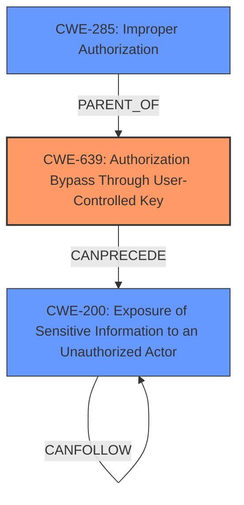

# Raw Analyzer Response for CVE-2024-11300

# Summary
| CWE ID | CWE Name | Confidence | CWE Abstraction Level | CWE Vulnerability Mapping Label | CWE-Vulnerability Mapping Notes |
|---|---|---|---|---|---|
| CWE-639 | Authorization Bypass Through User-Controlled Key | 0.8 | Base | Allowed | Primary CWE: The vulnerability description explicitly mentions unauthorized access to prompt data via specific URLs, which aligns with the concept of bypassing authorization by manipulating keys (URLs in this case). |
| CWE-200 | Exposure of Sensitive Information to an Unauthorized Actor | 0.6 | Class | Discouraged | Secondary Candidate: Accessing prompt data of another user leads to the exposure of sensitive prompt data, which is information exposure to an unauthorized actor. However, this is a consequence rather than the root cause. |
| CWE-285 | Improper Authorization | 0.5 | Class | Discouraged | Secondary Candidate: The vulnerability indicates a flaw in authorization logic, allowing unauthorized access. It's less specific than CWE-639 but still relevant. |

## Evidence and Confidence

*   **Confidence Score:** 0.7
*   **Evidence Strength:** MEDIUM

## Relationship Analysis
The primary CWE is CWE-639, which is a base-level CWE. CWE-200 and CWE-285 are higher-level class CWEs representing the impact and a general authorization issue, respectively. CWE-639 provides the most specific explanation of the **improper access control** because it's related to user-controlled keys (URLs).

## Vulnerability Chain
The vulnerability chain starts with **improper access control**, specifically an **Authorization Bypass Through User-Controlled Key** (CWE-639), which leads to the **Exposure of Sensitive Information to an Unauthorized Actor** (CWE-200). The root cause is the ability to manipulate the URL (key) to access other users' data.

## Summary of Analysis
The initial analysis identified **improper access control** as the root cause. The retriever results suggested CWE-285, CWE-639, CWE-497, and CWE-200. After reviewing the CWE specifications and guidance, CWE-639 was chosen as the primary CWE because it accurately describes the vulnerability where a user can access another user's prompt data by manipulating the URL (user-controlled key). CWE-200 is a secondary CWE that describes the impact of the vulnerability, and CWE-285 is a general authorization issue that's less specific.

The vulnerability description states: "In lunary-ai/lunary before version 1.6.3, an **improper access control** vulnerability exists where a user can access prompt data of another user... The vulnerability allows unauthorized users to view sensitive prompt data by accessing specific URLs, leading to potential exposure of critical information."

The selected CWEs are at the optimal level of specificity because CWE-639 describes the root cause, while CWE-200 describes the impact. Higher-level CWEs like CWE-284 (**Improper Access Control**) are too general.

CWEs considered but not used:

*   CWE-284: **Improper Access Control** - Too general; CWE-639 is a more specific cause.
*   CWE-497: **Exposure of Sensitive System Information to an Unauthorized Control Sphere** - Partially relevant, but CWE-200 is a better fit for the exposure of sensitive information.
*   CWE-306: **Missing Authentication for Critical Function** - Not applicable, as the issue is with authorization after authentication, not the lack of authentication.
*   CWE-863: **Incorrect Authorization** - Relevant, but CWE-639 is a more precise cause.
*   CWE-1427: **Improper Neutralization of Input Used for LLM Prompting** - Not directly relevant, although there might be secondary issues related to prompt injection, the primary issue is access control.
*   CWE-1272: **Sensitive Information Uncleared Before Debug/Power State Transition** - Not relevant to the vulnerability.