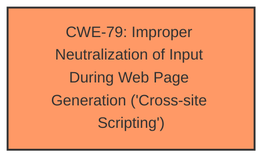

# Analysis Report for CVE-2024-11357

# Vulnerability Analysis Report: CVE-2024-11357

## Description

The goodlayers-core WordPress plugin before 2.0.10 **does not sanitise and escape some of its settings**, which could allow users with the contributor role and above to perform Stored Cross-Site Scripting attacks.

## Vulnerability Description Key Phrases

- **Rootcause:** does not sanitise and escape some of its settings
- **Weakness:** stored cross-site scripting
- **Impact:** Stored Cross-Site Scripting attacks
- **Product:** goodlayers-core WordPress plugin
- **Version:** before 2.0.10

## Analysis (with Relationship Data)

# Summary
| CWE ID | CWE Name | Confidence | CWE Abstraction Level | CWE Vulnerability Mapping Label | CWE-Vulnerability Mapping Notes |
|---|---|---|---|---|---|
| CWE-79 | Improper Neutralization of Input During Web Page Generation ('Cross-site Scripting') | 1.0 | Base | Primary CWE | Allowed |

## Evidence and Confidence

*   **Confidence Score:** 1.0
*   **Evidence Strength:** HIGH

## Relationship Analysis
The primary relationship that influenced the decision was the direct match of the vulnerability description to the definition of CWE-79. The weakness is a **stored cross-site scripting** vulnerability due to the plugin failing to sanitize and escape settings, which directly aligns with CWE-79's description of **improper neutralization of input during web page generation**.



## Vulnerability Chain
The vulnerability chain consists of:
1.  **Root Cause:** **does not sanitise and escape some of its settings**
2.  **Weakness:** **stored cross-site scripting**
3.  **Impact:** Stored Cross-Site Scripting attacks

The primary CWE, CWE-79, directly represents the root cause and weakness.

## Summary of Analysis
The analysis is based on the provided evidence, which clearly indicates a **stored cross-site scripting** vulnerability. The vulnerability description states that the plugin **does not sanitise and escape some of its settings**, leading to the possibility of injecting malicious scripts into web pages. The CVE Reference Links Content Summary confirms this by stating that the plugin fails to properly sanitize and escape user-supplied input, specifically in the titles within the Goodlayers Accordion Element. This allows for malicious JavaScript code to be stored in the database and executed in the browsers of other users.

The retriever results also suggest CWE-79 as a potential match. The graph relationships and the CWE specifications further support this classification. The chosen CWE is at the optimal level of specificity (Base) as it directly describes the **improper neutralization of input** leading to XSS.

The confidence level is high (1.0) due to the clear evidence and direct match with the CWE description.

Relevant CWE Information:
# Enhanced Context (25 CWEs)
The following CWEs were identified as potentially relevant to this vulnerability:

## CWE-79: Improper Neutralization of Input During Web Page Generation ('Cross-site Scripting')
**Abstraction Level**: Base
**Similarity Score**: 962.85
**Source**: sparse

**Description**:
The product does not neutralize or incorrectly neutralizes user-controllable input before it is placed in output that is used as a web page that is served to other users.

**Mapping Guidance**:
- Usage: Allowed
- Rationale: This CWE entry is at the Base level of abstraction, which is a preferred level of abstraction for mapping to the root causes of vulnerabilities.

**Relationships**:
- PARENTOF -> CWE-87
- PARENTOF -> CWE-86
- PARENTOF -> CWE-85
- PARENTOF -> CWE-84
- PARENTOF -> CWE-83


## CWE Relationship Analysis

Current CWEs represent these abstraction levels: .


### Vulnerability Chain Analysis

**Chain starting from CWE-87:**
- 87 (Improper Neutralization of Alternate XSS Syntax) - ROOT


**Chain starting from CWE-79:**
- 79 (Improper Neutralization of Input During Web Page Generation ('Cross-site Scripting')) - ROOT


### CWE Relationship Diagram

```mermaid
graph TD
    classDef primary fill:#f96,stroke:#333,stroke-width:2px
    classDef secondary fill:#69f,stroke:#333
    classDef tertiary fill:#9e9,stroke:#333
```


*Report generated on 2025-07-13 01:22:37*
