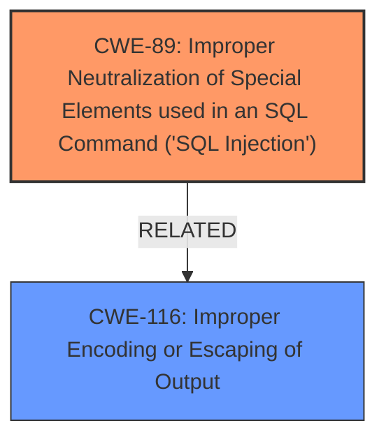

# Analysis Report for CVE-2024-11372

# Vulnerability Analysis Report: CVE-2024-11372

## Description

The Connexion Logs WordPress plugin through 3.0.2 **does not sanitize and escape a parameter before using it in a SQL statement**, allowing admins to perform **SQL injection** attacks

## Vulnerability Description Key Phrases

- **Rootcause:** does not sanitize and escape a parameter before using it in a SQL statement
- **Weakness:** SQL injection
- **Attacker:** admins
- **Product:** Connexion Logs WordPress plugin
- **Version:** through 3.0.2

## Analysis (with Relationship Data)

# Summary
| CWE ID | CWE Name | Confidence | CWE Abstraction Level | CWE Vulnerability Mapping Label | CWE-Vulnerability Mapping Notes |
|---|---|---|---|---|---|
| CWE-89 | Improper Neutralization of Special Elements used in an SQL Command ('SQL Injection') | 1.0 | Base | Primary | Allowed |
| CWE-116 | Improper Encoding or Escaping of Output | 0.5 | Class | Secondary | Allowed-with-Review |

## Evidence and Confidence

*   **Confidence Score:** 0.9
*   **Evidence Strength:** HIGH

## Relationship Analysis
The primary relationship is that CWE-89 [Improper Neutralization of Special Elements used in an SQL Command ('SQL Injection')] is a type of injection vulnerability where user-controlled input is not properly sanitized before being used in an SQL query. CWE-116 [Improper Encoding or Escaping of Output] is a related class that could contribute to the vulnerability if output encoding/escaping is also mishandled.



## Vulnerability Chain
The vulnerability chain starts with the **failure to sanitize and escape a parameter** before using it in an SQL statement (CWE-89), leading to the possibility of **SQL injection** attacks.

## Summary of Analysis
The primary weakness is clearly CWE-89 [Improper Neutralization of Special Elements used in an SQL Command ('SQL Injection')], as the vulnerability description and CVE reference summary explicitly state the lack of sanitization and escaping of parameters before using them in SQL queries. The retriever results also confirm this with a high score. The evidence directly supports this classification, stating "The plugin **does not sanitize and escape a parameter before using it in a SQL statement**". Confidence is high (0.9) because the description strongly indicates this weakness.

CWE-116 [Improper Encoding or Escaping of Output] was considered as a secondary weakness. While the primary issue is the lack of sanitization before the SQL query, improper output encoding could exacerbate the problem or lead to other vulnerabilities. However, the provided description focuses mainly on the input sanitization issue, so CWE-116 is considered a weaker, secondary candidate.

Other CWEs were considered but not selected:
*   CWE-352 [Cross-Site Request Forgery (CSRF)] - While the CVE Reference mentions a related CSRF vulnerability, this CVE is specifically about SQL injection.
*   CWE-90 [Improper Neutralization of Special Elements used in an LDAP Query ('LDAP Injection')] - Irrelevant as the vulnerability is related to SQL injection, not LDAP.
*   CWE-434 [Unrestricted Upload of File with Dangerous Type] - Irrelevant to the described SQL injection vulnerability.

Relevant CWE Information:

# Enhanced Context (25 CWEs)
The following CWEs were identified as potentially relevant to this vulnerability:

## CWE-89: Improper Neutralization of Special Elements used in an SQL Command ('SQL Injection')
**Abstraction Level**: Base
**Similarity Score**: 0.72
**Source**: dense

**Description**:
The product constructs all or part of an SQL command using externally-influenced input from an upstream component, but it does not neutralize or incorrectly neutralizes special elements that could modify the intended SQL command when it is sent to a downstream component. Without sufficient removal or quoting of SQL syntax in user-controllable inputs, the generated SQL query can cause those inputs to be interpreted as SQL instead of ordinary user data.

**Mapping Guidance**:
- Usage: Allowed
- Rationale: This CWE entry is at the Base level of abstraction, which is a preferred level of abstraction for mapping to the root causes of vulnerabilities.

## CWE-116: Improper Encoding or Escaping of Output
**Abstraction Level**: Class
**Similarity Score**: 0.68
**Source**: dense

**Description**:
The product prepares a structured message for communication with another component, but encoding or escaping of the data is either missing or done incorrectly. As a result, the intended structure of the message is not preserved.

**Mapping Guidance**:
- Usage: Allowed-with-Review
- Rationale: This CWE entry is a Class and might have Base-level children that would be more appropriate

## CWE-89: Improper Neutralization of Special Elements used in an SQL Command ('SQL Injection')
**Abstraction Level**: Base
**Similarity Score**: 883.78
**Source**: sparse

**Description**:
The product constructs all or part of an SQL command using externally-influenced input from an upstream component, but it does not neutralize or incorrectly neutralizes special elements that could modify the intended SQL command when it is sent to a downstream component. Without sufficient removal or quoting of SQL syntax in user-controllable inputs, the generated SQL query can cause those inputs to be interpreted as SQL instead of ordinary user data.

**Mapping Guidance**:
- Usage: Allowed
- Rationale: This CWE entry is at the Base level of abstraction, which is a preferred level of abstraction for mapping to the root causes of vulnerabilities.

## CWE-116: Improper Encoding or Escaping of Output
**Abstraction Level**: Class
**Similarity Score**: 852.56
**Source**: sparse

**Description**:
The product prepares a structured message for communication with another component, but encoding or escaping of the data is either missing or done incorrectly. As a result, the intended structure of the message is not preserved.

**Mapping Guidance**:
- Usage: Allowed-with-Review
- Rationale: This CWE entry is a Class and might have Base-level children that would be more appropriate


## CWE Relationship Analysis

Current CWEs represent these abstraction levels: .


### Vulnerability Chain Analysis

**Chain starting from CWE-90:**
- 90 (Improper Neutralization of Special Elements used in an LDAP Query ('LDAP Injection')) - ROOT


**Chain starting from CWE-89:**
- 89 (Improper Neutralization of Special Elements used in an SQL Command ('SQL Injection')) - ROOT


### CWE Relationship Diagram

```mermaid
graph TD
    classDef primary fill:#f96,stroke:#333,stroke-width:2px
    classDef secondary fill:#69f,stroke:#333
    classDef tertiary fill:#9e9,stroke:#333
```


*Report generated on 2025-07-13 01:23:34*
