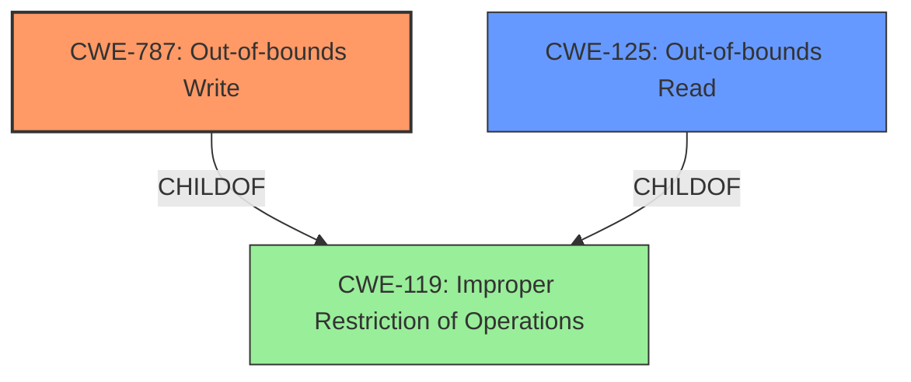

# Analysis Report for CVE-2024-11403

# Vulnerability Analysis Report: CVE-2024-11403

## Description

There exists an **out of bounds read/write** in LibJXL versions prior to commit9cc451b91b74ba470fd72bd48c121e9f33d24c99. The JPEG decoder used by the JPEG XL encoderwhen doing JPEG recompression (i.e. if using JxlEncoderAddJPEGFrame on untrusted input) does not properly check bounds in the presence of incomplete codes. This could lead to an **out-of-bounds write**. In jpegli which is released as part of the same project, the same vulnerability is present. However, the relevant buffer is part of a bigger structure, and the code makes no assumptions on the values that could be overwritten. The issue could however cause jpegli to read uninitialised memory, or addresses of functions.

## Vulnerability Description Key Phrases

- **Rootcause:** out of bounds read/write
- **Weakness:** out-of-bounds write
- **Impact:** ['read uninitialised memory', 'access functions']
- **Vector:** incomplete codes
- **Product:** LibJXL
- **Version:** prior to commit9cc451b91b74ba470fd72bd48c121e9f33d24c99
- **Component:** JPEG decoder

## Analysis (with Relationship Data)

# Summary
| CWE ID | CWE Name | Confidence | CWE Abstraction Level | CWE Vulnerability Mapping Label | CWE-Vulnerability Mapping Notes |
|---|---|---|---|---|---|
| CWE-787 | Out-of-bounds Write | 1.0 | Base | Allowed | Primary CWE: The vulnerability description explicitly states that the issue could lead to an **out-of-bounds write**. |
| CWE-125 | Out-of-bounds Read | 0.8 | Base | Allowed | Secondary Candidate: The vulnerability description mentions an **out of bounds read** which can lead to reading uninitialized memory. |

## Evidence and Confidence

*   **Confidence Score:** 0.9
*   **Evidence Strength:** HIGH

## Relationship Analysis
The primary CWE is CWE-787, which is a base level weakness describing an out-of-bounds write. The secondary weakness is CWE-125, which is a base level weakness describing an out-of-bounds read.



## Vulnerability Chain
The vulnerability chain starts with an **out-of-bounds read/write** due to incomplete codes in the JPEG decoder, leading to a potential **out-of-bounds write**, and the possibility of reading uninitialized memory or addresses of functions.
  - **Root Cause:** **Out-of-bounds read/write** in JPEG decoder.
  - **Weakness:** **Out-of-bounds write** (CWE-787).
  - **Impact:** Reading uninitialized memory, accessing functions (CWE-125).

## Summary of Analysis
The vulnerability description clearly indicates the potential for both an **out-of-bounds read** and an **out-of-bounds write** due to **improper bounds checking** in the JPEG decoder. The primary focus is on the **out-of-bounds write** (CWE-787) because the description explicitly states that the issue could lead to it. The **out-of-bounds read** (CWE-125) is a secondary concern, as it describes a potential consequence of the initial flaw.

The evidence from the vulnerability description is: "There exists an **out of bounds read/write** in LibJXL versions prior to commit9cc451b91b74ba470fd72bd48c121e9f33d24c99... This could lead to an **out-of-bounds write**... The issue could however cause jpegli to read uninitialised memory, or addresses of functions."

The retriever results also support this assessment, with CWE-787 and CWE-125 appearing among the top matches. I have chosen CWE-787 and CWE-125 as the best matches at the Base level of abstraction.

CWE-119 was considered, but it is a Class-level CWE ("Improper Restriction of Operations within the Bounds of a Memory Buffer"), and the vulnerability description allows for a more specific mapping using the Base-level CWEs.

Other CWEs considered but not used:
* CWE-190, CWE-193, CWE-197, CWE-823: These relate to integer overflows, off-by-one errors, numeric truncation, and pointer offset issues. While these could potentially contribute to an out-of-bounds write/read, the description doesn't explicitly point to these as root causes.


## CWE Relationship Analysis

Current CWEs represent these abstraction levels: .


### Vulnerability Chain Analysis

**Chain starting from CWE-823:**
- 823 (Use of Out-of-range Pointer Offset) - ROOT


**Chain starting from CWE-125:**
- 125 (Out-of-bounds Read) - ROOT


### CWE Relationship Diagram

```mermaid
graph TD
    classDef primary fill:#f96,stroke:#333,stroke-width:2px
    classDef secondary fill:#69f,stroke:#333
    classDef tertiary fill:#9e9,stroke:#333
```


*Report generated on 2025-07-13 01:24:47*
