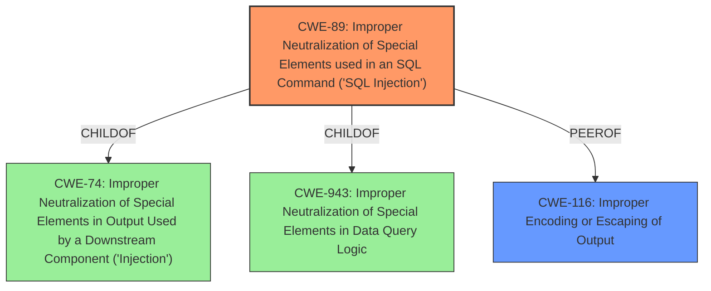

# Analysis Report for CVE-2024-11437

# Vulnerability Analysis Report: CVE-2024-11437

## Description

The Timeline Designer plugin for WordPress is vulnerable to SQL Injection via the s parameter in all versions up to, and including, 1.4 due to **insufficient escaping on the user supplied parameter and lack of sufficient preparation on the existing SQL query**. This makes it possible for unauthenticated attackers to append additional SQL queries into already existing queries that can be used to extract sensitive information from the database.

## Vulnerability Description Key Phrases

- **Rootcause:** ['insufficient escaping on the user supplied parameter and lack of sufficient preparation on the existing SQL query', 'insufficient escaping on user-supplied parameter']
- **Weakness:** ['SQL injection', 'weakness']
- **Impact:** ['extract sensitive information from the database', 'extract sensitive information from database', 'append additional SQL queries']
- **Attacker:** unauthenticated attackers
- **Product:** WordPress
- **Version:** up to and including 1.4
- **Component:** s parameter

## Analysis (with Relationship Data)

# Summary

| CWE ID  | CWE Name                                                                        | Confidence | CWE Abstraction Level | CWE Vulnerability Mapping Label | CWE-Vulnerability Mapping Notes |
| :-------- | :------------------------------------------------------------------------------ | :--------- | :---------------------- | :------------------------------ | :------------------------------ |
| CWE-89  | Improper Neutralization of Special Elements used in an SQL Command ('SQL Injection') | 1.0        | Base                    | Primary                         | Allowed                         |
| CWE-116 | Improper Encoding or Escaping of Output | 0.7        | Class                    | Secondary                         | Allowed-with-Review                         |

## Evidence and Confidence

*   **Confidence Score:** 0.85
*   **Evidence Strength:** HIGH

## Relationship Analysis

The primary CWE is CWE-89, which is a Base level CWE and accurately represents the **SQL Injection** vulnerability described. CWE-89 is a child of CWE-74 (Improper Neutralization of Special Elements in Output Used by a Downstream Component ('Injection')) and CWE-943 (Improper Neutralization of Special Elements in Data Query Logic). CWE-116 is also considered since the description mentions **insufficient escaping**, which could lead to improper encoding. However, the root cause is more specifically related to SQL commands, making CWE-89 the better fit.



## Vulnerability Chain

The vulnerability chain starts with **insufficient escaping** and **lack of sufficient preparation on the existing SQL query**, leading to **SQL Injection**, which allows attackers to **extract sensitive information from the database**.
- **Root Cause:** **Insufficient Escaping** and **Lack of Preparation**
- **Weakness:** **SQL Injection** (CWE-89)
- **Impact:** Extracting sensitive information from the database.

## Summary of Analysis

The primary weakness is CWE-89 because the vulnerability description explicitly mentions **SQL Injection** due to **insufficient escaping** and **lack of sufficient preparation** on the SQL query. The description states, "The Timeline Designer plugin for WordPress is vulnerable to SQL Injection via the s parameter in all versions up to, and including, 1.4 due to **insufficient escaping on the user supplied parameter and lack of sufficient preparation on the existing SQL query**."

CWE-116 was considered because of the phrase "**insufficient escaping**," but since the impact is specifically **SQL Injection**, CWE-89 is more appropriate as the primary CWE.

The selected CWEs are at the optimal level of specificity, with CWE-89 being a Base level CWE and directly addressing the SQL Injection vulnerability.

Relevant CWE Information:
- **CWE-89: Improper Neutralization of Special Elements used in an SQL Command ('SQL Injection')**
- **CWE-116: Improper Encoding or Escaping of Output**


## CWE Relationship Analysis

Current CWEs represent these abstraction levels: .


### Vulnerability Chain Analysis

**Chain starting from CWE-74:**
- 74 (Improper Neutralization of Special Elements in Output Used by a Downstream Component ('Injection')) - ROOT


**Chain starting from CWE-89:**
- 89 (Improper Neutralization of Special Elements used in an SQL Command ('SQL Injection')) - ROOT


### CWE Relationship Diagram

```mermaid
graph TD
    classDef primary fill:#f96,stroke:#333,stroke-width:2px
    classDef secondary fill:#69f,stroke:#333
    classDef tertiary fill:#9e9,stroke:#333
```


*Report generated on 2025-07-13 01:25:53*
