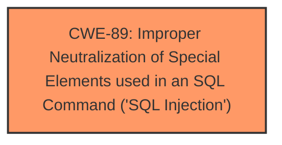

# Analysis for CVE-2024-11460

# Summary
| CWE ID | CWE Name | Confidence | CWE Abstraction Level | CWE Vulnerability Mapping Label | CWE-Vulnerability Mapping Notes |
|---|---|---|---|---|---|
| CWE-89 | Improper Neutralization of Special Elements used in an SQL Command ('SQL Injection') | 1.0 | Base | Primary | Allowed |

## Evidence and Confidence

*   **Confidence Score:** 1.0
*   **Evidence Strength:** HIGH

## Relationship Analysis
The primary identified CWE is CWE-89 [Improper Neutralization of Special Elements used in an SQL Command ('SQL Injection')], which is a Base level CWE. Several other CWEs were considered, particularly those related to input validation and sanitization, however, CWE-89 best represents the root cause of the vulnerability. The relationship analysis primarily focuses on identifying the most specific and relevant CWE based on the provided evidence.

## Vulnerability Chain
The vulnerability chain starts with the **insufficient escaping on the user supplied parameter and lack of sufficient preparation on the existing SQL query**, leading directly to CWE-89 [Improper Neutralization of Special Elements used in an SQL Command ('SQL Injection')]. This allows attackers to **extract sensitive information from the database**. The chain is:

1.  **Root Cause:** Insufficient input validation and sanitization (**insufficient escaping on the user supplied parameter and lack of sufficient preparation on the existing SQL query**)
2.  **Weakness:** CWE-89 [Improper Neutralization of Special Elements used in an SQL Command ('SQL Injection')]
3.  **Impact:** Extract sensitive information from the database

## Summary of Analysis
The analysis is strongly based on the provided evidence, particularly the vulnerability description and the CVE reference summary. The vulnerability description explicitly mentions **insufficient escaping on the user supplied parameter and lack of sufficient preparation on the existing SQL query**, directly aligning with the characteristics of CWE-89 [Improper Neutralization of Special Elements used in an SQL Command ('SQL Injection')]. The CVE reference summary further confirms this by stating that the **vulnerability stems from insufficient sanitization and escaping of the `search_string` parameter** and the **lack of prepared statements**.

The retriever results also support this classification, with CWE-89 [Improper Neutralization of Special Elements used in an SQL Command ('SQL Injection')] being the top-ranked CWE. The graph relationships did not significantly influence the final selection, as CWE-89 [Improper Neutralization of Special Elements used in an SQL Command ('SQL Injection')] is the most direct and specific representation of the vulnerability.

The selected CWE is at the optimal level of specificity, as it directly addresses the root cause of the vulnerability, which is the **improper neutralization of special elements used in an SQL command**.

Relevant CWE Information:

# Enhanced Context (25 CWEs)
The following CWEs were identified as potentially relevant to this vulnerability:

## CWE-352: Cross-Site Request Forgery (CSRF)
**Abstraction Level**: Compound
**Similarity Score**: 0.71
**Source**: dense

**Description**:
The web application does not, or can not, sufficiently verify whether a well-formed, valid, consistent request was intentionally provided by the user who submitted the request.

**Mapping Guidance**:
- Usage: Allowed
- Rationale: This is a well-known Composite of multiple weaknesses that must all occur simultaneously, although it is attack-oriented in nature.

*   **Why it was not selected:** CWE-352 [Cross-Site Request Forgery (CSRF)] is not relevant because the vulnerability is related to SQL injection and not CSRF.

## CWE-502: Deserialization of Untrusted Data
**Abstraction Level**: Base
**Similarity Score**: 0.71
**Source**: dense

**Description**:
The product deserializes untrusted data without sufficiently ensuring that the resulting data will be valid.

**Mapping Guidance**:
- Usage: Allowed
- Rationale: This CWE entry is at the Base level of abstraction, which is a preferred level of abstraction for mapping to the root causes of vulnerabilities.

*   **Why it was not selected:** CWE-502 [Deserialization of Untrusted Data] is not relevant because the vulnerability is related to SQL injection and not deserialization of data.

## CWE-425: Direct Request ('Forced Browsing')
**Abstraction Level**: Base
**Similarity Score**: 0.70
**Source**: dense

**Description**:
The web application does not adequately enforce appropriate authorization on all restricted URLs, scripts, or files.

**Mapping Guidance**:
- Usage: Allowed
- Rationale: This CWE entry is at the Base level of abstraction, which is a preferred level of abstraction for mapping to the root causes of vulnerabilities.

*   **Why it was not selected:** CWE-425 [Direct Request ('Forced Browsing')] is not relevant because the vulnerability is related to SQL injection and not authorization issues.

## CWE-116: Improper Encoding or Escaping of Output
**Abstraction Level**: Class
**Similarity Score**: 0.70
**Source**: dense

**Description**:
The product prepares a structured message for communication with another component, but encoding or escaping of the data is either missing or done incorrectly. As a result, the intended structure of the message is not preserved.

**Mapping Guidance**:
- Usage: Allowed-with-Review
- Rationale: This CWE entry is a Class and might have Base-level children that would be more appropriate

*   **Why it was not selected:** While encoding and escaping are related to preventing SQL injection, CWE-89 [Improper Neutralization of Special Elements used in an SQL Command ('SQL Injection')] is a more specific match for the described vulnerability.

## CWE-472: External Control of Assumed-Immutable Web Parameter
**Abstraction Level**: Base
**Similarity Score**: 0.70
**Source**: dense

**Description**:
The web application does not sufficiently verify inputs that are assumed to be immutable but are actually externally controllable, such as hidden form fields.

**Mapping Guidance**:
- Usage: Allowed
- Rationale: This CWE entry is at the Base level of abstraction, which is a preferred level of abstraction for mapping to the root causes of vulnerabilities.

*   **Why it was not selected:** CWE-472 [External Control of Assumed-Immutable Web Parameter] is not the primary issue, as the main problem is the lack of sanitization leading to SQL injection.

## CWE-89: Improper Neutralization of Special Elements used in an SQL Command ('SQL Injection')
**Abstraction Level**: Base
**Similarity Score**: 0.69
**Source**: dense

**Description**:
The product constructs all or part of an SQL command using externally-influenced input from an upstream component, but it does not neutralize or incorrectly neutralizes special elements that could modify the intended SQL command when it is sent to a downstream component. Without sufficient removal or quoting of SQL syntax in user-controllable inputs, the generated SQL query can cause those inputs to be interpreted as SQL instead of ordinary user data.

**Mapping Guidance**:
- Usage: Allowed
- Rationale: This CWE entry is at the Base level of abstraction, which is a preferred level of abstraction for mapping to the root causes of vulnerabilities.

*   **Why it was selected:** This is the primary CWE because the vulnerability stems from **insufficient escaping on the user supplied parameter and lack of sufficient preparation on the existing SQL query**, leading to SQL injection.

## CWE-201: Insertion of Sensitive Information Into Sent Data
**Abstraction Level**: Base
**Similarity Score**: 0.68
**Source**: dense

**Description**:
The code transmits data to another actor, but a portion of the data includes sensitive information that should not be accessible to that actor.

**Mapping Guidance**:
- Usage: Allowed
- Rationale: This CWE entry is at the Base level of abstraction, which is a preferred level of abstraction for mapping to the root causes of vulnerabilities.

*   **Why it was not selected:** CWE-201 [Insertion of Sensitive Information Into Sent Data] describes a different type of vulnerability where sensitive data is exposed, but this vulnerability is about SQL injection.

## CWE-79: Improper Neutralization of Input During Web Page Generation ('Cross-site Scripting')
**Abstraction Level**: Base
**Similarity Score**: 0.68
**Source**: dense

**Description**:
The product does not neutralize or incorrectly neutralizes user-controllable input before it is placed in output that is used as a web page that is served to other users.

**Mapping Guidance**:
- Usage: Allowed
- Rationale: This CWE entry is at the Base level of abstraction, which is a preferred level of abstraction for mapping to the root causes of vulnerabilities.

*   **Why it was not selected:** CWE-79 [Improper Neutralization of Input During Web Page Generation ('Cross-site Scripting')] is not relevant because the vulnerability is related to SQL injection and not cross-site scripting.

## CWE-790: Improper Filtering of Special Elements
**Abstraction Level**: Class
**Similarity Score**: 0.68
**Source**: dense

**Description**:
The product receives data from an upstream component, but does not filter or incorrectly filters special elements before sending