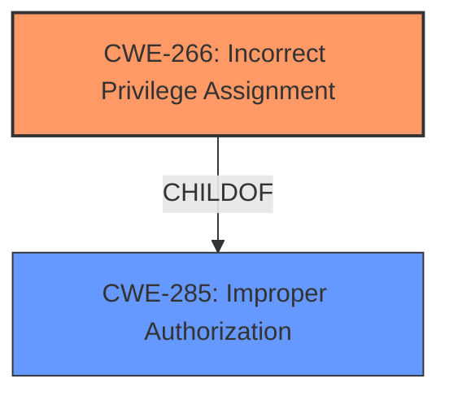

# Enhanced Analysis for CVE-2024-11485

# Summary

| CWE ID  | CWE Name                                                                   | Confidence | CWE Abstraction Level | CWE Vulnerability Mapping Label | CWE-Vulnerability Mapping Notes |
| :-------- | :------------------------------------------------------------------------- | :--------- | :---------------------- | :------------------------------ | :------------------------------ |
| CWE-266   | Incorrect Privilege Assignment                                             | 0.85       | Base                    | Primary                         | Allowed                         |
| CWE-285   | Improper Authorization                                                     | 0.60       | Class                     | Secondary                       | Discouraged                     |

## Evidence and Confidence

*   **Confidence Score:** 0.75
*   **Evidence Strength:** MEDIUM

## Relationship Analysis

The primary relationship that influenced the decision was the parent-child relationship between CWE-285 (Improper Authorization) and more specific CWEs related to privilege and permission issues. Given that the vulnerability description explicitly mentions "permission issues" as the impact and the guidance suggests that CWE-266 is appropriate for misassigned privileges, it was selected as the primary CWE. CWE-285, being a higher-level class, was considered as a secondary CWE due to its broader applicability to authorization failures.



## Vulnerability Chain

The vulnerability chain starts with **incorrect privilege assignment** (CWE-266), leading to **permission issues**.

CWE-266 (Root Cause) -> Permission Issues (Impact)

## Summary of Analysis

The initial analysis focused on identifying the root cause of the vulnerability. The description explicitly mentions "permission issues" resulting from manipulation of the `/decoration/admin/userregister.php` file.

The CWE guidance provides clear distinctions between privileges and permissions, suggesting CWE-266 for cases where privileges are incorrectly assigned. This aligned with the vulnerability details, indicating that a user or actor might be granted inappropriate access rights.

The retriever results also suggested CWE-266 and related CWEs, which further supported the selection of CWE-266 as the primary weakness.

The final decision prioritized CWE-266 because it represents the root cause of the issue which led to the impact of permission issues.

Relevant CWE Information:

# Enhanced Context (25 CWEs)
The following CWEs were identified as potentially relevant to this vulnerability:

## CWE-266: Incorrect Privilege Assignment
**Abstraction Level**: Base
**Similarity Score**: 0.79
**Source**: dense

**Description**:
A product incorrectly assigns a privilege to a particular actor, creating an unintended sphere of control for that actor.

**Mapping Guidance**:
- Usage: Allowed
- Rationale: This CWE entry is at the Base level of abstraction, which is a preferred level of abstraction for mapping to the root causes of vulnerabilities.

## CWE-285: Improper Authorization
**Abstraction Level**: Class
**Similarity Score**: 1324.36
**Source**: sparse

**Description**:
The product does not perform or incorrectly performs an authorization check when an actor attempts to access a resource or perform an action.

**Mapping Guidance**:
- Usage: Discouraged
- Rationale: CWE-285 is high-level and lower-level CWEs can frequently be used instead. It is a level-1 Class (i.e., a child of a Pillar).

## Technical Explanation for Selected CWEs:

*   **CWE-266: Incorrect Privilege Assignment**
    *   **How it matches:** The vulnerability description indicates that the manipulation of `/decoration/admin/userregister.php` leads to "permission issues." Based on the CWE Guidance, this aligns with **incorrectly assigning privileges** during user registration.
    *   **Security Implications:** This could allow unauthorized users to gain elevated privileges, potentially leading to data breaches, system compromise, or denial of service.
    *   **Relationship:** CWE-266 is a child of CWE-285 (Improper Authorization), making it a more specific representation of the authorization failure.
    *   **Mapping Guidance Influence:** The CWE guidance explicitly suggests using CWE-266 when a user is assigned the wrong role/group, which supports this mapping.
    *   **Primary Weakness:** This is considered the primary weakness because it represents the root cause of the permission issues.
    *   **Confidence:** 0.85

*   **CWE-285: Improper Authorization**
    *   **How it matches:** The vulnerability results in "permission issues", indicating that the application is not correctly authorizing access to resources or functionalities.
    *   **Security Implications:** Users might gain unauthorized access to sensitive data or functionality, leading to data breaches, system compromise, or privilege escalation.
    *   **Relationship:** CWE-285 is a parent Class of more specific authorization-related CWEs, such as CWE-266.
    *   **Mapping Guidance Influence:** While CWE-285 is discouraged for direct mapping, it serves as a broader categorization for the authorization failure. It acts as a high-level classification when a more specific CWE is unavailable.
    *   **Secondary Weakness:** This is a secondary weakness because it is a more general categorization of the authorization issue.
    *   **Confidence:** 0.60

## CWEs Considered but Not Used:

*   **CWE-416: Use After Free:** This CWE is not relevant because the description does not indicate any memory management issues or use-after-free conditions.
*   **CWE-441: Unintended Proxy or Intermediary ('Confused Deputy'):** This CWE is not relevant as there is no mention of a confused deputy situation where a program unintentionally misuses its authority.
*   **CWE-563: Assignment to Variable without Use:** This CWE is not applicable because the description doesn't suggest any instances of variables being assigned values but not subsequently used.
*   **CWE-89: Improper Neutralization of Special Elements used in an SQL Command ('SQL Injection'):** SQL injection is not indicated in the description.
*   **CWE-79: Improper Neutralization of Input During Web Page Generation ('Cross-site Scripting'):** Cross-site scripting is not indicated in the description.
*   **CWE-434: Unrestricted Upload of File with Dangerous Type:** The description does not mention any file upload functionality or associated vulnerabilities.
*   **CWE-1336: Improper Neutralization of Special Elements Used in a Template Engine:** The description doesn't suggest any template engine related issues.
*   **CWE-352: Cross-Site Request Forgery (CSRF):** There is no indication of CSRF in the description.
*   **CWE-472: External Control of Assumed-Immutable Web Parameter:** The description does not specify any issues related to external control of assumed-immutable parameters.
*   **CWE-471: Modification of Assumed-Immutable Data (MAID):** This CWE is not relevant because the description does not indicate any modification of assumed-immutable data.
*   **CWE-269: Improper Privilege Management:** The guidance discourages use of this.
*   **CWE-863: Incorrect Authorization:** Although related, CWE-266 provides a more specific root cause.
*   **CWE-425: Direct Request ('Forced Browsing'):** There is no indication of forced browsing in the description.
*   **CWE-276: Incorrect Default Permissions:** This is similar to CWE-266 but focuses on installation permissions. Since the vulnerability is at the user registration level, this is not applicable.
*   **CWE-807: Reliance on Untrusted Inputs in a Security Decision:** There is no indication of security decisions based on untrusted inputs.
*   **CWE-668: Exposure of Resource to Wrong Sphere:** This is a high level class that is not as specific as CWE-266.
*   **CWE-41: Improper Resolution of Path Equivalence:** The description does not indicate any path equivalence issues.
*   **CWE-274: Improper Handling of Insufficient Privileges:** The description does not indicate issues related to insufficient privileges.
*   **CWE-280: Improper Handling of Insufficient Permissions or Privileges:** The description does not indicate issues related to insufficient permissions or privileges.
*   **CWE-267: Privilege Defined With Unsafe Actions:** This is not as directly relevant as CWE-266.
*   **CWE-1275: Sensitive Cookie with Improper SameSite Attribute:** No cookie information is available.
*   **CWE-1336: Improper Neutralization of Special Elements Used in a Template Engine:** No template engine information is available.
*   **CWE-123: Write-what-where Condition:** No memory corruption information is available.


## CWE Relationship Analysis

Current CWEs represent these abstraction levels: .


### Vulnerability Chain Analysis

**Chain starting from CWE-274:**
- 274 (Improper Handling of Insufficient Privileges) - ROOT


**Chain starting from CWE-471:**
- 471 (Modification of Assumed-Immutable Data (MAID)) - ROOT


### CWE Relationship Diagram

```mermaid
graph TD
    classDef primary fill:#f96,stroke:#333,stroke-width:2px
    classDef secondary fill:#69f,stroke:#333
    classDef tertiary fill:#9e9,stroke:#333
```