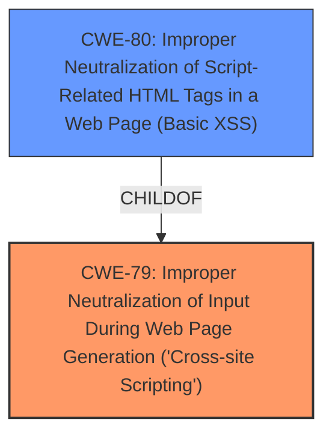

# Analysis Report for CVE-2024-11502

# Vulnerability Analysis Report: CVE-2024-11502

## Description

The Planning Center Online Giving WordPress plugin through 1.0.0 **does not validate and escape some of its shortcode attributes** before outputting them back in a page/post where the shortcode is embed, which could allow users with the contributor role and above to perform Stored **Cross-Site Scripting attacks**.

## Vulnerability Description Key Phrases

- **Rootcause:** does not validate and escape some of its shortcode attributes
- **Weakness:** Cross-Site Scripting attacks
- **Impact:** Stored Cross-Site Scripting attacks
- **Attacker:** users with the contributor role and above
- **Product:** Planning Center Online Giving WordPress plugin
- **Version:** through 1.0.0

## Analysis (with Relationship Data)

# Summary
| CWE ID | CWE Name | Confidence | CWE Abstraction Level | CWE Vulnerability Mapping Label | CWE-Vulnerability Mapping Notes |
|---|---|---|---|---|---|
| CWE-79 | Improper Neutralization of Input During Web Page Generation ('Cross-site Scripting') | 1.0 | Base |  Primary | Allowed |

## Evidence and Confidence

*   **Confidence Score:** 1.0
*   **Evidence Strength:** HIGH

## Relationship Analysis
The primary relationship that influenced the CWE selection is the parent-child relationship. While other CWEs were considered, CWE-79's description and usage align most directly with the vulnerability's root cause and impact. CWE-79 is a base level CWE which is appropriate.



## Vulnerability Chain
The vulnerability chain starts with the **failure to validate and escape shortcode attributes**. This leads to the **improper neutralization of input** during web page generation, resulting in **stored Cross-Site Scripting (XSS)**.

## Summary of Analysis
The vulnerability description clearly states that the Planning Center Online Giving WordPress plugin **does not validate and escape some of its shortcode attributes** before outputting them in a page/post. This allows users with contributor roles and above to perform stored Cross-Site Scripting (XSS) attacks. The root cause is the **lack of input validation and output escaping**, which directly corresponds to **CWE-79 (Improper Neutralization of Input During Web Page Generation ('Cross-site Scripting'))**.

The evidence supporting this decision is found in the "Vulnerability Description Key Phrases":

*   **rootcause:** **does not validate and escape some of its shortcode attributes**
*   **weakness:** **Cross-Site Scripting attacks**

The CVE Reference Links Content Summary confirms this, stating that the root cause is that "The plugin doesn't validate and escape shortcode attributes before outputting them back in a page/post" which leads to "Stored Cross-Site Scripting (XSS)."

The retriever results also list CWE-79 as a highly relevant CWE, which further supports this classification.

CWE-79 is a base-level CWE, which is appropriate for this vulnerability. While more specific variants of XSS exist (e.g., CWE-80), the provided information does not give sufficient information to select them.

Relevant CWE Information:

# Enhanced Context (25 CWEs)
The following CWEs were identified as potentially relevant to this vulnerability:

## CWE-352: Cross-Site Request Forgery (CSRF)
**Abstraction Level**: Compound
**Similarity Score**: 0.76
**Source**: dense

**Description**:
The web application does not, or can not, sufficiently verify whether a well-formed, valid, consistent request was intentionally provided by the user who submitted the request.

**Mapping Guidance**:
- Usage: Allowed
- Rationale: This is a well-known Composite of multiple weaknesses that must all occur simultaneously, although it is attack-oriented in nature.

*Not Used:* This CWE is not relevant to the described vulnerability, as it focuses on CSRF, which is a different type of web security issue than XSS.

## CWE-80: Improper Neutralization of Script-Related HTML Tags in a Web Page (Basic XSS)
**Abstraction Level**: Variant
**Similarity Score**: 0.72
**Source**: dense

**Description**:
The product receives input from an upstream component, but it does not neutralize or incorrectly neutralizes special characters such as "<", ">", and "&" that could be interpreted as web-scripting elements when they are sent to a downstream component that processes web pages.

**Mapping Guidance**:
- Usage: Allowed
- Rationale: This CWE entry is at the Variant level of abstraction, which is a preferred level of abstraction for mapping to the root causes of vulnerabilities.

*Not Used:* This is a more specific variant of XSS. However, the description lacks the details of the improper neutralization of characters.

## CWE-472: External Control of Assumed-Immutable Web Parameter
**Abstraction Level**: Base
**Similarity Score**: 0.72
**Source**: dense

**Description**:
The web application does not sufficiently verify inputs that are assumed to be immutable but are actually externally controllable, such as hidden form fields.

**Mapping Guidance**:
- Usage: Allowed
- Rationale: This CWE entry is at the Base level of abstraction, which is a preferred level of abstraction for mapping to the root causes of vulnerabilities.

*Not Used:* This CWE does not apply because the described vulnerability is not related to external control of assumed-immutable web parameters. The issue is with the lack of validation and escaping of shortcode attributes, leading to XSS.

## CWE-425: Direct Request ('Forced Browsing')
**Abstraction Level**: Base
**Similarity Score**: 0.72
**Source**: dense

**Description**:
The web application does not adequately enforce appropriate authorization on all restricted URLs, scripts, or files.

**Mapping Guidance**:
- Usage: Allowed
- Rationale: This CWE entry is at the Base level of abstraction, which is a preferred level of abstraction for mapping to the root causes of vulnerabilities.

*Not Used:* This CWE is not applicable because the vulnerability is not related to authorization issues. The core problem is the lack of input validation and output escaping, which leads to XSS.

## CWE-434: Unrestricted Upload of File with Dangerous Type
**Abstraction Level**: Base
**Similarity Score**: 0.70
**Source**: dense

**Description**:
The product allows the upload or transfer of dangerous file types that are automatically processed within its environment.

**Mapping Guidance**:
- Usage: Allowed
- Rationale: This CWE entry is at the Base level of abstraction, which is a preferred level of abstraction for mapping to the root causes of vulnerabilities.

*Not Used:* This CWE is not relevant, as the vulnerability does not involve file uploads.

## CWE-79: Improper Neutralization of Input During Web Page Generation ('Cross-site Scripting')
**Abstraction Level**: Base
**Similarity Score**: 0.70
**Source**: dense

**Description**:
The product does not neutralize or incorrectly neutralizes user-controllable input before it is placed in output that is used as a web page that is served to other users.

**Mapping Guidance**:
- Usage: Allowed
- Rationale: This CWE entry is at the Base level of abstraction, which is a preferred level of abstraction for mapping to the root causes of vulnerabilities.

*Used:* The product **does not validate and escape some of its shortcode attributes** before outputting them back in a page/post.

## CWE-96: Improper Neutralization of Directives in Statically Saved Code ('Static Code Injection')
**Abstraction Level**: Base
**Similarity Score**: 0.70
**Source**: dense

**Description**:
The product receives input from an upstream component, but it does not neutralize or incorrectly neutralizes code syntax before inserting the input into an executable resource, such as a library, configuration file, or template.

**Mapping Guidance**:
- Usage: Allowed
- Rationale: This CWE entry is at the Base level of abstraction, which is a preferred level of abstraction for mapping to the root causes of vulnerabilities.

*Not Used:* This CWE is not directly related. The vulnerability is about XSS, not static code injection.

## CWE-116: Improper Encoding or Escaping of Output
**Abstraction Level**: Class
**Similarity Score**: 0.70
**Source**: dense

**Description**:
The product prepares a structured message for communication with another component, but encoding or escaping of the data is either missing or done incorrectly. As a result, the intended structure of the message is not preserved.

**Mapping Guidance**:
- Usage: Allowed-with-Review
- Rationale: This CWE entry is a Class and might have Base-level children that would be more appropriate

*Not Used:* While related, CWE-79 is more specific to the context of XSS.

## CWE-639: Authorization Bypass Through User-Controlled Key
**Abstraction Level**: Base
**Similarity Score**: 0.69
**Source**: dense

**Description**:
The system's authorization functionality does not prevent one user from gaining access to another user's data or record by modifying the key value identifying the data.

**Mapping Guidance**:
- Usage: Allowed
- Rationale: This CWE entry is at the Base level of abstraction, which is a preferred level of abstraction for mapping to the root causes of vulnerabilities.

*Not Used:* This CWE is not applicable because the vulnerability isn't related to authorization bypass.

## CWE-1336: Improper Neutralization of Special Elements Used in a Template Engine
**Abstraction Level**: Base


## CWE Relationship Analysis

Current CWEs represent these abstraction levels: .


### Vulnerability Chain Analysis

**Chain starting from CWE-116:**
- 116 (Improper Encoding or Escaping of Output) - ROOT


**Chain starting from CWE-80:**
- 80 (Improper Neutralization of Script-Related HTML Tags in a Web Page (Basic XSS)) - ROOT


### CWE Relationship Diagram

```mermaid
graph TD
    classDef primary fill:#f96,stroke:#333,stroke-width:2px
    classDef secondary fill:#69f,stroke:#333
    classDef tertiary fill:#9e9,stroke:#333
```


*Report generated on 2025-07-13 01:29:29*
