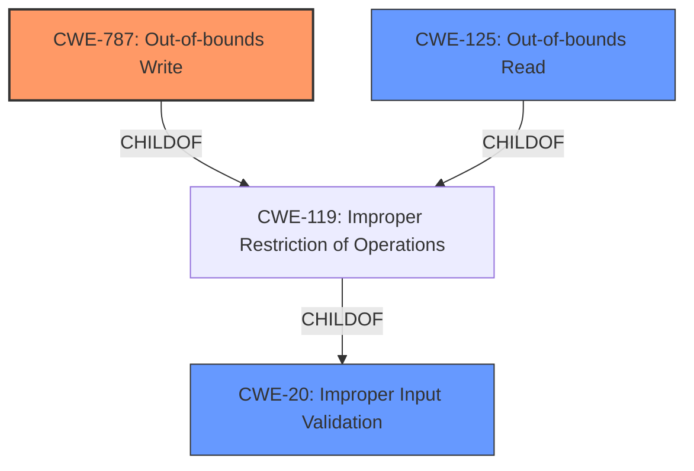

# Enhanced Analysis for CVE-2024-11528

# Summary
| CWE ID | CWE Name | Confidence | CWE Abstraction Level | CWE Vulnerability Mapping Label | CWE-Vulnerability Mapping Notes |
|---|---|---|---|---|---|
| CWE-787 | Out-of-bounds Write | 0.9 | Base | Allowed | Primary CWE. The **lack of proper validation of user-supplied data** leads to **memory corruption**, allowing out-of-bounds write. |
| CWE-125 | Out-of-bounds Read | 0.6 | Base | Allowed | Secondary Candidate. Although the primary issue is an out-of-bounds write, an out-of-bounds read could also be a consequence of the **lack of proper validation of user-supplied data** and **memory corruption** . |
| CWE-20 | Improper Input Validation | 0.5 | Class | Discouraged | Secondary Candidate. The vulnerability stems from the **lack of proper validation of user-supplied data**, making this a potential, although less specific, mapping. Discouraged because more specific CWEs exist. |

## Evidence and Confidence

*   **Confidence Score:** 0.9
*   **Evidence Strength:** HIGH

## Relationship Analysis
The primary relationship that influenced the decision was the parent-child relationship between CWE-119 (Improper Restriction of Operations within the Bounds of a Memory Buffer) and CWE-787 (Out-of-bounds Write) and CWE-125 (Out-of-bounds Read). CWE-787 and CWE-125 are more specific than CWE-119 and accurately describe the vulnerability.



## Vulnerability Chain
The vulnerability chain starts with the **lack of proper validation of user-supplied data** which leads to **memory corruption**, and finally results in the ability to execute arbitrary code.

1.  **Root Cause:** **Lack of proper validation of user-supplied data** (CWE-20 Implemented Incorrectly)
2.  **Weakness:** Memory Corruption (CWE-787 Out-of-bounds Write)
3.  **Impact:** Remote Code Execution

## Summary of Analysis
The primary vulnerability is an out-of-bounds write (CWE-787) due to the **lack of proper validation of user-supplied data**. This leads to memory corruption and enables remote code execution.

The analysis is strongly based on the provided evidence. The "Vulnerability Description Key Phrases" section explicitly states "**rootcause:** **lack of proper validation of user-supplied data**" and "**weakness:** **Memory Corruption**". The "CVE Reference Links Content Summary" confirms that the root cause is the "Lack of proper validation of user-supplied data when parsing DXF files, leading to a memory corruption condition."

CWE-787 is selected because it accurately describes the memory corruption resulting from writing data outside the intended buffer. CWE-125 is considered as a potential secondary weakness if the **lack of proper validation of user-supplied data** leads to an out-of-bounds read. CWE-20 is a higher-level class that describes the **lack of proper validation of user-supplied data**, but is less specific than CWE-787 or CWE-125.

The selected CWEs are at the optimal level of specificity (Base).
Relevant CWE Information:

# Enhanced Context (25 CWEs)
The following CWEs were identified as potentially relevant to this vulnerability:

## CWE-787: Out-of-bounds Write
**Abstraction Level**: Base
**Similarity Score**: 0.68
**Source**: dense

**Description**:
The product writes data past the end, or before the beginning, of the intended buffer.

**Mapping Guidance**:
- Usage: Allowed
- Rationale: This CWE entry is at the Base level of abstraction, which is a preferred level of abstraction for mapping to the root causes of vulnerabilities.

*Technical Explanation:* The vulnerability description clearly mentions that the **lack of proper validation of user-supplied data** leads to a **memory corruption condition**. This condition allows an attacker to overwrite memory locations beyond the intended buffer, which directly aligns with the description of CWE-787.
*Security Implications:* An out-of-bounds write can lead to arbitrary code execution, denial of service, or information disclosure.
*Relationship Analysis:* CWE-787 is a child of CWE-119 (Improper Restriction of Operations within the Bounds of a Memory Buffer).

## CWE-125: Out-of-bounds Read
**Abstraction Level**: Base
**Similarity Score**: 0.68
**Source**: dense

**Description**:
The product reads data past the end, or before the beginning, of the intended buffer.

**Mapping Guidance**:
- Usage: Allowed
- Rationale: This CWE entry is at the Base level of abstraction, which is a preferred level of abstraction for mapping to the root causes of vulnerabilities.

*Technical Explanation:* The **lack of proper validation of user-supplied data** could also lead to reading data outside the intended buffer.
*Security Implications:* An out-of-bounds read can lead to information disclosure or denial of service.
*Relationship Analysis:* CWE-125 is a child of CWE-119 (Improper Restriction of Operations within the Bounds of a Memory Buffer).

## CWE-824: Access of Uninitialized Pointer
**Abstraction Level**: Base
**Similarity Score**: 0.67
**Source**: dense

**Description**:
The product accesses or uses a pointer that has not been initialized.

**Mapping Guidance**:
- Usage: Allowed
- Rationale: This CWE entry is at the Base level of abstraction, which is a preferred level of abstraction for mapping to the root causes of vulnerabilities.

*Technical Explanation:* While possible, there's no explicit mention of uninitialized pointers in the provided vulnerability description. Therefore, this CWE is less likely to be the primary cause.
*Security Implications:* Accessing an uninitialized pointer can lead to unpredictable behavior, including crashes or exploitable conditions.

## CWE-789: Memory Allocation with Excessive Size Value
**Abstraction Level**: Variant
**Similarity Score**: 0.67
**Source**: dense

**Description**:
The product allocates memory based on an untrusted, large size value, but it does not ensure that the size is within expected limits, allowing arbitrary amounts of memory to be allocated.

**Mapping Guidance**:
- Usage: Allowed
- Rationale: This CWE entry is at the Variant level of abstraction, which is a preferred level of abstraction for mapping to the root causes of vulnerabilities.

*Technical Explanation:* The description focuses on memory corruption due to the **lack of proper validation of user-supplied data**, rather than excessive memory allocation.
*Security Implications:* Excessive memory allocation can lead to denial of service.

## CWE-129: Improper Validation of Array Index
**Abstraction Level**: Variant
**Similarity Score**: 0.67
**Source**: dense

**Description**:
The product uses untrusted input when calculating or using an array index, but the product does not validate or incorrectly validates the index to ensure the index references a valid position within the array.

**Mapping Guidance**:
- Usage: Allowed
- Rationale: This CWE entry is at the Variant level of abstraction, which is a preferred level of abstraction for mapping to the root causes of vulnerabilities.

*Technical Explanation:* While an improper array index could lead to an out-of-bounds write, the description is more general and highlights the **lack of proper validation of user-supplied data** that leads to memory corruption.
*Security Implications:* An invalid array index can lead to out-of-bounds access.

## CWE-788: Access of Memory Location After End of Buffer
**Abstraction Level**: Base
**Similarity Score**: 0.67
**Source**: dense

**Description**:
The product reads or writes to a buffer using an index or pointer that references a memory location after the end of the buffer.

**Mapping Guidance**:
- Usage: Discouraged
- Rationale: The CWE entry might be misused when lower-level CWE entries might be available. It also overlaps existing CWE entries and might be deprecated in the future.

*Technical Explanation:* This is very similar to CWE-787, but CWE-787 is preferred due to the mapping guidance.

## CWE-119: Improper Restriction of Operations within the Bounds of a Memory Buffer
**Abstraction Level**: Class
**Similarity Score**: 0.66
**Source**: dense

**Description**:
The product performs operations on


## CWE Relationship Analysis

Current CWEs represent these abstraction levels: .


### Vulnerability Chain Analysis

**Chain starting from CWE-125:**
- 125 (Out-of-bounds Read) - ROOT


**Chain starting from CWE-787:**
- 787 (Out-of-bounds Write) - ROOT


### CWE Relationship Diagram

```mermaid
graph TD
    classDef primary fill:#f96,stroke:#333,stroke-width:2px
    classDef secondary fill:#69f,stroke:#333
    classDef tertiary fill:#9e9,stroke:#333
```