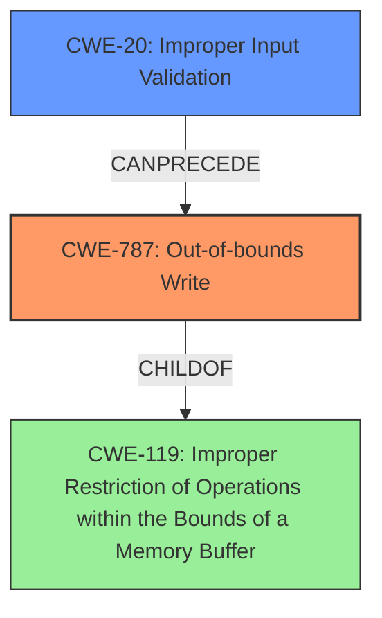

# Analysis for CVE-2024-11539

# Summary
| CWE ID  | CWE Name                                                                                     | Confidence | CWE Abstraction Level | CWE Vulnerability Mapping Label | CWE-Vulnerability Mapping Notes |
| :-------- | :------------------------------------------------------------------------------------------- | :---------- | :---------------------- | :------------------------------ | :------------------------------ |
| CWE-787   | Out-of-bounds Write                                                                          | 1.0         | Base                    | Primary CWE                      | Allowed                        |
| CWE-20    | Improper Input Validation                                                                    | 0.7         | Class                   | Secondary Candidate              | Discouraged                     |

## Evidence and Confidence

*   **Confidence Score:** 0.85
*   **Evidence Strength:** HIGH

## Relationship Analysis

The primary weakness is CWE-787, which represents an out-of-bounds write. CWE-787 is a child of CWE-119 (Improper Restriction of Operations within the Bounds of a Memory Buffer), indicating a more general class of memory buffer errors. The root cause, **lack of proper validation of user-supplied data**, points towards CWE-20 (Improper Input Validation), which can precede memory corruption issues like CWE-787. While CWE-20 is a parent (class) of CWE-1284 (Improper Validation of Specified Quantity in Input), the description lacks specific details to justify the selection of the more specific CWE-1284.

## Vulnerability Chain

The vulnerability chain begins with the **lack of proper validation of user-supplied data** (CWE-20). This leads to a **memory corruption** condition where data is written out of bounds (CWE-787). The ultimate impact is the ability to execute arbitrary code, which is a consequence of the memory corruption.

CWE-20 (Improper Input Validation) -> CWE-787 (Out-of-bounds Write) -> Remote Code Execution (Impact)

## Summary of Analysis

The analysis identifies CWE-787 (Out-of-bounds Write) as the primary CWE due to the **memory corruption** resulting from the **lack of proper validation of user-supplied data**. This aligns with the vulnerability description and the primary CWE match from similar CVE descriptions. CWE-20 (Improper Input Validation) is a secondary CWE because the root cause is described as the **lack of proper validation of user-supplied data**.

The relationship graph highlights the connection between the root cause (CWE-20) and the resulting memory corruption (CWE-787). The selection of CWE-787 is at the optimal level of specificity as it directly represents the out-of-bounds write condition.

Relevant CWE Information:

# Enhanced Context (25 CWEs)

## CWE-787: Out-of-bounds Write
**Abstraction Level**: Base
**Similarity Score**: 0.70
**Source**: dense

**Description**:
The product writes data past the end, or before the beginning, of the intended buffer.

**Mapping Guidance**:
- Usage: Allowed
- Rationale: This CWE entry is at the Base level of abstraction, which is a preferred level of abstraction for mapping to the root causes of vulnerabilities.

## CWE-20: Improper Input Validation
**Abstraction Level**: Class
**Similarity Score**: 995.10
**Source**: sparse

**Description**:
The product receives input or data, but it does
        not validate or incorrectly validates that the input has the
        properties that are required to process the data safely and
        correctly.

**Mapping Guidance**:
- Usage: Discouraged
- Rationale: CWE-20 is commonly misused in low-information vulnerability reports when lower-level CWEs could be used instead, or when more details about the vulnerability are available [REF-1287]. It is not useful for trend analysis. It is also a level-1 Class (i.e., a child of a Pillar).

### Other CWEs Considered and Rejected:

*   CWE-125 (Out-of-bounds Read): While related to memory safety, the vulnerability description specifically mentions **memory corruption**, implying a write operation, not a read.
*   CWE-119 (Improper Restriction of Operations within the Bounds of a Memory Buffer): This is a higher-level class, and CWE-787 provides a more specific description of the weakness.
*   CWE-122 (Heap-based Buffer Overflow) / CWE-121 (Stack-based Buffer Overflow): The description does not specify whether the buffer is heap-based or stack-based.
*   CWE-1284 (Improper Validation of Specified Quantity in Input): While input validation is the root cause, the description doesn't explicitly state the improper validation is related to a quantity (size or length).
*   CWE-788 (Access of Memory Location After End of Buffer): Similar to CWE-125, the provided description focuses on **memory corruption** which is a write, as opposed to a read.
*   CWE-131 (Incorrect Calculation of Buffer Size): The root cause is not the calculation of the size, but the **lack of proper validation**.