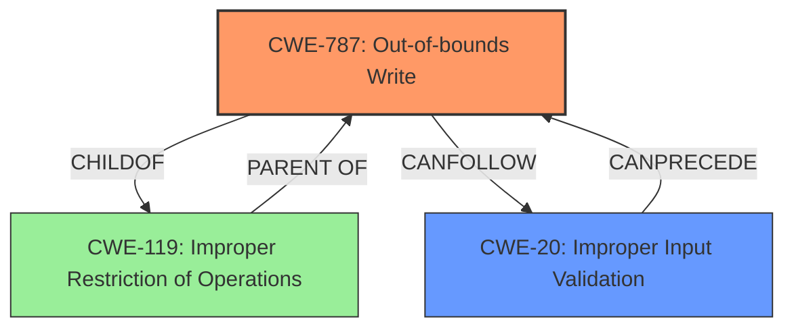

# Raw Analyzer Response for CVE-2024-11541

# Summary
| CWE ID | CWE Name | Confidence | CWE Abstraction Level | CWE Vulnerability Mapping Label | CWE-Vulnerability Mapping Notes |
|---|---|---|---|---|---|
| CWE-787 | Out-of-bounds Write | 1.0 | Base | Allowed | Primary CWE |
| CWE-20 | Improper Input Validation | 0.7 | Class | Discouraged | Secondary Candidate |

## Evidence and Confidence

*   **Confidence Score:** 0.9
*   **Evidence Strength:** HIGH

## Relationship Analysis
The primary relationship that influenced the decision was the parent-child relationship between CWE-20 and CWE-787. CWE-787 is a more specific instance of the general **improper input validation** issue described by CWE-20. The vulnerability description explicitly mentions both **lack of proper validation** (pointing to CWE-20) and **memory corruption** (often caused by out-of-bounds writes, pointing to CWE-787). Therefore, the chain relationship suggests that improper input validation leads to an out-of-bounds write.

## Vulnerability Chain
The vulnerability chain starts with **improper input validation** (CWE-20), which allows for attacker-controlled data to influence memory operations, leading to an **out-of-bounds write** (CWE-787). This then results in **memory corruption**, which can ultimately lead to remote code execution.

## Summary of Analysis
The initial assessment strongly pointed to CWE-787 (Out-of-bounds Write) due to the **memory corruption** condition directly resulting from a **lack of proper validation of user-supplied data.** The "CWE for similar CVE Descriptions" section also lists CWE-787 as the "Primary CWE Match" and the most frequent CWE.

CWE-20 (Improper Input Validation) was considered as a secondary factor because the **lack of proper validation** is the root cause that allows the out-of-bounds write to occur. While CWE-20 is a broader category, it accurately reflects the initial **root cause** of the vulnerability.

The final decision was to classify the vulnerability primarily as CWE-787, which is the direct cause of the **memory corruption**, and secondarily as CWE-20, because that is the **root cause** for the vulnerability. CWE-787 is at the optimal level of specificity (Base) since it precisely describes the type of memory error.