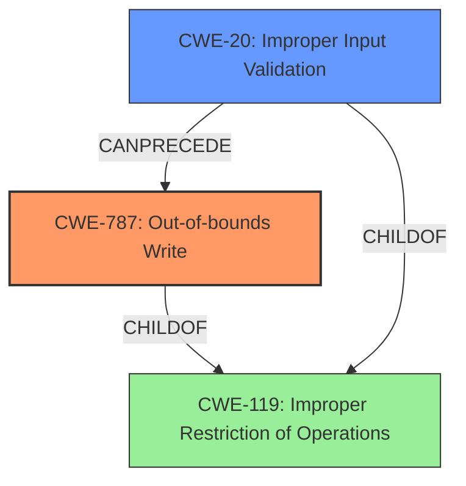

# Raw Analyzer Response for CVE-2024-11574

# Summary
| CWE ID | CWE Name | Confidence | CWE Abstraction Level | CWE Vulnerability Mapping Label | CWE-Vulnerability Mapping Notes |
|---|---|---|---|---|---|
| CWE-787 | Out-of-bounds Write | 1.0 | Base | Primary | Allowed |
| CWE-20 | Improper Input Validation | 0.7 | Class | Secondary | Discouraged |

## Evidence and Confidence

*   **Confidence Score:** 0.9
*   **Evidence Strength:** HIGH

## Relationship Analysis
The primary weakness is CWE-787 (Out-of-bounds Write), which is a base-level CWE. The vulnerability description indicates a **lack of proper validation of user-supplied data** leading to **memory corruption**. This aligns with CWE-787, as improper validation can lead to writing data outside the intended buffer.

CWE-20 (Improper Input Validation) is considered as a secondary weakness, as the root cause is the **lack of proper validation of user-supplied data**, which could lead to other vulnerabilities beyond just out-of-bounds write. It is a class-level CWE and discouraged, as more specific CWEs are available.

## Vulnerability Chain
The vulnerability chain starts with **lack of proper validation of user-supplied data** (CWE-20), which results in a **memory corruption** condition (CWE-787), and finally leads to Remote Code Execution.

## Summary of Analysis
The analysis is primarily based on the vulnerability description, which explicitly states the **lack of proper validation of user-supplied data** as the root cause, leading to **memory corruption**. The "CVE Reference Links Content Summary" confirms this. The primary CWE selected is CWE-787 (Out-of-bounds Write), as it directly describes the resulting memory corruption. CWE-20 is a secondary consideration because the root cause is **lack of proper validation of user-supplied data** that allows the write to occur out of bounds.

Other CWEs considered but not used:

*   CWE-125 (Out-of-bounds Read): Not applicable, as the vulnerability description focuses on writing to memory, not reading.
*   CWE-119 (Improper Restriction of Operations within the Bounds of a Memory Buffer): This is a class-level CWE and is too general. CWE-787 is a more specific base-level CWE.
*   CWE-122 (Heap-based Buffer Overflow): While it could be a possibility that the memory corruption happens on the heap, the description does not provide enough evidence to confirm this. Therefore, a more general CWE-787 is selected.
*   CWE-1284 (Improper Validation of Specified Quantity in Input): This is more specific to size or length validation, which isn't explicitly mentioned in the vulnerability description, so it is not the best fit.
*   CWE-434 (Unrestricted Upload of File with Dangerous Type): Irrelevant because there is no mention of uploading files.
*   CWE-95 (Improper Neutralization of Directives in Dynamically Evaluated Code ('Eval Injection')): Irrelevant because there is no dynamic evaluation involved.
*   CWE-824 (Access of Uninitialized Pointer): Irrelevant because there is no mention of uninitialized pointer.