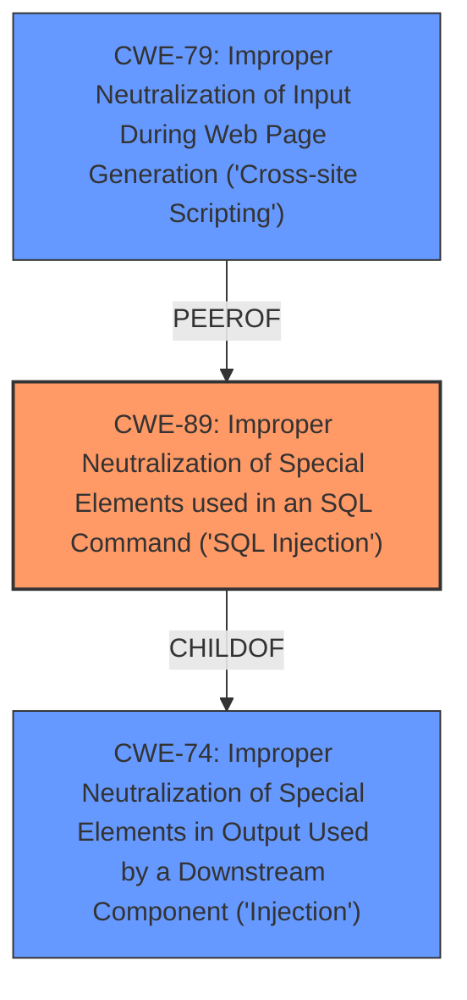

# Analysis Report for CVE-2024-11591

# Vulnerability Analysis Report: CVE-2024-11591

## Description

A vulnerability, which was classified as critical, was found in 1000 Projects Beauty Parlour Management System 1.0. This affects an unknown part of the file /admin/add-services.php. The manipulation of the argument sername leads to **sql injection**. It is possible to initiate the attack remotely. The exploit has been disclosed to the public and may be used.

## Vulnerability Description Key Phrases

- **Weakness:** sql injection
- **Product:** 1000 Projects Beauty Parlour Management System
- **Version:** 1
- **Component:** /admin/add-services.php

## Analysis (with Relationship Data)

# Summary
| CWE ID | CWE Name | Confidence | CWE Abstraction Level | CWE Vulnerability Mapping Label | CWE-Vulnerability Mapping Notes |
|---|---|---|---|---|---|
| CWE-89 | Improper Neutralization of Special Elements used in an SQL Command ('SQL Injection') | 1.0 | Base | Primary | Allowed |

## Evidence and Confidence

*   **Confidence Score:** 1.0
*   **Evidence Strength:** HIGH

## Relationship Analysis
The primary relationship influencing the decision is that CWE-89 is a Base level weakness, directly addressing the **SQL Injection** issue described in the vulnerability. While other CWEs like CWE-79 (Cross-Site Scripting) and CWE-74 (Injection) were considered, they represent different attack vectors or higher-level abstractions, making CWE-89 the most precise match.



## Vulnerability Chain
The vulnerability chain starts with the **lack of input validation** on the `sername` parameter, leading to **SQL Injection** (CWE-89). The potential impact includes unauthorized database access, sensitive data leakage, data tampering, system control, and service interruption.

## Summary of Analysis
The analysis is based on the provided evidence, primarily the vulnerability description highlighting the **SQL Injection** vulnerability in the `sername` parameter of the `admin/add-services.php` file. The CVE Reference Links Content Summary confirms that user-supplied input is directly used in SQL queries without proper sanitization, leading to the injection vulnerability.

The retriever results also strongly support CWE-89 as the primary weakness. The graph relationships show that while CWE-74 and CWE-79 are related, they aren't as specific as CWE-89 in this case. CWE-89 is at the optimal level of specificity, directly addressing the root cause of the vulnerability, which is the improper neutralization of special elements used in an SQL command.

Relevant CWE Information:
- CWE-89: Improper Neutralization of Special Elements used in an SQL Command ('SQL Injection')
  - The product constructs all or part of an SQL command using externally-influenced input, but it does not neutralize or incorrectly neutralizes special elements that could modify the intended SQL command.

I considered CWE-74 (Improper Neutralization of Special Elements in Output Used by a Downstream Component ('Injection')) and CWE-79 (Improper Neutralization of Input During Web Page Generation ('Cross-site Scripting')), but these were rejected because CWE-89 is more specific to the **SQL Injection** vulnerability. CWE-74 is a higher-level class, and CWE-79 is for Cross-Site Scripting, which is a different type of vulnerability.


## CWE Relationship Analysis

Current CWEs represent these abstraction levels: .


### Vulnerability Chain Analysis

**Chain starting from CWE-89:**
- 89 (Improper Neutralization of Special Elements used in an SQL Command ('SQL Injection')) - ROOT


**Chain starting from CWE-79:**
- 79 (Improper Neutralization of Input During Web Page Generation ('Cross-site Scripting')) - ROOT


### CWE Relationship Diagram

```mermaid
graph TD
    classDef primary fill:#f96,stroke:#333,stroke-width:2px
    classDef secondary fill:#69f,stroke:#333
    classDef tertiary fill:#9e9,stroke:#333
```


*Report generated on 2025-07-13 01:45:04*
