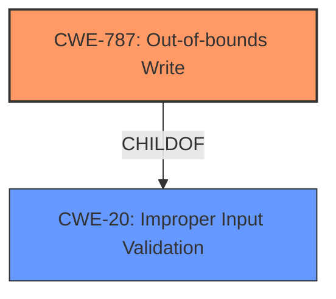

# Analysis Report for CVE-2024-11610

# Vulnerability Analysis Report: CVE-2024-11610

## Description

AutomationDirect C-More EA9 EAP9 File Parsing **Memory Corruption** Remote Code Execution Vulnerability. This vulnerability allows remote attackers to execute arbitrary code on affected installations of AutomationDirect C-More EA9. User interaction is required to exploit this vulnerability in that the target must visit a malicious page or open a malicious file. The specific flaw exists within the parsing of EAP9 files. The issue results from the **lack of proper validation of user-supplied data**, which can result in a memory corruption condition. An attacker can leverage this vulnerability to execute code in the context of the current process. Was ZDI-CAN-24773.

## Vulnerability Description Key Phrases

- **Rootcause:** lack of proper validation of user-supplied data
- **Weakness:** Memory Corruption
- **Impact:** ['execute code in the context of the current process', 'execute arbitrary code', 'Remote Code Execution']
- **Vector:** parsing of EAP9 files
- **Attacker:** remote attackers
- **Product:** AutomationDirect C-More EA9

## Analysis (with Relationship Data)

# Summary

| CWE ID | CWE Name | Confidence | CWE Abstraction Level | CWE Vulnerability Mapping Label | CWE-Vulnerability Mapping Notes |
|---|---|---|---|---|---|
| CWE-787 | Out-of-bounds Write | 0.9 | Base | Primary | Allowed |
| CWE-20 | Improper Input Validation | 0.7 | Class | Secondary | Discouraged |

## Evidence and Confidence

*   **Confidence Score:** 0.8
*   **Evidence Strength:** HIGH

## Relationship Analysis

The primary weakness is **CWE-787 (Out-of-bounds Write)**, which is a Base level CWE. This vulnerability stems from a **lack of proper validation of user-supplied data**, which can be generalized as **CWE-20 (Improper Input Validation)**, a Class level CWE. **CWE-20** is a general class of error that can lead to out-of-bounds writes.



## Vulnerability Chain

1.  The root cause is the **lack of proper validation of user-supplied data**.
2.  This leads to **memory corruption**.
3.  The memory corruption results in an **out-of-bounds write**.
4.  The out-of-bounds write allows for **arbitrary code execution**.

Therefore, the chain is: **Improper Input Validation** -> **Memory Corruption** -> **Out-of-bounds Write** -> **Arbitrary Code Execution**.

## Summary of Analysis

The analysis indicates that the primary cause of the vulnerability is the **lack of proper validation of user-supplied data**, resulting in a **memory corruption** condition, specifically an **out-of-bounds write**. The vulnerability description explicitly states: "The issue results from the **lack of proper validation of user-supplied data**, which can result in a memory corruption condition."

The retriever results strongly suggest **CWE-787 (Out-of-bounds Write)** as the most relevant CWE, with a high similarity score. While **CWE-20 (Improper Input Validation)** is also listed, it is a broader category and the description provides enough detail to identify the more specific **CWE-787**.

**CWE-787** is selected because the vulnerability description mentions that the **lack of validation** leads to **memory corruption**, which manifests as an **out-of-bounds write**. This aligns perfectly with the description of **CWE-787**: "The product writes data past the end, or before the beginning, of the intended buffer."

**CWE-20** is included as a secondary CWE because the root cause is the **lack of validation**. While **CWE-20** is discouraged for general use, it's appropriate here because it highlights the initial failure that led to the more specific **CWE-787**.

I considered other CWEs from the retriever results, such as:

*   **CWE-122 (Heap-based Buffer Overflow)** and **CWE-121 (Stack-based Buffer Overflow)**: While buffer overflows are a common consequence of out-of-bounds writes, the description doesn't specify whether the overflow occurs on the heap or stack. Therefore, **CWE-787** is a more accurate representation of the weakness.
*   **CWE-125 (Out-of-bounds Read)**: The vulnerability description specifically mentions **memory corruption**, implying a write operation rather than a read.

The final selection is based on the evidence provided and aims for the most specific and accurate representation of the vulnerability.


## CWE Relationship Analysis

Current CWEs represent these abstraction levels: .


### Vulnerability Chain Analysis

**Chain starting from CWE-121:**
- 121 (Stack-based Buffer Overflow) - ROOT


**Chain starting from CWE-125:**
- 125 (Out-of-bounds Read) - ROOT


### CWE Relationship Diagram

```mermaid
graph TD
    classDef primary fill:#f96,stroke:#333,stroke-width:2px
    classDef secondary fill:#69f,stroke:#333
    classDef tertiary fill:#9e9,stroke:#333
```


*Report generated on 2025-07-13 01:46:14*
