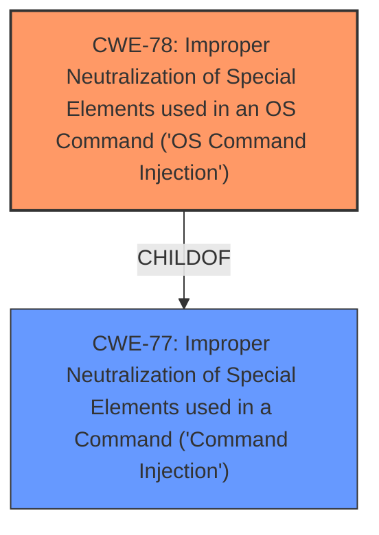

# Raw Analyzer Response for CVE-2024-11634

# Summary
| CWE ID | CWE Name | Confidence | CWE Abstraction Level | CWE Vulnerability Mapping Label | CWE-Vulnerability Mapping Notes |
|---|---|---|---|---|---|
| CWE-78 | Improper Neutralization of Special Elements used in an OS Command ('OS Command Injection') | 1.0 | Base | Allowed | Primary CWE |
| CWE-77 | Improper Neutralization of Special Elements used in a Command ('Command Injection') | 0.7 | Class | Allowed-with-Review | Secondary Candidate |

## Evidence and Confidence

*   **Confidence Score:** 0.9
*   **Evidence Strength:** HIGH

## Relationship Analysis
The primary relationship influencing the CWE selection is the ChildOf relationship. CWE-78 is a ChildOf CWE-77, making it more specific. The vulnerability description explicitly mentions command injection leading to remote code execution, which aligns with the nature of CWE-78 when applied to OS commands. The close relationship between these two CWEs allows for a confident assignment of CWE-78 as the primary weakness, further strengthened by the term "OS Command" in the CWE description.

## Vulnerability Chain
The vulnerability chain starts with **improper neutralization** of special elements in a command, specifically an OS command, leading to **command injection** and ultimately resulting in remote code execution.
  - The root cause is the **improper neutralization**.
  - The weakness is the resulting **OS command injection**.
  - The impact is remote code execution.

## Summary of Analysis
The initial analysis identified a **command injection** vulnerability. The Retriever Results listed CWE-77 and CWE-78 as top candidates. Given the specificity of the vulnerability description indicating it involves operating system commands, CWE-78 was selected as the primary CWE. This decision is based on the fact that CWE-78 is a more specific instance of CWE-77, and the vulnerability involves the injection of OS commands. The vulnerability description key phrases identify the **weakness** as **command injection**.
The final CWE selection is based on the provided evidence and relationship analysis. The selection of CWE-78 is at the optimal level of specificity because it directly addresses the **improper neutralization** of special elements within OS commands, leading to remote code execution.

Relevant CWE Information:

# Enhanced Context (25 CWEs)
The following CWEs were identified as potentially relevant to this vulnerability:

## CWE-74: Improper Neutralization of Special Elements in Output Used by a Downstream Component ('Injection')
**Abstraction Level**: Class
**Similarity Score**: 0.77
**Source**: dense

**Description**:
The product constructs all or part of a command, data structure, or record using externally-influenced input from an upstream component, but it does not neutralize or incorrectly neutralizes special elements that could modify how it is parsed or interpreted when it is sent to a downstream component.

**Mapping Guidance**:
- Usage: Discouraged
- Rationale: CWE-74 is high-level and often misused when lower-level weaknesses are more appropriate.

## CWE-78: Improper Neutralization of Special Elements used in an OS Command ('OS Command Injection')
**Abstraction Level**: base
**Similarity Score**: 4.31
**Source**: graph

**Description**:
CWE-78: Improper Neutralization of Special Elements used in an OS Command ('OS Command Injection')

**Mapping Guidance**:
- Usage: Allowed
- Rationale: This CWE entry is at the Base level of abstraction, which is a preferred level of abstraction for mapping to the root causes of vulnerabilities.

**Relationships**:
- CANFOLLOW -> CWE-184
- CANALSOBE -> CWE-88
- CHILDOF -> CWE-77
- CHILDOF -> CWE-77
- CHILDOF -> CWE-74

## CWE-77: Improper Neutralization of Special Elements used in a Command ('Command Injection')
**Abstraction Level**: Class
**Similarity Score**: 1.00
**Source**: alternate_terms

**Description**:
The product receives input from an upstream component that is used to construct all or part of a command that is sent to a downstream component. However, the product does not neutralize or incorrectly neutralizes special elements that could modify the command when it is sent to the downstream component.

**Mapping Guidance**:
- Usage: Allowed-with-Review
- Rationale: This CWE entry is a Class and might have Base-level children that would be more appropriate

## CWE-78: Improper Neutralization of Special Elements used in an OS Command ('OS Command Injection')
### Technical Explanation for CWE-78:

The vulnerability involves **improper neutralization** of special elements used in an OS command. An attacker can inject malicious commands into the input that, when processed by the system, allows them to execute arbitrary code on the server.

*   **How it matches:** The vulnerability description explicitly states a **command injection** exists in Ivanti products, leading to remote code execution. This directly aligns with the characteristics of CWE-78, which focuses on **command injection** vulnerabilities specifically related to OS commands.
*   **Security implications:** This can lead to complete system compromise, data theft, or denial of service.
*   **Relationships:** CWE-78 is a child of CWE-77, making it a more specific case of **command injection**.
*   **Primary/Secondary:** This is the primary weakness.
*   **MITRE Mapping Guidance:** The usage is ALLOWED, and this is a Base level CWE, making it an appropriate choice.

### Technical Explanation for CWE-77:

The vulnerability involves **improper neutralization** of special elements used in a command. An attacker can inject malicious commands into the input that, when processed by the system, allows them to execute arbitrary code on the server.

*   **How it matches:** The vulnerability description explicitly states a **command injection** exists in Ivanti products, leading to remote code execution. This directly aligns with the characteristics of CWE-77, which focuses on **command injection** vulnerabilities.
*   **Security implications:** This can lead to complete system compromise, data theft, or denial of service.
*   **Relationships:** CWE-77 is a parent of CWE-78
*   **Primary/Secondary:** This is a secondary candidate weakness.
*   **MITRE Mapping Guidance:** The usage is ALLOWED-WITH-REVIEW, and this is a Class level CWE, and suggests a more specific base-level child might be a better fit.

### Considered but not used:
*   CWE-74, CWE-89, CWE-94, CWE-1336, CWE-88, CWE-20: These were considered but deemed less relevant as they represent broader categories or different types of injection vulnerabilities (e.g., SQL injection, code injection) and input validation issues. The vulnerability description specifically indicates **command injection**, making CWE-78 a more precise fit.
* CWE-285: Improper Authorization, was not a fit because the vulnerability is related to **improper neutralization** of input, not an authorization issue.
* CWE-425: Direct Request ('Forced Browsing'), was not a fit because the vulnerability is related to **improper neutralization** of input, not about access control or authorization bypass.