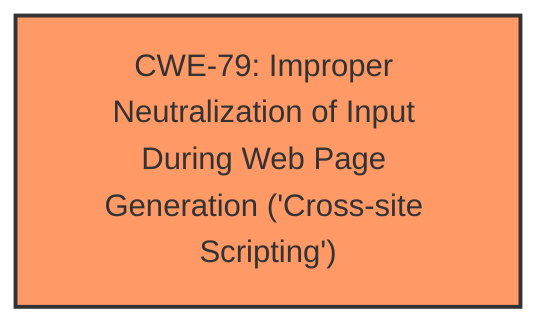

# Analysis Report for CVE-2024-11636

# Vulnerability Analysis Report: CVE-2024-11636

## Description

The Email Subscribers by Icegram Express WordPress plugin before 5.7.45 does not sanitise and escape some of its Text Block options, which could allow high privilege users such as admin to perform Stored Cross-Site Scripting attacks even when the unfiltered_html capability is disallowed (for example in multisite setup).

## Vulnerability Description Key Phrases

- **Weakness:** cross-site scripting
- **Impact:** ['Stored Cross-Site Scripting attacks', 'XSS attacks']
- **Attacker:** high privilege users such as admin
- **Product:** Email Subscribers by Icegram Express WordPress plugin
- **Version:** before 5.7.45
- **Component:** Text Block options

## Analysis (with Relationship Data)

# Summary
| CWE ID | CWE Name | Confidence | CWE Abstraction Level | CWE Vulnerability Mapping Label | CWE-Vulnerability Mapping Notes |
|---|---|---|---|---|---|
| CWE-79 | Improper Neutralization of Input During Web Page Generation ('Cross-site Scripting') | 1.0 | Base | Primary | Allowed |

## Evidence and Confidence

*   **Confidence Score:** 1.0
*   **Evidence Strength:** HIGH

## Relationship Analysis
The primary relationship identified is the direct match of the **weakness** described in the vulnerability to CWE-79. While other CWEs like CWE-80, CWE-116, and CWE-863 were considered, the direct nature of the **Cross-Site Scripting** vulnerability and the lack of authentication or authorization issues lead to the selection of CWE-79 as the most appropriate. CWE-79 is a Base level CWE, providing the right level of specificity.



## Vulnerability Chain
The vulnerability chain is straightforward:
1.  **Root Cause:** **Improper neutralization of input** within the Text Block options in the Email Subscribers plugin.
2.  **Weakness:** Stored Cross-Site Scripting (XSS).
3.  **Impact:** High-privilege users can inject malicious scripts, even with `unfiltered_html` disallowed.

The **Primary CWE** is CWE-79, identifying the root cause.

## Summary of Analysis
The analysis is based on strong evidence from the vulnerability description and the CVE Reference Links Content Summary, which clearly indicates that the Email Subscribers plugin does not sanitize and escape some of its Text Block options, leading to Stored Cross-Site Scripting. The description explicitly states that the **weakness** is **cross-site scripting**, making CWE-79 the most appropriate choice.

The other CWEs from the Retriever Results were considered but not used:

*   CWE-352 (Cross-Site Request Forgery): While related to web applications, this vulnerability is not about CSRF but rather about XSS.
*   CWE-116 (Improper Encoding or Escaping of Output): This is a more general case of improper output handling. CWE-79 is more specific to the XSS nature of this vulnerability.
*   CWE-862 (Missing Authorization): The vulnerability description does not indicate a missing authorization check. Although it mentions high privilege users, the problem is not a lack of authorization, but rather a lack of proper input sanitization.
*   CWE-89 (Improper Neutralization of Special Elements used in an SQL Command ('SQL Injection')): This is specific to SQL injection, which is not the case here.
*   CWE-434 (Unrestricted Upload of File with Dangerous Type): The vulnerability does not involve file uploads.
*   CWE-80 (Improper Neutralization of Script-Related HTML Tags in a Web Page (Basic XSS)): While very similar, CWE-79 is broader and more commonly used for XSS.
*   CWE-863 (Incorrect Authorization): Similar to CWE-862, the primary issue is not incorrect authorization, but rather a lack of input sanitization.

The selection of CWE-79 is at the optimal level of specificity because it directly addresses the **weakness** of **cross-site scripting** described in the vulnerability.

Relevant CWE Information:

# Enhanced Context (25 CWEs)
The following CWEs were identified as potentially relevant to this vulnerability:

## CWE-79: Improper Neutralization of Input During Web Page Generation ('Cross-site Scripting')
**Abstraction Level**: Base
**Similarity Score**: 1654.89
**Source**: sparse

**Description**:
The product does not neutralize or incorrectly neutralizes user-controllable input before it is placed in output that is used as a web page that is served to other users.

**Mapping Guidance**:
- Usage: Allowed
- Rationale: This CWE entry is at the Base level of abstraction, which is a preferred level of abstraction for mapping to the root causes of vulnerabilities.

**Relationships**:
- PARENTOF -> CWE-87
- PARENTOF -> CWE-86
- PARENTOF -> CWE-85
- PARENTOF -> CWE-84
- PARENTOF -> CWE-83


## CWE Relationship Analysis

Current CWEs represent these abstraction levels: .


### Vulnerability Chain Analysis

**Chain starting from CWE-87:**
- 87 (Improper Neutralization of Alternate XSS Syntax) - ROOT


**Chain starting from CWE-863:**
- 863 (Incorrect Authorization) - ROOT


### CWE Relationship Diagram

```mermaid
graph TD
    classDef primary fill:#f96,stroke:#333,stroke-width:2px
    classDef secondary fill:#69f,stroke:#333
    classDef tertiary fill:#9e9,stroke:#333
```


*Report generated on 2025-07-13 01:49:03*
