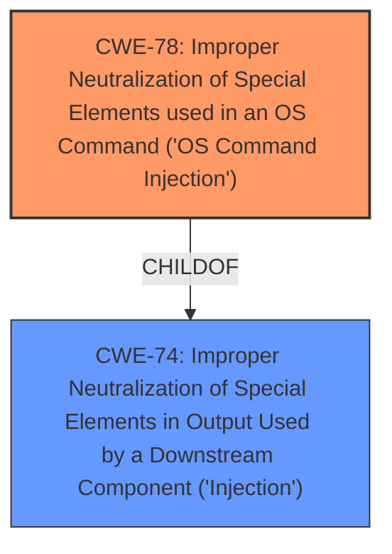

# Enhanced Analysis for CVE-2024-11659

# Summary
| CWE ID | CWE Name | Confidence | CWE Abstraction Level | CWE Vulnerability Mapping Label | CWE-Vulnerability Mapping Notes |
|---|---|---|---|---|---|
| CWE-78 | Improper Neutralization of Special Elements used in an OS Command ('OS Command Injection') | 1.0 | Base | Allowed | Primary CWE |

## Evidence and Confidence

*   **Confidence Score:** 1.0
*   **Evidence Strength:** HIGH

## Relationship Analysis
The primary relationship is that CWE-78 is a specific type of injection, making it a child of CWE-74 (Improper Neutralization of Special Elements in Output Used by a Downstream Component ('Injection')). The other relationships, such as CANFOLLOW to CWE-184 (Incomplete List of Disallowed Inputs), suggest potential follow-up weaknesses that could be present but are not explicitly stated. CWE-77 is a Class level, whereas CWE-78 is a Base level, making CWE-78 the more specific and appropriate choice.



## Vulnerability Chain
The vulnerability chain starts with the **improper neutralization** of the `iperf` argument, leading to **command injection**, and ultimately resulting in arbitrary command execution on the system.

## Summary of Analysis
The initial assessment strongly points to CWE-78, which is directly supported by the vulnerability description highlighting the **command injection** via the `iperf` parameter. The "CVE Reference Links Content Summary" explicitly states that the `iperf` parameter is passed to a system command execution function without proper sanitization. This confirms the **root cause** as an **improper neutralization** issue, making CWE-78 the most accurate and specific classification. The selection of CWE-78 is at the optimal level of specificity (Base) and is based on direct evidence from the vulnerability description and supporting documentation.

Relevant CWE Information:

# Enhanced Context (25 CWEs)
The following CWEs were identified as potentially relevant to this vulnerability:

## CWE-74: Improper Neutralization of Special Elements in Output Used by a Downstream Component ('Injection')
**Abstraction Level**: Class
**Similarity Score**: 0.77
**Source**: dense

**Description**:
The product constructs all or part of a command, data structure, or record using externally-influenced input from an upstream component, but it does not neutralize or incorrectly neutralizes special elements that could modify how it is parsed or interpreted when it is sent to a downstream component.

**Mapping Guidance**:
- Usage: Discouraged
- Rationale: CWE-74 is high-level and often misused when lower-level weaknesses are more appropriate.

## CWE-78: Improper Neutralization of Special Elements used in an OS Command ('OS Command Injection')
**Abstraction Level**: Base
**Similarity Score**: 0.77
**Source**: dense

**Description**:
The product constructs all or part of an OS command using externally-influenced input from an upstream component, but it does not neutralize or incorrectly neutralizes special elements that could modify the intended OS command when it is sent to a downstream component.

**Mapping Guidance**:
- Usage: Allowed
- Rationale: This CWE entry is at the Base level of abstraction, which is a preferred level of abstraction for mapping to the root causes of vulnerabilities.

## CWE-89: Improper Neutralization of Special Elements used in an SQL Command ('SQL Injection')
**Abstraction Level**: Base
**Similarity Score**: 1414.07
**Source**: sparse

**Description**:
The product constructs all or part of an SQL command using externally-influenced input from an upstream component, but it does not neutralize or incorrectly neutralizes special elements that could modify the intended SQL command when it is sent to a downstream component. Without sufficient removal or quoting of SQL syntax in user-controllable inputs, the generated SQL query can cause those inputs to be interpreted as SQL instead of ordinary user data.

**Mapping Guidance**:
- Usage: Allowed
- Rationale: This CWE entry is at the Base level of abstraction, which is a preferred level of abstraction for mapping to the root causes of vulnerabilities.

### Additional Considerations
- CWE-77 (Improper Neutralization of Special Elements used in a Command ('Command Injection')): While related, it's a Class-level CWE and less specific than CWE-78, which directly addresses OS command injection.
- CWE-89 (Improper Neutralization of Special Elements used in an SQL Command ('SQL Injection')): This is not applicable as the vulnerability involves OS commands, not SQL commands.
- CWE-79 (Improper Neutralization of Input During Web Page Generation ('Cross-site Scripting')): This is not applicable because the injection is happening at the OS command level, not during web page generation.


## CWE Relationship Analysis

Current CWEs represent these abstraction levels: .


### Vulnerability Chain Analysis

**Chain starting from CWE-89:**
- 89 (Improper Neutralization of Special Elements used in an SQL Command ('SQL Injection')) - ROOT


**Chain starting from CWE-77:**
- 77 (Improper Neutralization of Special Elements used in a Command ('Command Injection')) - ROOT


### CWE Relationship Diagram

```mermaid
graph TD
    classDef primary fill:#f96,stroke:#333,stroke-width:2px
    classDef secondary fill:#69f,stroke:#333
    classDef tertiary fill:#9e9,stroke:#333
```