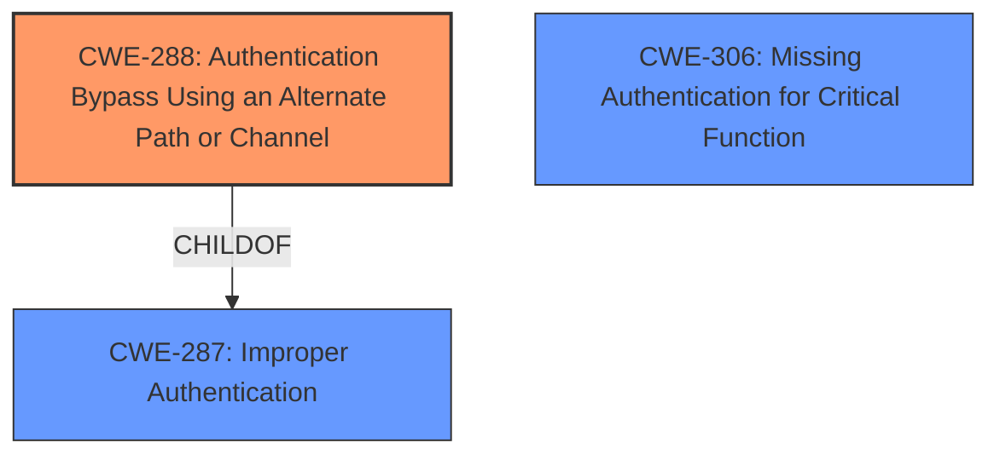

# Analysis for CVE-2024-11671

# Summary
| CWE ID | CWE Name | Confidence | CWE Abstraction Level | CWE Vulnerability Mapping Label | CWE-Vulnerability Mapping Notes |
|---|---|---|---|---|---|
| CWE-288 | Authentication Bypass Using an Alternate Path or Channel | 0.9 | Base | Allowed | Primary CWE: The application allows bypassing authentication by switching to an alternate data source. |
| CWE-287 | Improper Authentication | 0.7 | Class | Discouraged | Secondary Candidate: A more general case of authentication issues. |
| CWE-306 | Missing Authentication for Critical Function | 0.6 | Base | Allowed | Secondary Candidate: Considered because the MFA validation is bypassed, suggesting a lack of authentication for certain data source switching operations. |

## Evidence and Confidence

*   **Confidence Score:** 0.9
*   **Evidence Strength:** HIGH

## Relationship Analysis
The primary CWE selected is CWE-288, which represents a specific type of authentication bypass. CWE-287 is a parent class representing general improper authentication. CWE-306 is considered as a potential related issue where authentication is missing for critical functions. The choice of CWE-288 is based on the evidence that an alternate path (data source switching) is used to bypass authentication, making it more specific than the general CWE-287.

## Vulnerability Chain
The vulnerability chain starts with the **improper authentication** mechanism, specifically how MFA validation is handled during data source switching. The weakness allows an authenticated user to bypass the MFA validation process by switching data sources, ultimately leading to unauthorized access.
  - Root Cause: **Improper Authentication** (CWE-288)
  - Impact: Bypass MFA validation, potential unauthorized access.

## Summary of Analysis
The analysis is based on the provided vulnerability description and CVE reference content summary. The key evidence is the **improper authentication** in SQL data source MFA validation, which can be bypassed by switching data sources. This aligns directly with CWE-288, Authentication Bypass Using an Alternate Path or Channel.

The selection of CWE-288 is justified because it specifically describes the scenario where authentication is bypassed through an alternate path or channel, which in this case is the data source switching mechanism. While CWE-287 (Improper Authentication) is a more general class, CWE-288 provides a more precise representation of the vulnerability.

The retriever results also support this decision, with CWE-288 having a high relevance score.

Relevant CWE Information:

# Enhanced Context (25 CWEs)
The following CWEs were identified as potentially relevant to this vulnerability:

## CWE-288: Authentication Bypass Using an Alternate Path or Channel
**Abstraction Level**: Base
**Similarity Score**: 0.77
**Source**: dense

**Description**:
The product requires authentication, but the product has an alternate path or channel that does not require authentication.

**Mapping Guidance**:
- Usage: Allowed
- Rationale: This CWE entry is at the Base level of abstraction, which is a preferred level of abstraction for mapping to the root causes of vulnerabilities.
# Complete CWE Specifications

CWE-288: Authentication Bypass Using an Alternate Path or Channel

CWE-287: Improper Authentication

CWE-306: Missing Authentication for Critical Function