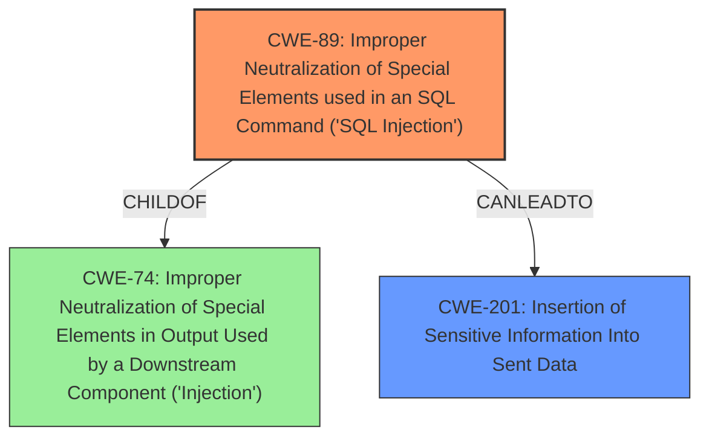

# Enhanced Analysis for CVE-2024-11710

# Summary
| CWE ID | CWE Name | Confidence | CWE Abstraction Level | CWE Vulnerability Mapping Label | CWE-Vulnerability Mapping Notes |
|---|---|---|---|---|---|
| CWE-89 | Improper Neutralization of Special Elements used in an SQL Command ('SQL Injection') | 1.0 | Base | Allowed | Primary CWE |
| CWE-201 | Insertion of Sensitive Information Into Sent Data | 0.6 | Base | Allowed | Secondary Candidate |

## Evidence and Confidence

*   **Confidence Score:** 0.9
*   **Evidence Strength:** HIGH

## Relationship Analysis
The primary CWE is CWE-89, which is a Base level CWE and directly addresses the **SQL Injection** vulnerability. Other CWEs like CWE-74 (Improper Neutralization of Special Elements in Output Used by a Downstream Component ('Injection')) are more general and less specific. The relationship of CWE-89 being a child of CWE-74 reinforces this. CWE-201 is included because of the impact of the **SQL Injection**, which leads to the potential disclosure of sensitive information.



## Vulnerability Chain
The vulnerability chain starts with **insufficient escaping on the user supplied parameter and lack of sufficient preparation on the existing SQL query**, leading to **SQL Injection**, which then results in potential information disclosure.

*   **Root Cause:** **Insufficient escaping and lack of preparation**
*   **Weakness:** CWE-89 (Improper Neutralization of Special Elements used in an SQL Command ('SQL Injection'))
*   **Impact:** CWE-201 (Insertion of Sensitive Information Into Sent Data)

## Summary of Analysis
The analysis is based on the provided vulnerability description and the associated CVE reference. The description clearly states that the vulnerability is due to **insufficient escaping** and a **lack of preparation** in SQL queries. This directly corresponds to CWE-89, which describes **improper neutralization** leading to **SQL Injection**. The CVE reference confirms this and provides additional details about the vulnerable parameters.

The retriever results also strongly suggest CWE-89 as the primary weakness. While other CWEs like CWE-116, CWE-352, and CWE-90 are listed, they are not as directly relevant as CWE-89. CWE-116 is related to encoding issues, which are not the primary cause here. CWE-352 is related to Cross-Site Request Forgery, which is a different type of vulnerability. CWE-90 is related to LDAP Injection, which is also not relevant.

The selection of CWE-89 is at the optimal level of specificity because it directly reflects the nature of the **SQL Injection** vulnerability. It is a Base level CWE, which is preferred for root cause analysis.

CWE-201 is included as a secondary weakness to highlight the potential impact of the **SQL Injection**, which is the disclosure of sensitive information.

Relevant CWE Information:

# Enhanced Context (25 CWEs)
The following CWEs were identified as potentially relevant to this vulnerability:

## CWE-472: External Control of Assumed-Immutable Web Parameter
**Abstraction Level**: Base
**Similarity Score**: 0.76
**Source**: dense

**Description**:
The web application does not sufficiently verify inputs that are assumed to be immutable but are actually externally controllable, such as hidden form fields.

**Mapping Guidance**:
- Usage: Allowed
- Rationale: This CWE entry is at the Base level of abstraction, which is a preferred level of abstraction for mapping to the root causes of vulnerabilities.

**Relationships**:
- CANFOLLOW -> CWE-656
- REQUIREDBY -> CWE-384
- CHILDOF -> CWE-471
- CHILDOF -> CWE-642
- CANPRECEDE -> CWE-472

*Not Used:* While this CWE relates to external control of parameters, it's not as directly relevant as CWE-89, which focuses on **SQL Injection** caused by **improper neutralization**.

## CWE-425: Direct Request ('Forced Browsing')
**Abstraction Level**: Base
**Similarity Score**: 0.76
**Source**: dense

**Description**:
The web application does not adequately enforce appropriate authorization on all restricted URLs, scripts, or files.

**Mapping Guidance**:
- Usage: Allowed
- Rationale: This CWE entry is at the Base level of abstraction, which is a preferred level of abstraction for mapping to the root causes of vulnerabilities.

**Relationships**:
- CANPRECEDE -> CWE-98
- CANPRECEDE -> CWE-471
- CHILDOF -> CWE-424
- CHILDOF -> CWE-288
- CHILDOF -> CWE-862

*Not Used:* This CWE is about authorization bypass, which is not the primary issue here. The vulnerability is about **SQL Injection**, not about unauthorized access.

## CWE-352: Cross-Site Request Forgery (CSRF)
**Abstraction Level**: Compound
**Similarity Score**: 0.75
**Source**: dense

**Description**:
The web application does not, or can not, sufficiently verify whether a well-formed, valid, consistent request was intentionally provided by the user who submitted the request.

**Mapping Guidance**:
- Usage: Allowed
- Rationale: This is a well-known Composite of multiple weaknesses that must all occur simultaneously, although it is attack-oriented in nature.

**Relationships**:
- REQUIREDBY -> CWE-613
- CANFOLLOW -> CWE-656
- CANPRECEDE -> CWE-362
- CANPRECEDE -> CWE-287
- CHILDOF -> CWE-1057

*Not Used:* This CWE addresses CSRF, which is a different type of vulnerability than **SQL Injection**.

## CWE-116: Improper Encoding or Escaping of Output
**Abstraction Level**: Class
**Similarity Score**: 0.75
**Source**: dense

**Description**:
The product prepares a structured message for communication with another component, but encoding or escaping of the data is either missing or done incorrectly. As a result, the intended structure of the message is not preserved.

**Mapping Guidance**:
- Usage: Allowed-with-Review
- Rationale: This CWE entry is a Class and might have Base-level children that would be more appropriate

**Relationships**:
- CANFOLLOW -> CWE-20
- CANFOLLOW -> CWE-264
- CANFOLLOW -> CWE-137
- CANFOLLOW -> CWE-74
- CHILDOF -> CWE-1087

*Not Used:* While **insufficient escaping** is mentioned in the description, CWE-89 (SQL Injection) is more specific.

## CWE-89: Improper Neutralization of Special Elements used in an SQL Command ('SQL Injection')
**Abstraction Level**: Base
**Similarity Score**: 0.75
**Source**: dense

**Description**:
The product constructs all or part of an SQL command using externally-influenced input from an upstream component, but it does not neutralize or incorrectly neutralizes special elements that could modify the intended SQL command when it is sent to a downstream component. Without sufficient removal or quoting of SQL syntax in user-controllable inputs, the generated SQL query can cause those inputs to be interpreted as SQL instead of ordinary user data.

**Mapping Guidance**:
- Usage: Allowed
- Rationale: This CWE entry is at the Base level of abstraction, which is a preferred level of abstraction for mapping to the root causes of vulnerabilities.

**Relationships**:
- PARENTOF -> CWE-564
- CANFOLLOW -> CWE-456
- CHILDOF -> CWE-74
- CHILDOF -> CWE-943
- PARENTOF -> CWE-89

*Used:* This is the primary CWE, as it directly addresses the **SQL Injection** vulnerability.

## CWE-639: Authorization Bypass Through User-Controlled Key
**Abstraction Level**: Base
**Similarity Score**: 0.75
**Source**: dense

**Description**:
The system's authorization functionality does not prevent one user from gaining access to another user's data or record by modifying the key value identifying the data.

**Mapping Guidance**:
- Usage: Allowed
- Rationale: This CWE entry is at the Base level of abstraction, which is a preferred level of abstraction for mapping to the root causes of vulnerabilities.

**Relationships**:
- CANPRECEDE -> CWE-287
- CANPRECEDE -> CWE-284
- CANPRECEDE -> CWE-


## CWE Relationship Analysis

Current CWEs represent these abstraction levels: .


### Vulnerability Chain Analysis

**Chain starting from CWE-471:**
- 471 (Modification of Assumed-Immutable Data (MAID)) - ROOT


**Chain starting from CWE-862:**
- 862 (Missing Authorization) - ROOT


### CWE Relationship Diagram

```mermaid
graph TD
    classDef primary fill:#f96,stroke:#333,stroke-width:2px
    classDef secondary fill:#69f,stroke:#333
    classDef tertiary fill:#9e9,stroke:#333
```