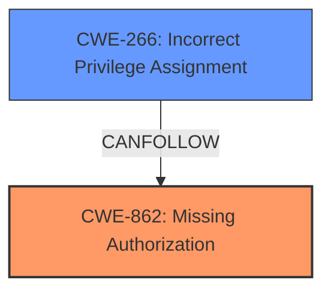

# Analysis Report for CVE-2024-11721

# Vulnerability Analysis Report: CVE-2024-11721

## Description

The Frontend Admin by DynamiApps plugin for WordPress is vulnerable to privilege escalation in all versions up to, and including, 3.24.5. This is due to **insufficient controls on the user role select field** when utilizing the Role field in a form. This makes it possible for unauthenticated attackers to create new administrative user accounts, even when the administrative user role has not been provided as an option to the user, granted that unauthenticated users have been provided access to the form.

## Vulnerability Description Key Phrases

- **Rootcause:** insufficient controls on the user role select field
- **Impact:** ['create new administrative user accounts', 'privilege escalation']
- **Attacker:** unauthenticated attackers
- **Product:** Frontend Admin by DynamiApps plugin for WordPress
- **Version:** all versions up to and including 3.24.5

## Analysis (with Relationship Data)

# Summary
| CWE ID | CWE Name | Confidence | CWE Abstraction Level | CWE Vulnerability Mapping Label | CWE-Vulnerability Mapping Notes |
|---|---|---|---|---|---|
| CWE-862 | Missing Authorization | 0.9 | Class | Allowed-with-Review | Primary CWE. The plugin **does not perform an authorization check** when an actor attempts to access a resource or perform an action. |
| CWE-266 | Incorrect Privilege Assignment | 0.7 | Base | Allowed | Secondary candidate. The plugin **incorrectly assigns a privilege** (administrative user role) to an unauthenticated actor. |

## Evidence and Confidence

*   **Confidence Score:** 0.8
*   **Evidence Strength:** HIGH

## Relationship Analysis
The primary CWE is CWE-862, Missing Authorization, which reflects the core issue of the plugin not checking authorization when creating new user accounts. CWE-266, Incorrect Privilege Assignment, is a secondary CWE because the vulnerability also involves assigning incorrect privileges to unauthorized users. CWE-862 is a class-level CWE, while CWE-266 is at the base level. The relationship between them is that **missing authorization** can lead to **incorrect privilege assignment**.



## Vulnerability Chain
The vulnerability chain starts with the **missing authorization** check (CWE-862), leading to the **incorrect assignment of administrative privileges** (CWE-266) to unauthenticated users. This ultimately results in privilege escalation and complete control of the WordPress site.

## Summary of Analysis
The initial assessment identified CWE-862, Missing Authorization, as the primary CWE due to the **lack of authorization checks on the user role select field**. The retriever results, vulnerability description, and CVE reference links all point to the core issue of **missing authorization** leading to privilege escalation. The relationship analysis shows how missing authorization can lead to incorrect privilege assignment. The mapping guidance emphasizes the importance of identifying the root cause, which in this case is the **missing authorization check**. The evidence from the vulnerability description, particularly the phrases "**insufficient controls on the user role select field**" and "**does not properly validate the selected user role**," supports the classification of CWE-862 as the primary CWE. Additionally, CWE-266, Incorrect Privilege Assignment, is considered as a secondary CWE due to the **incorrect assignment of admin privileges**. The selected CWEs are at the optimal level of specificity, with CWE-862 being a class-level CWE and CWE-266 being a base-level CWE.

Relevant CWE Information:

**CWE-862: Missing Authorization**
The product **does not perform an authorization check** when an actor attempts to access a resource or perform an action. This aligns directly with the vulnerability description, where the plugin fails to check if the user is authorized to create administrative accounts.
*   **Security Implications:** Unauthorized users can perform actions they should not be able to, such as creating administrative accounts.
*   **Impact:** Privilege escalation, complete control of the WordPress site.

**CWE-266: Incorrect Privilege Assignment**
A product **incorrectly assigns a privilege** to a particular actor, creating an unintended sphere of control for that actor. This is relevant because the unauthenticated user is being assigned the administrative privilege incorrectly.
*   **Security Implications:** Unauthorized users gain higher levels of access, leading to privilege escalation.
*   **Impact:** Complete control of the WordPress site, potential data breach/manipulation.

Other CWEs Considered:

*   CWE-863 (Incorrect Authorization): Considered but not used because the vulnerability is that there **is no** authorization check, not that the authorization check is performed incorrectly.
*   CWE-306 (Missing Authentication for Critical Function): Authentication is not the primary issue; the problem is the lack of authorization after a user interacts with the form, so this CWE is not the best fit.
*   CWE-269 (Improper Privilege Management): This is too high level and discouraged. The root cause is more specifically related to missing authorization, making CWE-862 a better fit.


## CWE Relationship Analysis

Current CWEs represent these abstraction levels: .


### Vulnerability Chain Analysis

**Chain starting from CWE-863:**
- 863 (Incorrect Authorization) - ROOT


**Chain starting from CWE-862:**
- 862 (Missing Authorization) - ROOT


### CWE Relationship Diagram

```mermaid
graph TD
    classDef primary fill:#f96,stroke:#333,stroke-width:2px
    classDef secondary fill:#69f,stroke:#333
    classDef tertiary fill:#9e9,stroke:#333
```


*Report generated on 2025-07-13 01:59:01*
