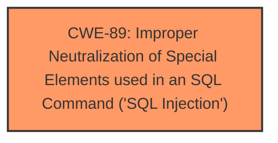

# Analysis for CVE-2024-11730

# Summary
| CWE ID | CWE Name | Confidence | CWE Abstraction Level | CWE Vulnerability Mapping Label | CWE-Vulnerability Mapping Notes |
|---|---|---|---|---|---|
| CWE-89 | Improper Neutralization of Special Elements used in an SQL Command ('SQL Injection') | 1.0 | Base | Allowed | Primary CWE. This is the root cause of the vulnerability due to **insufficient escaping on the user supplied parameter and lack of sufficient preparation on the existing SQL query**. |

## Evidence and Confidence

*   **Confidence Score:** 1.0
*   **Evidence Strength:** HIGH

## Relationship Analysis
The primary relationship influencing the decision is that CWE-89 is a Base level CWE, which is preferred. There are no parent or child relationships that would make another CWE more appropriate.

## Vulnerability Chain
The vulnerability chain is:
1.  **Improper Neutralization of Special Elements used in an SQL Command ('SQL Injection')** (CWE-89) due to **insufficient escaping on the user supplied parameter and lack of sufficient preparation on the existing SQL query**.
2.  Extraction of sensitive information from the database (Impact).

## Summary of Analysis
The vulnerability is an SQL injection vulnerability (CWE-89) in the KiviCare Clinic & Patient Management System (EHR) plugin for WordPress. The **root cause** is **insufficient escaping on the user supplied parameter and lack of sufficient preparation on the existing SQL query**, which allows authenticated attackers to inject arbitrary SQL code via the `sort[]` parameter of the `static_data_list` AJAX action. This can lead to sensitive information disclosure.

The selection of CWE-89 is based on the vulnerability description and the CVE Reference Links Content Summary, which explicitly state that the vulnerability is an SQL injection vulnerability due to **insufficient escaping** and **lack of preparation**. The Retriever Results also list CWE-89 as the top candidate with the highest similarity score. The CWE is at the Base level of abstraction, which is the preferred level.

Other CWEs were considered but not selected:

*   CWE-79 (Improper Neutralization of Input During Web Page Generation ('Cross-site Scripting')): This was not selected because the vulnerability is specifically related to SQL injection, not cross-site scripting.
*   CWE-352 (Cross-Site Request Forgery (CSRF)): This was not selected because the vulnerability is not related to CSRF.
*   CWE-425 (Direct Request ('Forced Browsing')): This was not selected because the vulnerability is not related to forced browsing.
*   CWE-502 (Deserialization of Untrusted Data): This was not selected because the vulnerability is not related to deserialization.
*   CWE-472 (External Control of Assumed-Immutable Web Parameter): This was not selected because the vulnerability is not related to external control of parameters.
*   CWE-639 (Authorization Bypass Through User-Controlled Key): This was not selected because the vulnerability is not related to authorization bypass.
*   CWE-434 (Unrestricted Upload of File with Dangerous Type): This was not selected because the vulnerability is not related to file uploads.
*   CWE-116 (Improper Encoding or Escaping of Output): This was not selected because CWE-89 is more specific to the type of injection present.
*   CWE-178 (Improper Handling of Case Sensitivity): This was not selected because the vulnerability is not related to case sensitivity.
*   CWE-90 (Improper Neutralization of Special Elements used in an LDAP Query ('LDAP Injection')): This was not selected because the vulnerability is not related to LDAP queries.
*   CWE-138 (Improper Neutralization of Special Elements): This was not selected because this is a discouraged CWE.
*   CWE-184 (Incomplete List of Disallowed Inputs): This was not selected because the vulnerability is not related to a list of disallowed inputs.
*   CWE-471 (Modification of Assumed-Immutable Data (MAID)): This was not selected because the vulnerability is not related to modification of immutable data.
*   CWE-494 (Download of Code Without Integrity Check): This was not selected because the vulnerability is not related to downloads of code.
*   CWE-183 (Permissive List of Allowed Inputs): This was not selected because the vulnerability is not related to a list of allowed inputs.