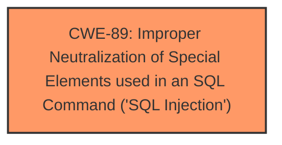

# Analysis for CVE-2024-11818

# Summary
| CWE ID | CWE Name | Confidence | CWE Abstraction Level | CWE Vulnerability Mapping Label | CWE-Vulnerability Mapping Notes |
|---|---|---|---|---|---|
| CWE-89 | Improper Neutralization of Special Elements used in an SQL Command ('SQL Injection') | 1.0 | Base | Allowed | Primary CWE. The **SQL Injection** vulnerability exists because the application directly uses the 'email' parameter from user input within SQL queries without proper sanitization or validation. |

## Evidence and Confidence

*   **Confidence Score:** 1.0
*   **Evidence Strength:** HIGH

## Relationship Analysis
The primary relationship that influenced the decision was the direct match of the vulnerability description to the CWE-89 description. The vulnerability involves the improper neutralization of special elements used in an SQL command, directly aligning with the definition of CWE-89. The other CWEs were not selected as they were not direct matches for this **SQL Injection** vulnerability.

## Vulnerability Chain
The vulnerability chain consists of:
1.  **Root Cause:** Lack of input validation and sanitization of the 'email' parameter in `/signup.php`.
2.  **Weakness:** CWE-89: Improper Neutralization of Special Elements used in an SQL Command ('SQL Injection').
3.  **Impact:** Unauthorized database access, sensitive data leakage, data tampering, system control, and service disruption.

## Summary of Analysis
The analysis is based on the provided evidence, which explicitly states that the **weakness** is an **SQL injection** in the `/signup.php` file due to the **improper handling of the 'email' parameter**. The `CVE Reference Links Content Summary` clearly indicates the root cause as the lack of input validation and sanitization, leading to the possibility of injecting malicious SQL code.

The retriever results also strongly support CWE-89 as the primary CWE, with a score of 1.0. The description of CWE-89 perfectly matches the vulnerability's characteristics, making it the optimal choice.

The decision is based on direct evidence from the vulnerability description and the retriever results. CWE-89 is at the optimal level of specificity as it directly addresses the **SQL injection** vulnerability.