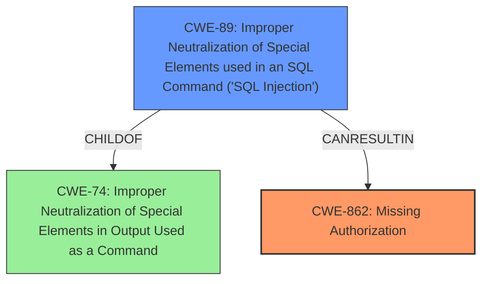

# Raw Analyzer Response for CVE-2024-11840

# Summary
| CWE ID | CWE Name | Confidence | CWE Abstraction Level | CWE Vulnerability Mapping Label | CWE-Vulnerability Mapping Notes |
|---|---|---|---|---|---|
| CWE-862 | Missing Authorization | 0.9 | Class | Primary | Allowed-with-Review |
| CWE-89 | Improper Neutralization of Special Elements used in an SQL Command ('SQL Injection') | 0.8 | Base | Secondary | Allowed |

## Evidence and Confidence

*   **Confidence Score:** 0.85
*   **Evidence Strength:** HIGH

## Relationship Analysis
The primary weakness is a **Missing Authorization (CWE-862)**, which can lead to other vulnerabilities like **SQL Injection (CWE-89)**. The graph shows a hierarchical relationship where **CWE-89** is a child of **CWE-74** (Improper Neutralization of Special Elements in Output Used as a Command), and **CWE-862** is also related to access control issues. The relationship is that the **missing authorization** allows an attacker to inject SQL commands. The abstraction levels are appropriate as **CWE-862** is a Class, representing a general lack of authorization, while **CWE-89** is a Base, representing the specific **SQL Injection** vulnerability.

## Vulnerability Chain
The vulnerability chain starts with a **missing capability check** (**CWE-862**), which allows authenticated attackers with Subscriber-level access or higher to access functions they should not be able to. This lack of authorization then leads to the possibility of **SQL injection** attacks (**CWE-89**).

**Chain:** **CWE-862** (Missing Authorization) -> **CWE-89** (SQL Injection)

## Summary of Analysis
The initial analysis identified **CWE-862** as the primary weakness due to the **missing capability check**, which is the root cause of the vulnerability. The secondary weakness is **CWE-89**, which is a direct result of the **missing authorization**.

The evidence for **CWE-862** is strong, as the vulnerability description states: "The RapidLoad Optimize Web Vitals Automatically plugin for WordPress is vulnerable to unauthorized access of data and modification of data due to a **missing capability check** on the uucss_data, update_rapidload_settings, wp_ajax_update_htaccess_file, uucss_update_rule, upload_rules, get_all_rules, update_titan_settings, preload_page, and activate_module functions in all versions up to, and including, 2.4.2."

The evidence for **CWE-89** is also strong, as the vulnerability description states that the **missing capability check** "makes it possible for authenticated attackers, with Subscriber-level access and above, to modify plugin settings or conduct **SQL injection** attacks."

The relationship graph supports the selection of these CWEs, as it shows how **CWE-862** can lead to **CWE-89**. The abstraction levels are appropriate, as **CWE-862** is a Class, representing a general lack of authorization, while **CWE-89** is a Base, representing the specific **SQL injection** vulnerability.

The decision is based on the provided evidence and the relationship analysis. The selected CWEs are at the optimal level of specificity.

Relevant CWE Information:

# Enhanced Context (25 CWEs)

## CWE-862: Missing Authorization
**Technical Explanation:** The RapidLoad Optimize Web Vitals Automatically plugin lacks proper authorization checks on multiple functions, allowing users with Subscriber-level access or higher to access and modify data they should not be able to. This **missing authorization** is the root cause of the vulnerability.
**Security Implications:** This can lead to unauthorized access and modification of plugin settings, potentially allowing attackers to inject malicious code or disable critical functionality.
**Relationship Analysis:** **CWE-862** is a Class-level CWE.
**Mapping Guidance Analysis:** The Usage is Allowed-with-Review, as it is a Class, but it directly represents the **missing capability check**.

## CWE-89: Improper Neutralization of Special Elements used in an SQL Command ('SQL Injection')
**Technical Explanation:** Due to the **missing authorization**, attackers can potentially inject SQL commands into the application, leading to unauthorized data access or modification.
**Security Implications:** This can lead to the extraction of sensitive data, modification or deletion of data, or potentially gaining full control of the WordPress website.
**Relationship Analysis:** **CWE-89** is a Base-level CWE. It is related to **CWE-74** (Improper Neutralization of Special Elements in Output Used as a Command).
**Mapping Guidance Analysis:** The Usage is Allowed, as it accurately represents the **SQL injection** vulnerability.

## Other CWEs Considered and Rejected:

*   **CWE-352: Cross-Site Request Forgery (CSRF):** While CSRF is a common web vulnerability, there is no specific evidence in the provided description to suggest that this vulnerability involves CSRF. Therefore, it was rejected.
*   **CWE-425: Direct Request ('Forced Browsing'):** This CWE is similar to **CWE-862**, but **CWE-862** is more specific to the **missing authorization** issue described in the vulnerability.
*   **CWE-434: Unrestricted Upload of File with Dangerous Type:** This CWE is not relevant as there is no mention of file uploads in the vulnerability description.