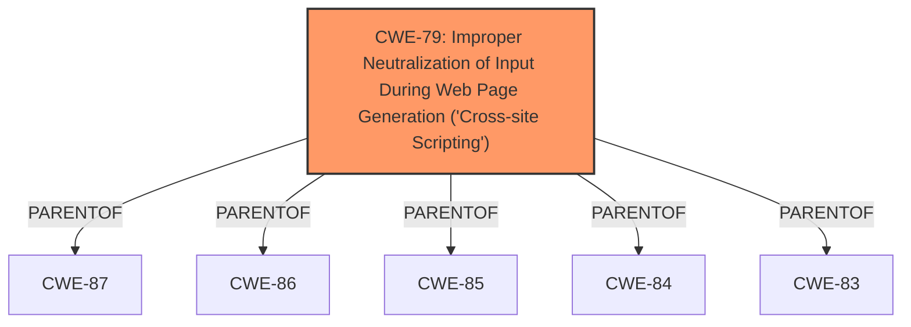

# Analysis for CVE-2024-11929

# Summary
| CWE ID | CWE Name | Confidence | CWE Abstraction Level | CWE Vulnerability Mapping Label | CWE-Vulnerability Mapping Notes |
|---|---|---|---|---|---|
| CWE-79 | Improper Neutralization of Input During Web Page Generation ('Cross-site Scripting') | 1.0 | Base | Allowed | Primary CWE. The vulnerability is a stored XSS due to **insufficient input sanitization and output escaping**, which directly aligns with the description of CWE-79. |

## Evidence and Confidence

*   **Confidence Score:** 1.0
*   **Evidence Strength:** HIGH

## Relationship Analysis
The primary CWE is CWE-79, which is a Base level CWE. There are parent and child relationships, but none that offer a more specific mapping in this case.

## Vulnerability Chain
The vulnerability chain starts with **insufficient input sanitization and output escaping** in the `rfbwp_save_settings()` function, leading to stored cross-site scripting. The attacker injects arbitrary web scripts, which are then executed when a user accesses the injected page.

## Summary of Analysis
The vulnerability is a stored XSS due to **insufficient input sanitization and output escaping**. The `rfbwp_save_settings()` function in the Responsive FlipBook Plugin Wordpress plugin is vulnerable. Authenticated attackers with Subscriber-level access and above can inject arbitrary web scripts in pages.

The primary CWE is CWE-79 Improper Neutralization of Input During Web Page Generation ('Cross-site Scripting'). This is because the root cause is **insufficient input sanitization and output escaping**, which directly aligns with the description of CWE-79.

Other CWEs Considered:
*   CWE-116: Improper Encoding or Escaping of Output - While related, CWE-79 is more specific to XSS.
*   CWE-352: Cross-Site Request Forgery (CSRF) - CSRF is a different type of vulnerability. This vulnerability description does not mention anything about CSRF.
*   CWE-434: Unrestricted Upload of File with Dangerous Type - This CWE is not relevant because the vulnerability does not involve file uploads.