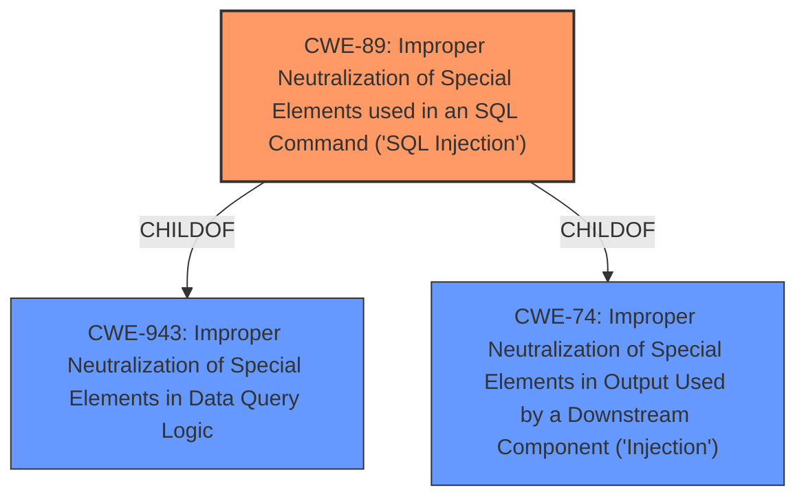

# Enhanced Analysis for CVE-2024-11939

# Summary
| CWE ID | CWE Name | Confidence | CWE Abstraction Level | CWE Vulnerability Mapping Label | CWE-Vulnerability Mapping Notes |
|---|---|---|---|---|---|
| CWE-89 | Improper Neutralization of Special Elements used in an SQL Command ('SQL Injection') | 1.0 | Base | Allowed | Primary CWE. The description explicitly states the vulnerability is a **blind time-based SQL injection** due to **insufficient escaping** and **lack of sufficient preparation on the existing SQL query** |

## Evidence and Confidence

*   **Confidence Score:** 1.0
*   **Evidence Strength:** HIGH

## Relationship Analysis
The primary CWE selected is CWE-89, which is a Base level CWE. The retriever results show several Class-level CWEs like CWE-116, CWE-138, CWE-943, and Variant-level CWEs such as CWE-95. The analysis focused on identifying the root cause. CWE-89 is a direct and specific representation of the **SQL Injection** vulnerability described.



## Vulnerability Chain
The vulnerability chain starts with the **insufficient escaping** of user-supplied parameters and a **lack of sufficient preparation on the existing SQL query**. This leads to the **SQL Injection** vulnerability (CWE-89), which allows unauthenticated attackers to append additional SQL queries to extract sensitive information.

## Summary of Analysis
The analysis is based on the vulnerability description, which explicitly states that the Cost Calculator Builder PRO plugin is vulnerable to **blind time-based SQL Injection**. The **root cause** is the **insufficient escaping** and **lack of sufficient preparation** leading to the injection. The retriever results also strongly suggest CWE-89 as the most relevant CWE. The selection of CWE-89 is at the optimal level of specificity, as it directly addresses the vulnerability described.

Relevant CWE Information:
# Enhanced Context (25 CWEs)
The following CWEs were identified as potentially relevant to this vulnerability:

- CWE-89: Improper Neutralization of Special Elements used in an SQL Command ('SQL Injection') is the most relevant and accurately captures the **SQL injection** vulnerability due to **insufficient escaping** and **lack of sufficient preparation**.
- CWE-116: Improper Encoding or Escaping of Output was considered because of the mention of **insufficient escaping**, but it is a class-level CWE and not as specific as CWE-89.
- CWE-943: Improper Neutralization of Special Elements in Data Query Logic was considered, but CWE-89 is a more specific child of this class and therefore a better fit.
- CWE-90: Improper Neutralization of Special Elements used in an LDAP Query ('LDAP Injection') was considered but is not applicable as the vulnerability is **SQL Injection**, not LDAP Injection.
- CWE-96: Improper Neutralization of Directives in Statically Saved Code ('Static Code Injection') was considered but is not applicable as the vulnerability is **SQL Injection**, not static code injection.
- CWE-425: Direct Request ('Forced Browsing') was considered but is not applicable as the vulnerability is due to **insufficient escaping** and **lack of sufficient preparation**.


## CWE Relationship Analysis

Current CWEs represent these abstraction levels: .


### Vulnerability Chain Analysis

**Chain starting from CWE-90:**
- 90 (Improper Neutralization of Special Elements used in an LDAP Query ('LDAP Injection')) - ROOT


**Chain starting from CWE-89:**
- 89 (Improper Neutralization of Special Elements used in an SQL Command ('SQL Injection')) - ROOT


### CWE Relationship Diagram

```mermaid
graph TD
    classDef primary fill:#f96,stroke:#333,stroke-width:2px
    classDef secondary fill:#69f,stroke:#333
    classDef tertiary fill:#9e9,stroke:#333
```