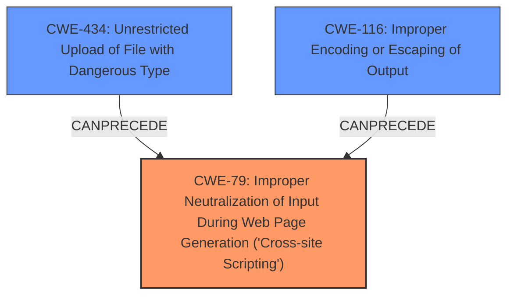

# Enhanced Analysis for CVE-2024-11954

# Summary
| CWE ID | CWE Name | Confidence | CWE Abstraction Level | CWE Vulnerability Mapping Label | CWE-Vulnerability Mapping Notes |
|---|---|---|---|---|---|
| CWE-79 | Improper Neutralization of Input During Web Page Generation ('Cross-site Scripting') | 1.0 | Base | Allowed | Primary CWE. The vulnerability lies in the application's failure to neutralize user-controllable input before placing it in the output used as a web page. |
| CWE-434 | Unrestricted Upload of File with Dangerous Type | 0.8 | Base | Allowed | Secondary Candidate. The file upload functionality, specifically related to PDF files, contributes to the vulnerability by allowing the upload of potentially malicious files. |
| CWE-116 | Improper Encoding or Escaping of Output | 0.6 | Class | Allowed-with-Review | Secondary Candidate. Inadequate encoding or escaping of output can exacerbate the XSS vulnerability, leading to improper rendering of the data. |

## Evidence and Confidence

*   **Confidence Score:** 0.9
*   **Evidence Strength:** HIGH

## Relationship Analysis
The primary vulnerability is CWE-79 [Improper Neutralization of Input During Web Page Generation ('Cross-site Scripting')], as the application fails to properly neutralize input, leading to XSS. CWE-434 [Unrestricted Upload of File with Dangerous Type] is related because the vulnerability is triggered by uploading a malicious PDF. CWE-116 [Improper Encoding or Escaping of Output] is also related, as proper encoding/escaping could have prevented the XSS. These relationships showcase how improper handling of file uploads can lead to XSS due to lack of input sanitization and output encoding.



## Vulnerability Chain
The vulnerability chain starts with CWE-434 [Unrestricted Upload of File with Dangerous Type] (uploading a malicious PDF), which leads to CWE-79 [Improper Neutralization of Input During Web Page Generation ('Cross-site Scripting')] due to **improper sanitization** of the PDF content, and could be further exacerbated by CWE-116 [Improper Encoding or Escaping of Output]. The root cause is the **missing sanitization** of input.

## Summary of Analysis
The primary vulnerability is CWE-79 [Improper Neutralization of Input During Web Page Generation ('Cross-site Scripting')], which directly addresses the **lack of neutralization** of user input. The evidence from the CVE Reference Links Content Summary states: "The vulnerability stems from the application's failure to properly sanitize content when a user uploads a PDF file." CWE-434 [Unrestricted Upload of File with Dangerous Type] is relevant as the attack vector involves uploading a malicious file. CWE-116 [Improper Encoding or Escaping of Output] could have mitigated the XSS by ensuring special characters are properly encoded. All selected CWEs are at the appropriate level of specificity.

Relevant CWE Information:

# Enhanced Context (25 CWEs)
The following CWEs were identified as potentially relevant to this vulnerability:

## CWE-434: Unrestricted Upload of File with Dangerous Type
**Abstraction Level**: Base
**Similarity Score**: 0.74
**Source**: dense

**Description**:
The product allows the upload or transfer of dangerous file types that are automatically processed within its environment.

**Mapping Guidance**:
- Usage: Allowed
- Rationale: This CWE entry is at the Base level of abstraction, which is a preferred level of abstraction for mapping to the root causes of vulnerabilities.


## CWE-79: Improper Neutralization of Input During Web Page Generation ('Cross-site Scripting')
**Abstraction Level**: Base
**Similarity Score**: 0.73
**Source**: dense

**Description**:
The product does not neutralize or incorrectly neutralizes user-controllable input before it is placed in output that is used as a web page that is served to other users.

**Mapping Guidance**:
- Usage: Allowed
- Rationale: This CWE entry is at the Base level of abstraction, which is a preferred level of abstraction for mapping to the root causes of vulnerabilities.


## CWE-116: Improper Encoding or Escaping of Output
**Abstraction Level**: Class
**Similarity Score**: 0.73
**Source**: dense

**Description**:
The product prepares a structured message for communication with another component, but encoding or escaping of the data is either missing or done incorrectly. As a result, the intended structure of the message is not preserved.

**Mapping Guidance**:
- Usage: Allowed-with-Review
- Rationale: This CWE entry is a Class and might have Base-level children that would be more appropriate


## CWE-80: Improper Neutralization of Script-Related HTML Tags in a Web Page (Basic XSS)
**Abstraction Level**: Variant
**Similarity Score**: 0.72
**Source**: dense

**Description**:
The product receives input from an upstream component, but it does not neutralize or incorrectly neutralizes special characters such as "<", ">", and "&" that could be interpreted as web-scripting elements when they are sent to a downstream component that processes web pages.

**Mapping Guidance**:
- Usage: Allowed
- Rationale: This CWE entry is at the Variant level of abstraction, which is a preferred level of abstraction for mapping to the root causes of vulnerabilities.

CWE-80 [Improper Neutralization of Script-Related HTML Tags in a Web Page (Basic XSS)] was considered but not selected because the description states the XSS vulnerability is due to a failure to sanitize content within an uploaded PDF file. The broader CWE-79 [Improper Neutralization of Input During Web Page Generation ('Cross-site Scripting')] is more appropriate as it describes the general failure to neutralize input, regardless of the specific HTML tags.


## CWE Relationship Analysis

Current CWEs represent these abstraction levels: .


### Vulnerability Chain Analysis

**Chain starting from CWE-79:**
- 79 (Improper Neutralization of Input During Web Page Generation ('Cross-site Scripting')) - ROOT


**Chain starting from CWE-116:**
- 116 (Improper Encoding or Escaping of Output) - ROOT


### CWE Relationship Diagram

```mermaid
graph TD
    classDef primary fill:#f96,stroke:#333,stroke-width:2px
    classDef secondary fill:#69f,stroke:#333
    classDef tertiary fill:#9e9,stroke:#333
```