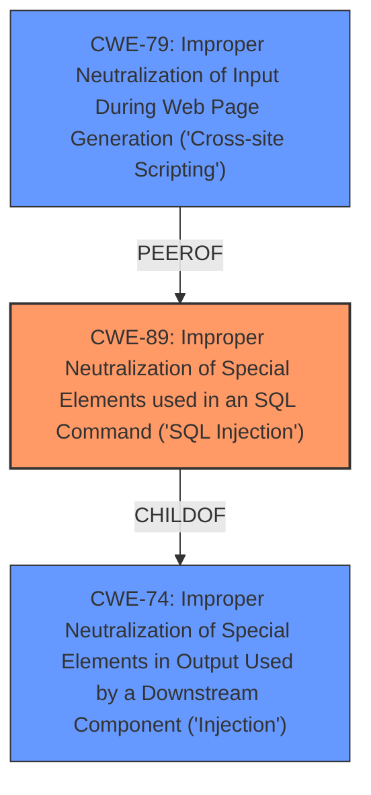

# Analysis Report for CVE-2024-11964

# Vulnerability Analysis Report: CVE-2024-11964

## Description

A vulnerability, which was classified as critical, was found in PHPGurukul Complaint Management system 1.0. This affects an unknown part of the file /user/index.php. The manipulation of the argument emailid leads to **sql injection**. It is possible to initiate the attack remotely. The exploit has been disclosed to the public and may be used.

## Vulnerability Description Key Phrases

- **Weakness:** sql injection
- **Product:** PHPGurukul Complaint Management system
- **Version:** 1
- **Component:** /user/index.php

## Analysis (with Relationship Data)

# Summary
| CWE ID | CWE Name | Confidence | CWE Abstraction Level | CWE Vulnerability Mapping Label | CWE-Vulnerability Mapping Notes |
|---|---|---|---|---|---|
| CWE-89 | Improper Neutralization of Special Elements used in an SQL Command ('SQL Injection') | 1.0 | Base | Allowed | Primary CWE |

## Evidence and Confidence

*   **Confidence Score:** 1.0
*   **Evidence Strength:** HIGH

## Relationship Analysis
The primary relationship impacting the decision is the direct match of the vulnerability to **SQL Injection** as the root cause. The retriever results strongly support CWE-89 as the primary classification. While other CWEs like CWE-79 (Cross-Site Scripting) and CWE-74 (Improper Neutralization of Special Elements in Output Used by a Downstream Component ('Injection')) were considered due to their presence in the retriever results, they don't accurately reflect the root cause of the vulnerability, which is the **improper handling of SQL commands**. The base level of abstraction is appropriate as it directly reflects the nature of the **SQL injection** vulnerability.



## Vulnerability Chain
The vulnerability chain starts with the **improper sanitization** of the 'emailid' parameter, leading to **SQL injection**, and potentially resulting in unauthorized database access, data leakage, data tampering, system control, and service interruption.

## Summary of Analysis
The analysis is based on the provided evidence, which clearly indicates an **SQL injection** vulnerability due to **improper sanitization** of user input. The "CVE Reference Links Content Summary" section explicitly states: "The application does not properly sanitize user input from the 'emailid' parameter in the `/user/index.php` file before using it in SQL queries." The retriever results also strongly support CWE-89 as the primary classification. The graph relationships show that while other CWEs like CWE-79 and CWE-74 are related, they are not the direct root cause. CWE-89 is at the optimal level of specificity as it directly addresses the **SQL injection** vulnerability.

Relevant CWE Information:

# Enhanced Context (25 CWEs)

## CWE-89: Improper Neutralization of Special Elements used in an SQL Command ('SQL Injection')
**Abstraction Level**: Base
**Similarity Score**: 0.78
**Source**: dense

**Description**:
The product constructs all or part of an SQL command using externally-influenced input from an upstream component, but it does not neutralize or incorrectly neutralizes special elements that could modify the intended SQL command when it is sent to a downstream component. Without sufficient removal or quoting of SQL syntax in user-controllable inputs, the generated SQL query can cause those inputs to be interpreted as SQL instead of ordinary user data.

**Mapping Guidance**:
- Usage: Allowed
- Rationale: This CWE entry is at the Base level of abstraction, which is a preferred level of abstraction for mapping to the root causes of vulnerabilities.

## CWE-89: Improper Neutralization of Special Elements used in an SQL Command ('SQL Injection')
**Abstraction Level**: Base
**Similarity Score**: 887.71
**Source**: sparse

**Description**:
The product constructs all or part of an SQL command using externally-influenced input from an upstream component, but it does not neutralize or incorrectly neutralizes special elements that could modify the intended SQL command when it is sent to a downstream component. Without sufficient removal or quoting of SQL syntax in user-controllable inputs, the generated SQL query can cause those inputs to be interpreted as SQL instead of ordinary user data.

**Mapping Guidance**:
- Usage: Allowed
- Rationale: This CWE entry is at the Base level of abstraction, which is a preferred level of abstraction for mapping to the root causes of vulnerabilities.

I considered other CWEs from the Retriever Results and Complete CWE Specifications, but did not use them:

*   **CWE-79 (Improper Neutralization of Input During Web Page Generation ('Cross-site Scripting'))**: While XSS is a common web vulnerability, the description explicitly points to **SQL injection** as the root cause.
*   **CWE-74 (Improper Neutralization of Special Elements in Output Used by a Downstream Component ('Injection'))**: This is a broader category of injection vulnerabilities, but CWE-89 is a more specific and accurate classification for **SQL injection**.
*   **CWE-434 (Unrestricted Upload of File with Dangerous Type)**: This is not relevant to the described vulnerability, as it concerns file uploads rather than **SQL injection**.
*   **CWE-425 (Direct Request ('Forced Browsing'))**: This is not relevant as the vulnerability is about **SQL injection** and not authorization bypass.
*   **CWE-95 (Improper Neutralization of Directives in Dynamically Evaluated Code ('Eval Injection'))**: This is not relevant as the vulnerability is about **SQL injection** and not code evaluation.
*   **CWE-1336 (Improper Neutralization of Special Elements Used in a Template Engine)**: This is not relevant as the vulnerability is about **SQL injection** and not template injection.
*   **CWE-96 (Improper Neutralization of Directives in Statically Saved Code ('Static Code Injection'))**: This is not relevant as the vulnerability is about **SQL injection** and not static code injection.


## CWE Relationship Analysis

Current CWEs represent these abstraction levels: .


### Vulnerability Chain Analysis

**Chain starting from CWE-89:**
- 89 (Improper Neutralization of Special Elements used in an SQL Command ('SQL Injection')) - ROOT


**Chain starting from CWE-79:**
- 79 (Improper Neutralization of Input During Web Page Generation ('Cross-site Scripting')) - ROOT


### CWE Relationship Diagram

```mermaid
graph TD
    classDef primary fill:#f96,stroke:#333,stroke-width:2px
    classDef secondary fill:#69f,stroke:#333
    classDef tertiary fill:#9e9,stroke:#333
```


*Report generated on 2025-07-13 02:11:45*
