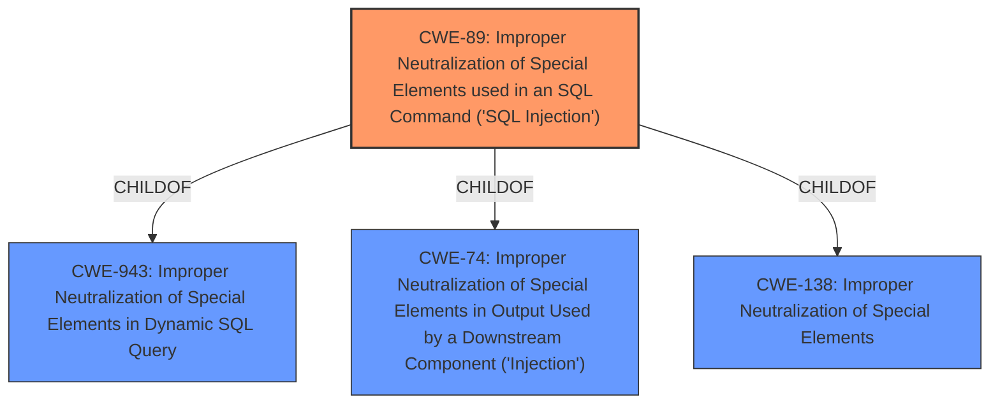

# Analysis for CVE-2024-12025

# Summary
| CWE ID | CWE Name | Confidence | CWE Abstraction Level | CWE Vulnerability Mapping Label | CWE-Vulnerability Mapping Notes |
|---|---|---|---|---|---|
| CWE-89 | Improper Neutralization of Special Elements used in an SQL Command ('SQL Injection') | 1.0 | Base | Primary CWE | Allowed |

## Evidence and Confidence

*   **Confidence Score:** 1.0
*   **Evidence Strength:** HIGH

## Relationship Analysis
The primary relationship that influenced the decision was the parent-child relationship between CWE-89 and higher-level classes like CWE-138. Given the explicit mention of **SQL Injection** as the weakness and the root cause being **insufficient escaping** and **lack of sufficient preparation on the existing SQL query**, CWE-89 is the most specific and appropriate choice. While other CWEs like CWE-79 (Cross-site Scripting) and CWE-90 (LDAP Injection) were considered due to their presence in the Retriever Results and graph relationships, they were deemed less relevant as the vulnerability is clearly an SQL Injection.

## Vulnerability Chain
The vulnerability chain starts with **insufficient escaping on the user supplied parameter and lack of sufficient preparation on the existing SQL query**, leading to **SQL Injection** and ultimately resulting in the ability to **extract sensitive information from the database**.

Root Cause: **Insufficient escaping on the user supplied parameter and lack of sufficient preparation on the existing SQL query**
Weakness: **SQL Injection** (CWE-89)
Impact: Sensitive Data Exposure

## Summary of Analysis
The analysis is primarily based on the explicit description of the vulnerability as an **SQL Injection** due to **insufficient escaping** and **lack of sufficient query preparation**. This aligns directly with the definition and characteristics of CWE-89.

The evidence from the "Vulnerability Description Key Phrases" and "CVE Reference Links Content Summary" confirms this assessment:

*   "**rootcause:** **insufficient escaping on the user supplied parameter and lack of sufficient preparation on the existing SQL query**"
*   "**weakness:** **SQL injection**"
*   "The primary vulnerability is an SQL injection flaw. The plugin fails to properly sanitize the `taxonomy` parameter received through the REST API before using it in a SQL query."

The graph relationships helped to confirm that while broader categories exist (e.g., CWE-138), CWE-89 is the most specific and accurate representation of the vulnerability. The retriever results also support this choice, with CWE-89 having the highest score.

The selected CWE is at the optimal level of specificity because it directly identifies the type of injection vulnerability (**SQL Injection**), rather than just a general lack of input sanitization or output encoding.

Relevant CWE Information:

# Enhanced Context (25 CWEs)
The following CWEs were identified as potentially relevant to this vulnerability:

## CWE-352: Cross-Site Request Forgery (CSRF)
**Abstraction Level**: Compound
**Similarity Score**: 0.75
**Source**: dense

**Description**:
The web application does not, or can not, sufficiently verify whether a well-formed, valid, consistent request was intentionally provided by the user who submitted the request.

**Mapping Guidance**:
- Usage: Allowed
- Rationale: This is a well-known Composite of multiple weaknesses that must all occur simultaneously, although it is attack-oriented in nature.

*Not Used*: Not related to the identified weakness.

## CWE-425: Direct Request ('Forced Browsing')
**Abstraction Level**: Base
**Similarity Score**: 0.71
**Source**: dense

**Description**:
The web application does not adequately enforce appropriate authorization on all restricted URLs, scripts, or files.

**Mapping Guidance**:
- Usage: Allowed
- Rationale: This CWE entry is at the Base level of abstraction, which is a preferred level of abstraction for mapping to the root causes of vulnerabilities.

*Not Used*: Not related to the identified weakness.

## CWE-116: Improper Encoding or Escaping of Output
**Abstraction Level**: Class
**Similarity Score**: 0.71
**Source**: dense

**Description**:
The product prepares a structured message for communication with another component, but encoding or escaping of the data is either missing or done incorrectly. As a result, the intended structure of the message is not preserved.

**Mapping Guidance**:
- Usage: Allowed-with-Review
- Rationale: This CWE entry is a Class and might have Base-level children that would be more appropriate

*Not Used*: While improper escaping is mentioned, it's in the context of SQL, making CWE-89 a better fit.

## CWE-639: Authorization Bypass Through User-Controlled Key
**Abstraction Level**: Base
**Similarity Score**: 0.71
**Source**: dense

**Description**:
The system's authorization functionality does not prevent one user from gaining access to another user's data or record by modifying the key value identifying the data.

**Mapping Guidance**:
- Usage: Allowed
- Rationale: This CWE entry is at the Base level of abstraction, which is a preferred level of abstraction for mapping to the root causes of vulnerabilities.

*Not Used*: Not related to the identified weakness.

## CWE-201: Insertion of Sensitive Information Into Sent Data
**Abstraction Level**: Base
**Similarity Score**: 0.71
**Source**: dense

**Description**:
The code transmits data to another actor, but a portion of the data includes sensitive information that should not be accessible to that actor.

**Mapping Guidance**:
- Usage: Allowed
- Rationale: This CWE entry is at the Base level of abstraction, which is a preferred level of abstraction for mapping to the root causes of vulnerabilities.

*Not Used*: Describes the impact but not the root cause.

## CWE-434: Unrestricted Upload of File with Dangerous Type
**Abstraction Level**: Base
**Similarity Score**: 0.70
**Source**: dense

**Description**:
The product allows the upload or transfer of dangerous file types that are automatically processed within its environment.

**Mapping Guidance**:
- Usage: Allowed
- Rationale: This CWE entry is at the Base level of abstraction, which is a preferred level of abstraction for mapping to the root causes of vulnerabilities.

*Not Used*: Not related to the identified weakness.

## CWE-472: External Control of Assumed-Immutable Web Parameter
**Abstraction Level**: Base
**Similarity Score**: 0.70
**Source**: dense

**Description**:
The web application does not sufficiently verify inputs that are assumed to be immutable but are actually externally controllable, such as hidden form fields.

**Mapping Guidance**:
- Usage: Allowed
- Rationale: This CWE entry is at the Base level of abstraction, which is a preferred level of abstraction for mapping to the root causes of vulnerabilities.

*Not Used*: While related to external control of parameters, it does not cover the specifics of SQL injection.

## CWE-502: Deserialization of Untrusted Data
**Abstraction Level**: Base
**Similarity Score**: 0.70
**Source**: dense

**Description**:
The product deserializes untrusted data without sufficiently ensuring that the resulting data will be valid.

**Mapping Guidance**:
- Usage: Allowed
- Rationale: This CWE entry is at the Base level of abstraction, which is a preferred level of abstraction for mapping to the root causes of vulnerabilities.

*Not Used*: Not related to the identified weakness.

## CWE-96: Improper Neutralization of Directives in Statically Saved Code ('Static Code Injection')
**Abstraction Level**: Base
**Similarity Score**: 0.70
**Source**: dense

**Description**:
The product receives input from an upstream component, but it does not neutralize or incorrectly neutralizes code syntax before inserting the input into an executable resource, such as a library, configuration file, or template.

**Mapping Guidance**:
- Usage: Allowed
- Rationale: This CWE entry is at the Base level of abstraction, which is a preferred level of abstraction for mapping to the root causes of vulnerabilities.

*Not Used*: Not related to the identified weakness.

## CWE-79: Improper Neutralization of Input During Web Page Generation ('Cross-site Scripting')
**Abstraction Level**: Base
**Similarity Score**: 0.70
**Source**: dense