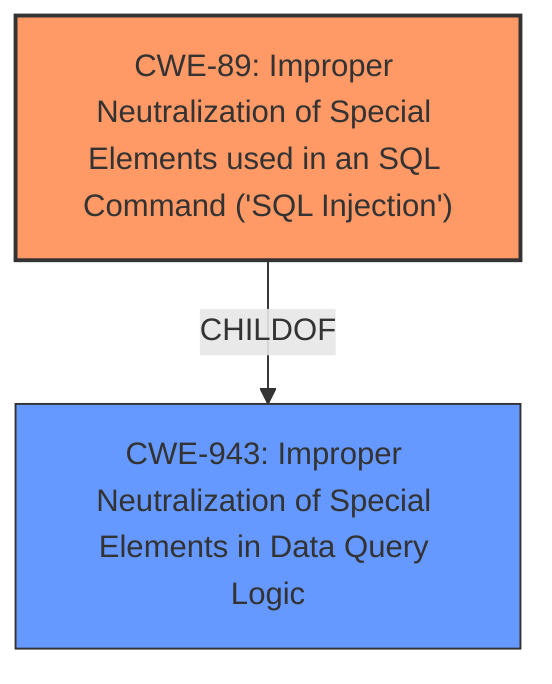

# Analysis Report for CVE-2024-12030

# Vulnerability Analysis Report: CVE-2024-12030

## Description

The MDTF Meta Data and Taxonomies Filter plugin for WordPress is vulnerable to **SQL Injection** via the key attribute of the mdf_value shortcode in all versions up to, and including, 1.3.3.5 due to **insufficient escaping on the user supplied parameter and lack of sufficient preparation on the existing SQL query**. This makes it possible for authenticated attackers, with Contributor-level access and above, to append additional SQL queries into already existing queries that can be used to extract sensitive information from the database.

## Vulnerability Description Key Phrases

- **Rootcause:** insufficient escaping on the user supplied parameter and lack of sufficient preparation on the existing SQL query
- **Weakness:** SQL Injection
- **Impact:** ['extract sensitive information from the database', 'SQL Injection']
- **Attacker:** authenticated attackers with Contributor-level access and above
- **Product:** WordPress MDTF Meta Data and Taxonomies Filter plugin
- **Version:** up to and including 1.3.3.5
- **Component:** key attribute of the mdf_value shortcode

## Analysis (with Relationship Data)

# Summary

| CWE ID | CWE Name | Confidence | CWE Abstraction Level | CWE Vulnerability Mapping Label | CWE-Vulnerability Mapping Notes |
|---|---|---|---|---|---|
| CWE-89 | Improper Neutralization of Special Elements used in an SQL Command ('SQL Injection') | 1.0 | Base | Primary | Allowed |

## Evidence and Confidence

*   **Confidence Score:** 1.0
*   **Evidence Strength:** HIGH

## Relationship Analysis
The primary relationship that influenced the decision was the direct match of the vulnerability description to the CWE-89 description, indicating **improper neutralization** leading to **SQL Injection**. While other CWEs like CWE-943 (Improper Neutralization of Special Elements in Data Query Logic) are related as parents, CWE-89 provides the most specific and accurate classification.



## Vulnerability Chain
The vulnerability chain consists of:
1.  **Root Cause:** **Insufficient escaping on the user-supplied parameter** within the `mdf_value` shortcode of the WordPress plugin.
2.  **Weakness:** This leads to **Improper Neutralization** of special elements in an SQL command (CWE-89).
3.  **Impact:** The attacker can then **extract sensitive information** from the database by injecting malicious SQL queries.

## Summary of Analysis
The analysis is strongly based on the provided evidence, particularly the vulnerability description, which explicitly mentions **SQL Injection** and **insufficient escaping**.

The vulnerability description states: "The MDTF Meta Data and Taxonomies Filter plugin for WordPress is vulnerable to **SQL Injection** via the key attribute of the mdf_value shortcode in all versions up to, and including, 1.3.3.5 due to **insufficient escaping on the user supplied parameter and lack of sufficient preparation on the existing SQL query**."

This statement directly maps to CWE-89, which describes a scenario where a product constructs an SQL command using externally-influenced input but does not neutralize or incorrectly neutralizes special elements.

The relationship graph shows that CWE-89 is a child of CWE-943 (Improper Neutralization of Special Elements in Data Query Logic). However, CWE-89 is more specific as it directly identifies the vulnerability as an SQL Injection.

The selected CWE is at the optimal level of specificity because it clearly defines the type of injection occurring.

Relevant CWE Information:

# Enhanced Context (25 CWEs)
The following CWEs were identified as potentially relevant to this vulnerability:

## CWE-352: Cross-Site Request Forgery (CSRF)
**Abstraction Level**: Compound
**Similarity Score**: 0.74
**Source**: dense

**Description**:
The web application does not, or can not, sufficiently verify whether a well-formed, valid, consistent request was intentionally provided by the user who submitted the request.

**Mapping Guidance**:
- Usage: Allowed
- Rationale: This is a well-known Composite of multiple weaknesses that must all occur simultaneously, although it is attack-oriented in nature.

*Not selected:* While CSRF could be a potential attack vector, it is not the root cause of this specific vulnerability. The root cause is the **insufficient escaping** leading to **SQL Injection**.

## CWE-425: Direct Request ('Forced Browsing')
**Abstraction Level**: Base
**Similarity Score**: 0.70
**Source**: dense

**Description**:
The web application does not adequately enforce appropriate authorization on all restricted URLs, scripts, or files.

**Mapping Guidance**:
- Usage: Allowed
- Rationale: This CWE entry is at the Base level of abstraction, which is a preferred level of abstraction for mapping to the root causes of vulnerabilities.

*Not selected:* The vulnerability is not related to authorization issues. The core problem is **improper input handling**, which leads to **SQL Injection**.

## CWE-472: External Control of Assumed-Immutable Web Parameter
**Abstraction Level**: Base
**Similarity Score**: 0.69
**Source**: dense

**Description**:
The web application does not sufficiently verify inputs that are assumed to be immutable but are actually externally controllable, such as hidden form fields.

**Mapping Guidance**:
- Usage: Allowed
- Rationale: This CWE entry is at the Base level of abstraction, which is a preferred level of abstraction for mapping to the root causes of vulnerabilities.

*Not selected:* While the `key` attribute is user-controlled, the primary issue is the **lack of proper escaping** rather than the immutability of the parameter.

## CWE-96: Improper Neutralization of Directives in Statically Saved Code ('Static Code Injection')
**Abstraction Level**: Base
**Similarity Score**: 0.69
**Source**: dense

**Description**:
The product receives input from an upstream component, but it does not neutralize or incorrectly neutralizes code syntax before inserting the input into an executable resource, such as a library, configuration file, or template.

**Mapping Guidance**:
- Usage: Allowed
- Rationale: This CWE entry is at the Base level of abstraction, which is a preferred level of abstraction for mapping to the root causes of vulnerabilities.

*Not selected:* This vulnerability is an **SQL Injection**, not a static code injection.

## CWE-116: Improper Encoding or Escaping of Output
**Abstraction Level**: Class
**Similarity Score**: 0.69
**Source**: dense

**Description**:
The product prepares a structured message for communication with another component, but encoding or escaping of the data is either missing or done incorrectly. As a result, the intended structure of the message is not preserved.

**Mapping Guidance**:
- Usage: Allowed-with-Review
- Rationale: This CWE entry is a Class and might have Base-level children that would be more appropriate

*Not selected:* Although related to escaping, CWE-116 is a more general case. The specific problem is **SQL Injection**, making CWE-89 a better fit.

## CWE-639: Authorization Bypass Through User-Controlled Key
**Abstraction Level**: Base
**Similarity Score**: 0.69
**Source**: dense

**Description**:
The system's authorization functionality does not prevent one user from gaining access to another user's data or record by modifying the key value identifying the data.

**Mapping Guidance**:
- Usage: Allowed
- Rationale: This CWE entry is at the Base level of abstraction, which is a preferred level of abstraction for mapping to the root causes of vulnerabilities.

*Not selected:* The problem isn't related to authorization bypass but rather the **improper handling of user input** in the SQL query.

## CWE-79: Improper Neutralization of Input During Web Page Generation ('Cross-site Scripting')
**Abstraction Level**: Base
**Similarity Score**: 0.68
**Source**: dense

**Description**:
The product does not neutralize or incorrectly neutralizes user-controllable input before it is placed in output that is used as a web page that is served to other users.

**Mapping Guidance**:
- Usage: Allowed
- Rationale: This CWE entry is at the Base level of abstraction, which is a preferred level of abstraction for mapping to the root causes of vulnerabilities.

*Not selected:* This vulnerability is an **SQL Injection**, not Cross-site Scripting (XSS).

## CWE-790: Improper Filtering of Special Elements
**Abstraction Level**: Class
**Similarity Score**: 0.68
**Source**: dense

**Description**:
The product receives data from an upstream component, but does not filter or incorrectly filters special elements before sending it to a downstream component.

**Mapping Guidance**:
- Usage: Allowed-with-Review
- Rationale: This CWE entry is a Class and might have Base-level children that would be more appropriate

*Not selected:* Too generic. The vulnerability is specifically an **SQL Injection**.

## CWE-95: Improper Neutralization of Directives in Dynamically Evaluated Code ('Eval Injection')
**Abstraction Level**: Variant
**Similarity Score**: 0.68
**Source**: dense

**Description**:
The product receives input from an upstream component, but it does not neutralize or incorrectly neutralizes code syntax before using the input in a dynamic evaluation call (e.g. "eval").

**Mapping Guidance**:
- Usage: Allowed
- Rationale: This CWE entry is at the Variant level of abstraction, which is a preferred level of abstraction for mapping to the root causes of vulnerabilities.

*Not selected:* This vulnerability is an **SQL Injection**, not an Eval Injection.

## CWE-184: Incomplete List of Disallowed Inputs
**Abstraction Level**: Base
**Similarity Score**: 0.67
**Source**: dense

**Description**:
The product implements a protection mechanism that relies on a list of inputs (or properties of inputs) that are not allowed by policy or otherwise require other action to neutralize


## CWE Relationship Analysis

Current CWEs represent these abstraction levels: .


### Vulnerability Chain Analysis

**Chain starting from CWE-89:**
- 89 (Improper Neutralization of Special Elements used in an SQL Command ('SQL Injection')) - ROOT


**Chain starting from CWE-116:**
- 116 (Improper Encoding or Escaping of Output) - ROOT


### CWE Relationship Diagram

```mermaid
graph TD
    classDef primary fill:#f96,stroke:#333,stroke-width:2px
    classDef secondary fill:#69f,stroke:#333
    classDef tertiary fill:#9e9,stroke:#333
```


*Report generated on 2025-07-13 02:17:43*
