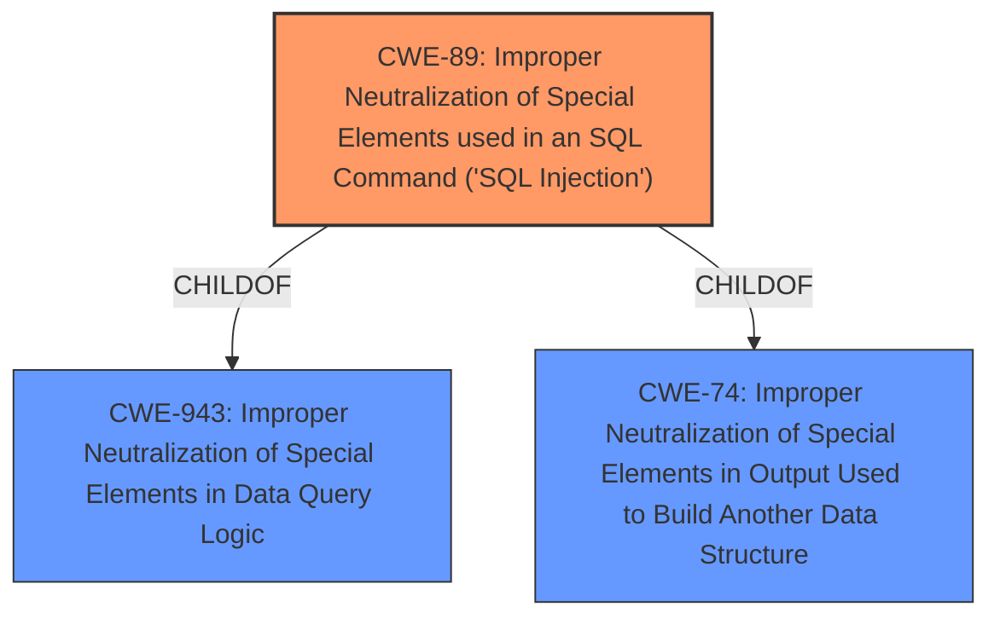

# Enhanced Analysis for CVE-2024-12031

# Summary

| CWE ID  | CWE Name                                                                                    | Confidence | CWE Abstraction Level | CWE Vulnerability Mapping Label | CWE-Vulnerability Mapping Notes |
| :-------- | :------------------------------------------------------------------------------------------ | :--------- | :---------------------- | :------------------------------ | :------------------------------ |
| CWE-89    | Improper Neutralization of Special Elements used in an SQL Command ('SQL Injection')      | 1.0        | Base                    | Primary CWE                   | Allowed                       |

## Evidence and Confidence

*   **Confidence Score:** 1.0
*   **Evidence Strength:** HIGH

## Relationship Analysis

The primary relationship that influenced the decision was the hierarchical structure with CWE-89 as a base CWE directly addressing the **SQL Injection** vulnerability. While other CWEs like CWE-943 (Improper Neutralization of Special Elements in Data Query Logic) exist as a Class, CWE-89 is more specific and directly reflects the **SQL Injection** vulnerability described. The chain relationships and abstraction levels were considered to ensure the selection of the most accurate and specific CWE.



## Vulnerability Chain

The vulnerability chain starts with **insufficient escaping** and **lack of sufficient preparation on the existing SQL query** leading to **SQL Injection**, which then allows attackers to extract sensitive information from the database.

*   Root Cause: **Insufficient escaping** and **lack of sufficient preparation on the existing SQL query**
*   Weakness: **SQL Injection** (CWE-89)
*   Impact: Extraction of sensitive information from the database.

## Summary of Analysis

The analysis is based on the vulnerability description, which clearly indicates an **SQL Injection** vulnerability due to **insufficient escaping on the user supplied parameter and lack of sufficient preparation on the existing SQL query**. This aligns directly with CWE-89 (Improper Neutralization of Special Elements used in an SQL Command ('SQL Injection')). The evidence for this includes:

*   Vulnerability Description: "The Advanced Floating Content plugin for WordPress is vulnerable to **SQL Injection** ... due to **insufficient escaping on the user supplied parameter and lack of sufficient preparation on the existing SQL query**."
*   CVE Reference Links Content Summary: "The vulnerability is due to insufficient input sanitization and lack of proper SQL query preparation... SQL Injection vulnerability. Specifically, it's an Improper Neutralization of Special Elements used in an SQL Command ('SQL Injection')."

The graph relationships were considered, and CWE-89 was selected as the most specific base CWE. The other candidate CWEs, such as CWE-943 and CWE-74, are class-level CWEs that are less specific than CWE-89.

Relevant CWE Information:

# Enhanced Context (25 CWEs)

## CWE-352: Cross-Site Request Forgery (CSRF)

This CWE was considered but is not applicable because the vulnerability is related to **SQL Injection**, not CSRF.

## CWE-434: Unrestricted Upload of File with Dangerous Type

This CWE was considered but is not applicable because the vulnerability is not related to file uploads.

## CWE-425: Direct Request ('Forced Browsing')

This CWE was considered but is not applicable because the vulnerability is related to **SQL Injection**, not authorization bypass.

## CWE-89: Improper Neutralization of Special Elements used in an SQL Command ('SQL Injection')

This CWE is the primary candidate and is selected due to the vulnerability being a clear case of **SQL Injection**. The vulnerability description explicitly mentions the **insufficient escaping** and **lack of sufficient preparation on the existing SQL query**, which directly aligns with the characteristics of CWE-89.

## CWE-116: Improper Encoding or Escaping of Output

This CWE was considered but is not as specific as CWE-89. While improper escaping is a contributing factor, the core issue is the **SQL Injection** itself, making CWE-89 a more appropriate choice.

## CWE-79: Improper Neutralization of Input During Web Page Generation ('Cross-site Scripting')

This CWE was considered but is not applicable because the vulnerability is related to **SQL Injection**, not Cross-site Scripting.

## CWE-502: Deserialization of Untrusted Data

This CWE was considered but is not applicable because the vulnerability is not related to deserialization of untrusted data.

## CWE-472: External Control of Assumed-Immutable Web Parameter

This CWE was considered but is not applicable because the vulnerability is related to **SQL Injection**, not modification of assumed-immutable parameters.

## CWE-639: Authorization Bypass Through User-Controlled Key

This CWE was considered but is not applicable because the vulnerability is related to **SQL Injection**, not authorization bypass.

## CWE-96: Improper Neutralization of Directives in Statically Saved Code ('Static Code Injection')

This CWE was considered but is not applicable because the vulnerability is related to **SQL Injection**, not static code injection.

## CWE-90: Improper Neutralization of Special Elements used in an LDAP Query ('LDAP Injection')

This CWE was considered but is not applicable because the vulnerability is related to **SQL Injection**, not LDAP injection.

## CWE-138: Improper Neutralization of Special Elements

This CWE was considered but is a class-level CWE and is less specific than CWE-89.

## CWE-943: Improper Neutralization of Special Elements in Data Query Logic

This CWE was considered but CWE-89 is more specific as it directly identifies the vulnerability as **SQL Injection**.

## CWE-73: External Control of File Name or Path

This CWE was considered but is not applicable because the vulnerability is related to **SQL Injection**, not file path manipulation.

## CWE-41: Improper Resolution of Path Equivalence

This CWE was considered but is not applicable because the vulnerability is related to **SQL Injection**, not path equivalence.

## CWE-471: Modification of Assumed-Immutable Data (MAID)

This CWE was considered but is not applicable because the vulnerability is related to **SQL Injection**, not modification of assumed-immutable data.

## CWE-183: Permissive List of Allowed Inputs

This CWE was considered but is not applicable because the vulnerability is related to **SQL Injection**, not input validation.

## CWE-59: Improper Link Resolution Before File Access ('Link Following')

This CWE was considered but is not applicable because the vulnerability is related to **SQL Injection**, not link following.


## CWE Relationship Analysis

Current CWEs represent these abstraction levels: .


### Vulnerability Chain Analysis

**Chain starting from CWE-471:**
- 471 (Modification of Assumed-Immutable Data (MAID)) - ROOT


**Chain starting from CWE-639:**
- 639 (Authorization Bypass Through User-Controlled Key) - ROOT


### CWE Relationship Diagram

```mermaid
graph TD
    classDef primary fill:#f96,stroke:#333,stroke-width:2px
    classDef secondary fill:#69f,stroke:#333
    classDef tertiary fill:#9e9,stroke:#333
```