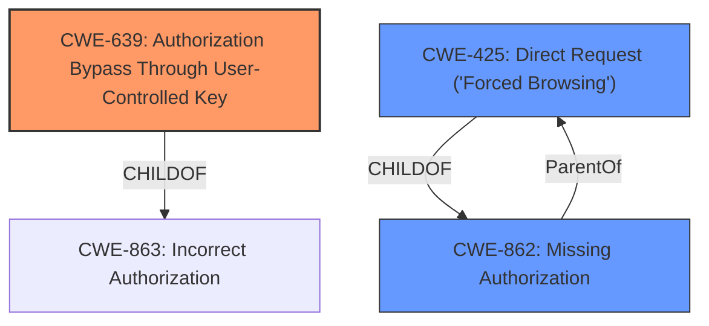

# Enhanced Analysis for CVE-2024-12048

# Summary
| CWE ID | CWE Name | Confidence | CWE Abstraction Level | CWE Vulnerability Mapping Label | CWE-Vulnerability Mapping Notes |
|---|---|---|---|---|---|
| CWE-639 | Authorization Bypass Through User-Controlled Key | 1.0 | Base | Primary | Allowed |
| CWE-425 | Direct Request ('Forced Browsing') | 0.7 | Base | Secondary | Allowed |
| CWE-862 | Missing Authorization | 0.6 | Class | Secondary | Allowed-with-Review |

## Evidence and Confidence

*   **Confidence Score:** 0.8
*   **Evidence Strength:** HIGH

## Relationship Analysis
The primary CWE is CWE-639, which is a base-level weakness describing authorization bypass through user-controlled keys. This is further refined by the secondary CWE-425, which represents direct requests without adequate authorization enforcement. CWE-862, a class-level weakness denoting missing authorization, also contributes to the overall vulnerability.



## Vulnerability Chain
The vulnerability chain starts with an **Insecure Direct Object Reference (IDOR)**, leading to the **missing authorization** checks which causes **attackers** to **view, edit, and delete other users information**.

CWE-639 (Authorization Bypass Through User-Controlled Key) -> CWE-425 (Direct Request) -> Impact (View/Edit/Delete other users' data).

## Summary of Analysis
The analysis is based on the vulnerability description, which explicitly states an **IDOR** vulnerability due to the application failing to properly check authorization. The primary weakness, CWE-639, directly addresses the **authorization bypass** by modifying the key value identifying the data. The description includes endpoints that are vulnerable and an impact of attackers viewing, editing, and deleting other user's information.

The retriever results and keyphrase analysis both point to CWE-639, CWE-425, and CWE-862 as relevant. CWE-639 is chosen as the primary because it directly reflects the **root cause** of the **IDOR**, where attackers can manipulate keys to access unauthorized data. The other CWEs refine the authorization context, where direct requests bypass checks.

The selected CWEs are at the optimal level of specificity because CWE-639 is a base-level weakness that accurately represents the core issue, while CWE-425 and CWE-862 provide additional context regarding the nature of the authorization failure.

Relevant CWE Information:

*   **CWE-639: Authorization Bypass Through User-Controlled Key** - The system's authorization functionality does not prevent one user from gaining access to another user's data or record by modifying the key value identifying the data. This aligns directly with the **IDOR** vulnerability.
*   **CWE-425: Direct Request ('Forced Browsing')** - The web application does not adequately enforce appropriate authorization on all restricted URLs, scripts, or files. This supports the fact that the authorization checks are not being properly enforced for the listed API endpoints.
*   **CWE-862: Missing Authorization** - The product does not perform an authorization check when an actor attempts to access a resource or perform an action. This CWE is a class level and could be considered, but is less specific than CWE-639 and CWE-425.

CWEs considered but not used:
*   CWE-285, CWE-863 are considered as alternatives. They are not selected as they are less descriptive of the actual vulnerability than CWE-639, CWE-425, and CWE-862. They are higher-level classes that describe authorization issues.


## CWE Relationship Analysis

Current CWEs represent these abstraction levels: .


### Vulnerability Chain Analysis

**Chain starting from CWE-863:**
- 863 (Incorrect Authorization) - ROOT


**Chain starting from CWE-862:**
- 862 (Missing Authorization) - ROOT


### CWE Relationship Diagram

```mermaid
graph TD
    classDef primary fill:#f96,stroke:#333,stroke-width:2px
    classDef secondary fill:#69f,stroke:#333
    classDef tertiary fill:#9e9,stroke:#333
```