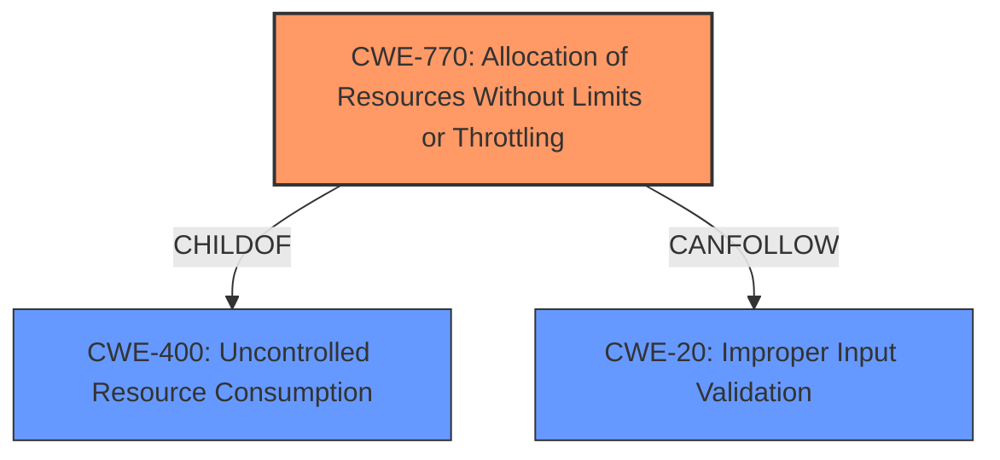

# Analysis for CVE-2024-12070

# Summary
| CWE ID  | CWE Name                                         | Confidence | CWE Abstraction Level | CWE Vulnerability Mapping Label | CWE-Vulnerability Mapping Notes |
| :-------- | :----------------------------------------------- | :--------- | :-------------------- | :------------------------------ | :-------------------------------- |
| CWE-770 | Allocation of Resources Without Limits or Throttling | 0.9        | Base                  | Allowed                       | Primary CWE                       |
| CWE-400 | Uncontrolled Resource Consumption                | 0.7        | Class                 | Discouraged                     | Secondary Candidate               |
| CWE-20  | Improper Input Validation                        | 0.6        | Class                 | Discouraged                     | Secondary Candidate               |

## Evidence and Confidence

*   **Confidence Score:** 0.8
*   **Evidence Strength:** HIGH

## Relationship Analysis

The primary CWE, CWE-770, is a Base level CWE which is a child of the Class level CWE-400. The vulnerability description indicates that the **improper handling of a large filename** leads to the **allocation of resources without limits or throttling**, causing a Denial of Service. The relationship between CWE-770 and CWE-400 is hierarchical, with CWE-770 being a more specific case of uncontrolled resource consumption. CWE-20 is related as improper input validation could lead to resource exhaustion. The abstraction levels influenced the selection by favoring the more specific Base level CWE-770 over the Class level CWE-400.

## Vulnerability Chain

The vulnerability chain starts with **improper handling of form-data with a large filename** (**rootcause**), which leads to **allocation of resources without limits or throttling**, ultimately causing a **Denial of Service (DoS)**.

Vulnerability Chain: **Improper Handling of Large Filename** -> **Allocation of Resources Without Limits or Throttling (CWE-770)** -> **Denial of Service**.

## Summary of Analysis

The initial analysis focused on identifying the root cause of the Denial of Service vulnerability. The vulnerability description clearly states that the **improper handling of form-data with a large filename** is the root cause. This leads to an **allocation of resources without limits or throttling**, which is best represented by CWE-770.

The choice of CWE-770 is strongly supported by the vulnerability description, which explicitly mentions the **improper handling of form-data with a large filename** leading to the server becoming overwhelmed.

> *"The vulnerability is due to **improper handling of form-data with a large filename** in the file upload request. By sending a payload with an excessively large filename, the server becomes overwhelmed and unresponsive, leading to unavailability for legitimate users."*

The graph relationships influenced the selection by highlighting the hierarchical relationship between CWE-770 and CWE-400, favoring the more specific Base level CWE-770.

CWE-770 is selected as the primary CWE because it accurately represents the weakness of allocating resources without limits or throttling due to the **improper handling of a large filename**. This is the optimal level of specificity as it directly addresses the root cause of the vulnerability. CWE-400 is considered as a broader classification but is less specific than CWE-770. CWE-20 is considered, but is too general since the specific **improper handling of the filename** is known.

Relevant CWE Information:

# Enhanced Context (25 CWEs)
The following CWEs were identified as potentially relevant to this vulnerability:

## CWE-41: Improper Resolution of Path Equivalence
**Abstraction Level**: Base
**Similarity Score**: 0.73
**Source**: dense

**Description**:
The product is vulnerable to file system contents disclosure through path equivalence. Path equivalence involves the use of special characters in file and directory names. The associated manipulations are intended to generate multiple names for the same object.

**Mapping Guidance**:
- Usage: Allowed
- Rationale: This CWE entry is at the Base level of abstraction, which is a preferred level of abstraction for mapping to the root causes of vulnerabilities.

## CWE-23: Relative Path Traversal
**Abstraction Level**: Base
**Similarity Score**: 0.72
**Source**: dense

**Description**:
The product uses external input to construct a pathname that should be within a restricted directory, but it does not properly neutralize sequences such as ".." that can resolve to a location that is outside of that directory.

**Mapping Guidance**:
- Usage: Allowed
- Rationale: This CWE entry is at the Base level of abstraction, which is a preferred level of abstraction for mapping to the root causes of vulnerabilities.

## CWE-212: Improper Removal of Sensitive Information Before Storage or Transfer
**Abstraction Level**: Base
**Similarity Score**: 0.72
**Source**: dense

**Description**:
The product stores, transfers, or shares a resource that contains sensitive information, but it does not properly remove that information before the product makes the resource available to unauthorized actors.

**Mapping Guidance**:
- Usage: Allowed
- Rationale: This CWE entry is at the Base level of abstraction, which is a preferred level of abstraction for mapping to the root causes of vulnerabilities.

## CWE-425: Direct Request ('Forced Browsing')
**Abstraction Level**: Base
**Similarity Score**: 0.72
**Source**: dense

**Description**:
The web application does not adequately enforce appropriate authorization on all restricted URLs, scripts, or files.

**Mapping Guidance**:
- Usage: Allowed
- Rationale: This CWE entry is at the Base level of abstraction, which is a preferred level of abstraction for mapping to the root causes of vulnerabilities.

## CWE-668: Exposure of Resource to Wrong Sphere
**Abstraction Level**: Class
**Similarity Score**: 0.72
**Source**: dense

**Description**:
The product exposes a resource to the wrong control sphere, providing unintended actors with inappropriate access to the resource.

**Mapping Guidance**:
- Usage: Discouraged
- Rationale: CWE-668 is high-level and is often misused as a catch-all when lower-level CWE IDs might be applicable. It is sometimes used for low-information vulnerability reports [REF-1287]. It is a level-1 Class (i.e., a child of a Pillar). It is not useful for trend analysis.

## CWE-434: Unrestricted Upload of File with Dangerous Type
**Abstraction Level**: Base
**Similarity Score**: 0.72
**Source**: dense

**Description**:
The product allows the upload or transfer of dangerous file types that are automatically processed within its environment.

**Mapping Guidance**:
- Usage: Allowed
- Rationale: This CWE entry is at the Base level of abstraction, which is a preferred level of abstraction for mapping to the root causes of vulnerabilities.

## CWE-552: Files or Directories Accessible to External Parties
**Abstraction Level**: Base
**Similarity Score**: 0.72
**Source**: dense

**Description**:
The product makes files or directories accessible to unauthorized actors, even though they should not be.

**Mapping Guidance**:
- Usage: Allowed
- Rationale: This CWE entry is at the Base level of abstraction, which is a preferred level of abstraction for mapping to the root causes of vulnerabilities.

## CWE-472: External Control of Assumed-Immutable Web Parameter
**Abstraction Level**: Base
**Similarity Score**: 0.72
**Source**: dense

**Description**:
The web application does not sufficiently verify inputs that are assumed to be immutable but are actually externally controllable, such as hidden form fields.

**Mapping Guidance**:
- Usage: Allowed
- Rationale: This CWE entry is at the Base level of abstraction, which is a preferred level of abstraction for mapping to the root causes of vulnerabilities.

## CWE-73: External Control of File Name or Path
**Abstraction Level**: Base
**Similarity Score**: 0.72
**Source**: dense

**Description**:
The product allows user input to control or influence paths or file names that are used in filesystem operations.

**Mapping Guidance**:
- Usage: Allowed
- Rationale: This CWE entry is at the Base level of abstraction, which is a preferred level of abstraction for mapping to the root causes of vulnerabilities.

## CWE-345: Insufficient Verification of Data Authenticity
**Abstraction Level**: Class
**Similarity Score**: 0.72
**Source**: dense

**Description**:
The product does not sufficiently verify the origin or authenticity of data, in a way that causes it to accept invalid data.

**Mapping Guidance**:
- Usage: Discouraged
- Rationale: